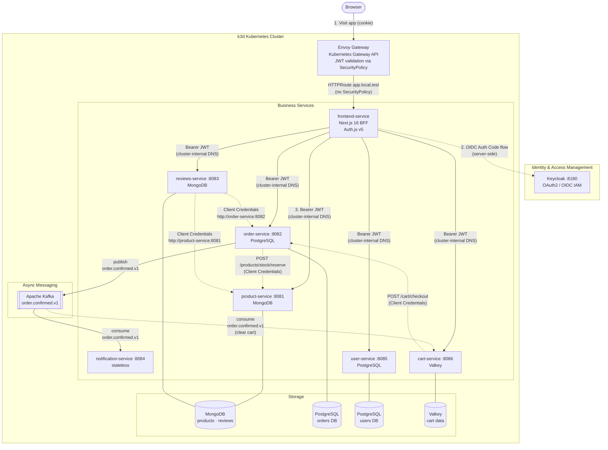
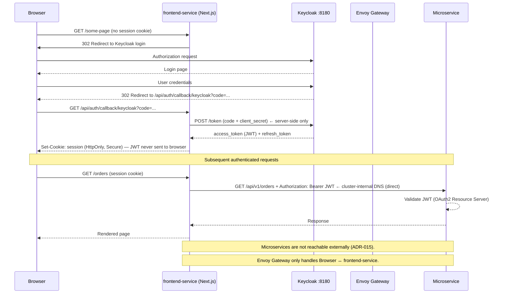
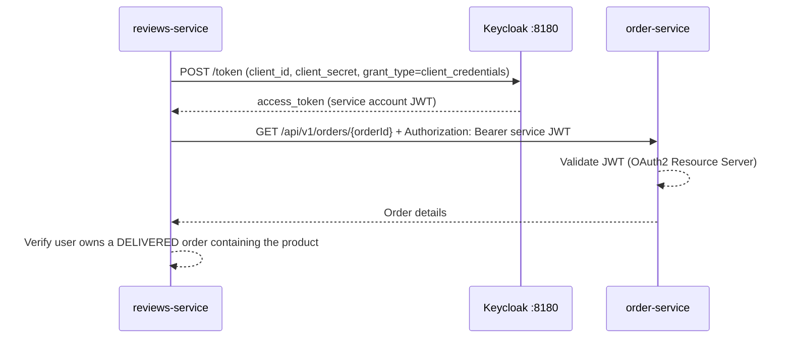
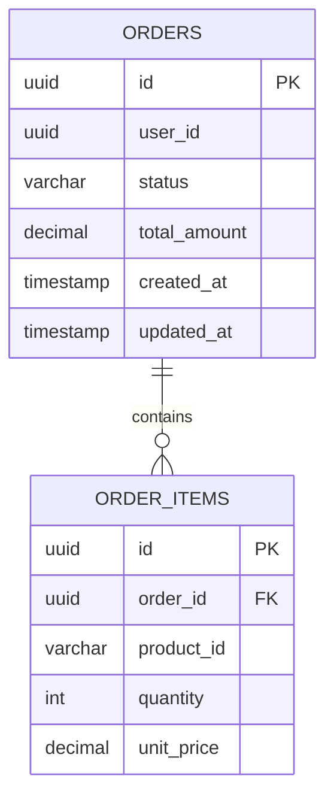
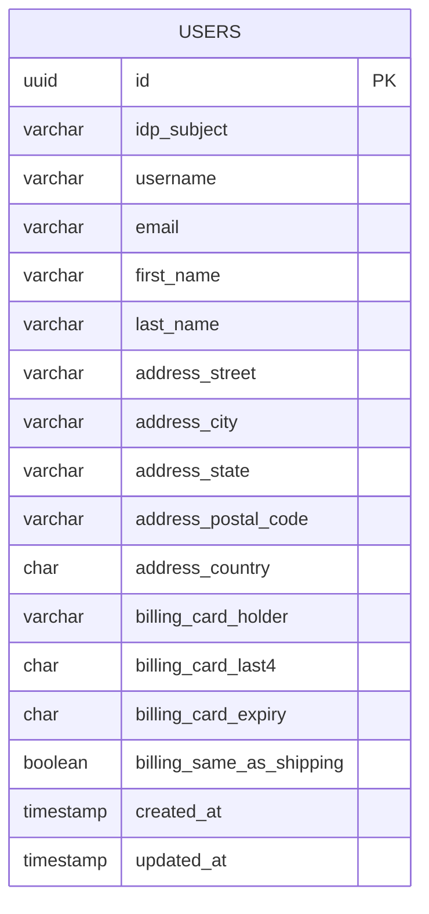
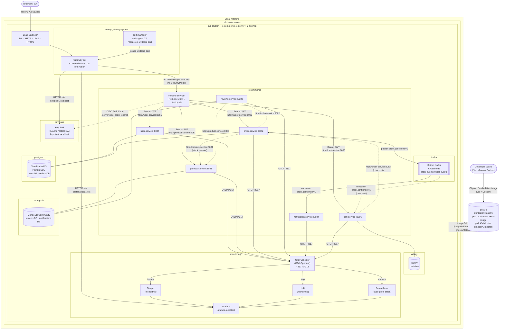

# Architecture & Design

Technical reference for the E-Commerce Microservice Platform — service interactions, security model, data models, observability pipeline, Kubernetes cluster layout, and CI/CD pipeline details.

For setup and runtime instructions see [README.md](README.md).

## Table of Contents

- [Architecture Diagram](#architecture-diagram)
- [Security: OAuth2 + Keycloak](#security-oauth2--keycloak)
- [Service Details](#service-details)
- [Kafka Events](#kafka-events)
- [Data Models](#data-models)
- [Observability](#observability)
- [Kubernetes Deployment Architecture](#kubernetes-deployment-architecture)
  - [PostgreSQL — CloudNativePG](#postgresql--cloudnativepg)
- [CI/CD Pipeline Details](#cicd-pipeline-details)
- [Architecture Decision Records](#architecture-decision-records)

---

## Architecture Diagram



> **Entry point:** External traffic enters through **Envoy Gateway** (Kubernetes Gateway API). The external gateway exposes only three hostnames: `app.local.test` (Next.js BFF), `keycloak.local.test`, and `grafana.local.test`. **Microservices are not exposed externally.** The Next.js BFF calls them directly via Kubernetes Service DNS (`http://service-name:port`) server-side. JWT validation is handled by each service's own OAuth2 Resource Server configuration. See [ADR-015](design/adr-015-microservices-not-exposed-externally.md).

> Service-to-service calls use plain Kubernetes Service DNS (`http://service-name:port`). kube-proxy handles server-side load balancing across pods — no client-side discovery library required. See [design/adr-002-plain-kubernetes-dns-service-calls.md](design/adr-002-plain-kubernetes-dns-service-calls.md) for the full rationale.

---

## Security: OAuth2 + Keycloak

### Overview

Security is centralized in **Keycloak**. No service stores user passwords. Every HTTP request — whether from an external client or between services — carries a signed JWT that each resource server independently validates using Keycloak's JWKS public keys.

### Keycloak Realm Configuration

| Setting | Value |
|---------|-------|
| Realm | `e-commerce` |
| JWKS endpoint | `http://keycloak:8180/realms/e-commerce/protocol/openid-connect/certs` |
| Token endpoint | `http://keycloak:8180/realms/e-commerce/protocol/openid-connect/token` |

One Keycloak client per service (all confidential, with service accounts enabled):

| Keycloak Client ID | Grant Types | Used By |
|--------------------|-------------|---------|
| `e-commerce-web` | Authorization Code (confidential BFF) | `frontend-service` Next.js server (Auth.js v5) |
| `product-service` | Client Credentials | product-service resource server + service account |
| `order-service` | Client Credentials | order-service resource server + service account |
| `reviews-service` | Client Credentials | reviews-service resource server + service account |
| `user-service` | Client Credentials | user-service resource server + service account |
| `notification-service` | Client Credentials | notification-service resource server |
| `cart-service` | Client Credentials | cart-service resource server + service account |

> **`e-commerce-web` is a confidential client** — the `client_secret` lives only in the Next.js server environment (`KEYCLOAK_CLIENT_SECRET`). The browser never sees the JWT; Auth.js manages the OIDC session server-side and issues an HttpOnly cookie to the browser. See [ADR-007](design/adr-007-nextjs-bff-frontend.md).

### Token Flow 1 — User Authentication (Authorization Code — BFF)



### Token Flow 2 — Service-to-Service (Client Credentials Grant)

Used when a service calls another service in a background or validation context (e.g., Reviews Service verifying an order before allowing a review):



> For the complete Keycloak realm setup — clients, scopes, roles, test users, service-account assignments, and realm JSON — see [design/keycloak-configuration.md](design/keycloak-configuration.md).

### Spring Boot Configuration Per Role

| Service Role | Dependency | Key `application.yaml` property |
|---|---|---|
| Resource Server (all services) | `spring-boot-starter-oauth2-resource-server` | `spring.security.oauth2.resourceserver.jwt.jwk-set-uri` |
| OAuth2 Client (service accounts) | `spring-boot-starter-oauth2-client` | `spring.security.oauth2.client.registration.<id>.grant-type=client_credentials` |

---

## Service Details

### frontend-service · port 3001 (local) / 3000 (container) · stateless

Browser-facing Next.js 16 application implementing the BFF pattern. See [ADR-007](design/adr-007-nextjs-bff-frontend.md) for the full rationale.

| Aspect | Detail |
|--------|--------|
| Framework | Next.js 16 (App Router) |
| Auth library | Auth.js v5 |
| Session storage | Encrypted HttpOnly cookie (JWT never in browser) |
| Keycloak client | `e-commerce-web` (confidential — `client_secret` in server env only) |
| API calls | Server Components / Route Handlers call microservices directly via Kubernetes Service DNS (`http://service-name:port`) — no gateway hop |
| Envoy HTTPRoute | `app.local.test` — **no `SecurityPolicy`** (Auth.js handles authentication); microservices have no external HTTPRoute |
| Local dev port | 3001 (3000 is reserved for Grafana) |

More details about frontend design in [frontend-design](design/frontend-design.md).

---

### product-service · port 8081 · MongoDB

Manages the product catalog.

**REST API**

| Method | Path | Description | Required Role |
|--------|------|-------------|---------------|
| `GET` | `/api/v1/products` | List products (paginated) | Any authenticated user |
| `GET` | `/api/v1/products/{id}` | Get product by ID | Any authenticated user |
| `POST` | `/api/v1/products` | Create product | `SCOPE_products:write` (admin only) |
| `PUT` | `/api/v1/products/{id}` | Update product | `SCOPE_products:write` (admin only) |
| `DELETE` | `/api/v1/products/{id}` | Delete product | `SCOPE_products:write` (admin only) |
| `POST` | `/api/v1/products/stock/reserve` | Reserve stock for a confirmed order (M2M only) | `SCOPE_products:write` |

---

### order-service · port 8082 · PostgreSQL

Manages the full order lifecycle. Orders are created as `PENDING` previews and transition to `CONFIRMED` once the user explicitly confirms and stock is reserved. Publishes a Kafka event on order confirmation.

**REST API**

| Method | Path | Description | Required Role |
|--------|------|-------------|---------------|
| `GET` | `/api/v1/orders` | List all orders on the platform | `SCOPE_products:write` (admin only) |
| `POST` | `/api/v1/orders` | Create a new order preview (`PENDING`) | Any authenticated user |
| `POST` | `/api/v1/orders/{id}/confirm` | Confirm order: reserve stock → `CONFIRMED` → publish Kafka event | Owner (`SCOPE_orders:write`) |
| `GET` | `/api/v1/orders/{id}` | Get order by ID | Owner or `SCOPE_products:write` |
| `GET` | `/api/v1/orders/user/{userId}` | List user's orders | Owner or `SCOPE_products:write` |
| `PUT` | `/api/v1/orders/{id}/status` | Update order status | `SCOPE_products:write` (admin only) |

**Order status lifecycle:** `PENDING` → `CONFIRMED` → `SHIPPED` → `DELIVERED` | `CANCELLED`

**Kafka event published:** `order.confirmed.v1` (on `/confirm`) — see [Kafka Events](#kafka-events).

**M2M `userId` passthrough:** `POST /api/v1/orders` is called both by end-users (browser → frontend) and by `cart-service` (Client Credentials). End-user tokens are resolved via `user-service`; service-account tokens have no corresponding user row. When called with a service-account token, the caller **must** supply a `userId` UUID in the request body — `cart-service` pre-resolves the real user's UUID and passes it through.

---

### reviews-service · port 8083 · MongoDB

Stores product reviews. A review can only be submitted by a user who has a **delivered** order containing the reviewed product.

**REST API**

| Method | Path | Description | Required Role |
|--------|------|-------------|---------------|
| `GET` | `/api/v1/reviews/product/{productId}` | List reviews for a product | Any authenticated user |
| `POST` | `/api/v1/reviews` | Submit a review | Any authenticated user |
| `DELETE` | `/api/v1/reviews/{id}` | Delete own review | Owner |

**Business rule validation (via Client Credentials):**

1. Extract JWT `sub` → call `user-service` resolve endpoint → obtain internal `userId` (cached locally)
2. Call `product-service` → verify the product exists
3. Call `order-service` → verify the internal `userId` has a `DELIVERED` order containing `productId`

---

### notification-service · port 8084 · stateless

Pure Kafka consumer. No REST API. No database. Receives order events and dispatches notifications (email / push / log).

| Property | Value |
|----------|-------|
| Topic | `order.confirmed.v1` |
| Consumer group | `notification-group` |
| Action | Send email / push notification / write to observability pipeline |

---

### user-service · port 8085 · PostgreSQL

Stores user profile data. **Does not store passwords** — Keycloak manages credentials. The `idp_subject` field stores the IAM provider's `sub` UUID, used only within this service for identity resolution.

The profile also holds a **shipping address** and a **billing account** (card display metadata only) that `order-service` uses when processing a purchase order.

> **IAM portability:** `user-service` is the **only** service that knows about Keycloak's `sub`. All other services reference the internal `users.id` UUID. On a future IAM provider migration, only the `idp_subject` column in this one service needs updating. See [design/iam-portability.md](design/iam-portability.md).

**REST API**

| Method | Path | Description | Required Role |
|--------|------|-------------|---------------|
| `GET` | `/api/v1/users` | List all registered users | `SCOPE_products:write` (admin only) |
| `GET` | `/api/v1/users/me` | Get own profile (resolved from JWT `sub`) | Any authenticated user |
| `GET` | `/api/v1/users/{id}` | Get user profile by ID | Any authenticated user |
| `GET` | `/api/v1/users/resolve?idp_subject={sub}` | Resolve IAM `sub` → internal user profile | Service account only |
| `PUT` | `/api/v1/users/{id}` | Update own profile (name, address, billing) | Owner |

**`PUT /api/v1/users/{id}` request body (all fields optional / patch semantics)**

```json
{
  "firstName": "Jane",
  "lastName":  "Doe",
  "shippingAddress": {
    "street":     "123 Main St",
    "city":       "Springfield",
    "state":      "IL",
    "postalCode": "62701",
    "country":    "US"
  },
  "billingAccount": {
    "cardHolder":    "Jane Doe",
    "cardLast4":     "4242",
    "cardExpiry":    "12/28",
    "sameAsShipping": true
  }
}
```

> **Lazy registration flow:** On every call to `GET /api/v1/users/me`, `user-service` resolves the caller's profile in three steps: **(1)** look up by `idp_subject = sub` — found → return immediately; **(2)** not found → look up by `email` — found → re-link the existing row to the new `sub` and return (handles dev Keycloak resets or IAM migrations without losing user data); **(3)** no email match → create a new profile from the JWT claims (`email`, `given_name`, `family_name`, `preferred_username`). No explicit registration step required.

> **Per-service lazy resolution:** When `order-service` or `reviews-service` needs to associate a user with data, they extract the JWT `sub`, call `GET /api/v1/users/resolve?idp_subject={sub}` to obtain the internal `users.id`, then cache the mapping locally (TTL: 5–15 min). Subsequent requests for the same user skip the resolution call.

See [design/user-service-keycloak-registration-flow.md](design/user-service-keycloak-registration-flow.md) for the full lazy-registration sequence diagram and edge cases (IAM migration, dev Keycloak resets).

---

### cart-service · port 8086 · Valkey

Manages the per-user shopping cart. Cart data is stored in **Valkey** (Redis-compatible in-memory cache) with a 7-day TTL keyed by `cart:{userId}`.

**Checkout flow (two phases):**
1. `POST /cart/checkout` — cart-service reads the cart and calls `POST /api/v1/orders` on order-service to create a `PENDING` order preview. Cart is **not cleared** at this point. The order ID is returned so the user can review before confirming.
2. `POST /orders/{id}/confirm` (on order-service) — reserves stock on product-service, transitions the order to `CONFIRMED`, publishes `order.confirmed.v1` to Kafka.
3. cart-service **consumes `order.confirmed.v1`** and calls its own `clearCart(userId)` internally — no direct HTTP callback from order-service required (avoids circular dependency).

> **Circular dependency avoided:** cart-service already calls order-service (for checkout), so order-service must never call cart-service directly. Cart clearing is decoupled via Kafka. See [design/adr-013-two-phase-checkout-flow.md](design/adr-013-two-phase-checkout-flow.md).

**REST API**

| Method | Path | Description | Required Role |
|--------|------|-------------|---------------|
| `GET` | `/api/v1/cart` | Get own cart (resolved from JWT `sub`) | Any authenticated user |
| `POST` | `/api/v1/cart/checkout` | Initiate checkout — creates a `PENDING` order preview via order-service | Any authenticated user |
| `PUT` | `/api/v1/cart/items/{productId}` | Add / update item (qty=0 removes the item) | Any authenticated user |
| `DELETE` | `/api/v1/cart/items/{productId}` | Remove a single item from the cart | Any authenticated user |
| `DELETE` | `/api/v1/cart` | Clear entire cart | Any authenticated user |

**Cart data model (Valkey)**

Each cart is stored as a single JSON value under key `cart:{userId}` with a TTL of 7 days.

```json
{
  "userId":     "550e8400-e29b-41d4-a716-446655440001",
  "items": [
    {
      "productId":   "64b1f2c3d4e5f6a7b8c9d0e1",
      "productName": "Wireless Keyboard",
      "price":       49.99,
      "quantity":    2,
      "lineTotal":   99.98
    }
  ],
  "totalItems": 2,
  "grandTotal": 99.98,
  "expiresAt":  "2026-05-01T10:00:00Z"
}
```

---

## Kafka Events

| Topic | Producer | Consumer(s) | Description |
|-------|----------|-------------|-------------|
| `order.confirmed.v1` | `order-service` | `notification-service`, `cart-service` | Fired when an order is confirmed and stock reserved |

### `OrderConfirmedEvent` payload

```json
{
  "orderId":     "550e8400-e29b-41d4-a716-446655440000",
  "userId":      "550e8400-e29b-41d4-a716-446655440001",
  "totalAmount": 149.98,
  "itemCount":   2,
  "confirmedAt": "2026-04-23T10:15:00Z"
}
```

---

## Data Models

### PostgreSQL — orders DB



**`status` values:** `PENDING` → `CONFIRMED` → `SHIPPED` → `DELIVERED` | `CANCELLED`

---

### PostgreSQL — users DB



> `idp_subject` — the `sub` UUID issued by the IAM provider (Keycloak). Indexed for fast lookup. Used **only** inside `user-service` to link a JWT to the internal profile. Cross-service references always use `id` instead, keeping all other services IAM-agnostic.
>
> **Address** — shipping address used by `order-service` when dispatching orders. All columns are nullable; users fill them in from the Profile page.
>
> **Billing** — only the cardholder name, last-four card digits, and expiry (MM/YY) are stored for display purposes. Full PAN and CVV are **never** persisted.

---

### MongoDB — products collection

```json
{
  "_id":         "ObjectId",
  "name":        "string",
  "description": "string",
  "price":       "Decimal128",
  "category":    "string",
  "imageUrl":    "string",
  "stockQty":    "int32",
  "createdAt":   "Date",
  "updatedAt":   "Date"
}
```

### MongoDB — reviews collection

```json
{
  "_id":       "ObjectId",
  "productId": "string  (MongoDB ObjectId ref → products collection)",
  "orderId":   "string  (UUID ref → PostgreSQL orders.id)",
  "userId":    "string  (internal users.id UUID — resolved via user-service)",
  "rating":    "int32   (1–5)",
  "comment":   "string",
  "createdAt": "Date"
}
```

---

## Observability

All services export traces, metrics, and logs via the **OTLP protocol**. The pipeline differs between the two environments but the Spring Boot configuration remains the same in both — only the OTLP endpoint URL changes.

| Signal | Backend | Spring Boot integration |
|--------|---------|------------------------|
| **Traces** | Grafana Tempo | `spring-boot-starter-opentelemetry` — W3C TraceContext propagation |
| **Logs** | Grafana Loki | Logback `OpenTelemetryAppender` — logs correlated with trace IDs |
| **Metrics** | Prometheus | Micrometer via OTLP — JVM, HTTP server, Kafka consumer lag |

---

### Local Development — `grafana/otel-lgtm` (all-in-one)

In the Docker Compose environment a single `grafana/otel-lgtm` container provides the full OTLP receiver, Loki, Tempo, Prometheus, and Pyroscope, and Grafana UI. Services send OTLP directly to it.

```
  ┌──────────────────────────────────────────┐
  │  Spring Boot service                     │
  │  OTLP endpoint: http://localhost:4318    │
  └────────────────────┬─────────────────────┘
                       │ OTLP HTTP :4318 / gRPC :4317
          ┌────────────▼────────────┐
          │   grafana/otel-lgtm     │  ← Docker Compose  (profile: observability)
          │   all-in-one image      │
          │                         │
          │  ┌─────┐ ┌─────┐ ┌───┐  │
          │  │Loki │ │Tempo│ │ P │  │  P = Prometheus
          │  └─────┘ └─────┘ └───┘  │
          │       Grafana :3000     │
          └─────────────────────────┘
```

OTLP endpoint used by Spring Boot services: `http://localhost:4318`

---

### Staging (k3d) — OpenTelemetry Operator + kube-prometheus-stack + Tempo + Loki

In the Kubernetes staging cluster, the **OpenTelemetry Operator** manages a central `OpenTelemetryCollector` deployment. Services send a single OTLP stream to the collector, which fans it out to three dedicated backends: monolithic **Tempo** (traces), monolithic **Loki** (logs), and **Prometheus** via **kube-prometheus-stack** (metrics + Grafana UI). All backends use ephemeral `emptyDir` storage — appropriate for an ephemeral k3d staging cluster.

> **Why not `lgtm-distributed`?** The `grafana/lgtm-distributed` umbrella chart is deprecated. The individual charts (`grafana/tempo`, `grafana/loki`, `prometheus-community/kube-prometheus-stack`) are the current recommended path.

```
  ┌──────────────────────────────────────────────────────┐
  │  Spring Boot service (namespace: e-commerce)         │
  │  OTLP endpoint: otel-collector.monitoring:4317       │
  └──────────────────────────┬───────────────────────────┘
                             │ OTLP gRPC :4317
          ┌──────────────────▼─────────────────────────────────┐
          │   OpenTelemetryCollector  (namespace: monitoring)  │
          │   managed by opentelemetry-operator                │
          │                                                    │
          │  receivers:  otlp (gRPC :4317, HTTP :4318)         │
          │  processors: memory_limiter → batch                │
          │              → resource/staging                    │
          └────┬────────────────┬──────────────┬───────────────┘
               │ traces         │ logs         │ metrics
               │ OTLP gRPC      │ OTLP HTTP    │ OTLP HTTP
               ▼                ▼              ▼
  ┌────────────────┐  ┌──────────────┐  ┌────────────────────┐
  │ Tempo          │  │ Loki         │  │ Prometheus         │
  │ monolithic     │  │ monolithic   │  │ (kube-prom-stack)  │
  │ :4317 (gRPC)   │  │ :3100/otlp   │  │ :9090/otlp         │
  └───────┬────────┘  └──────┬───────┘  └────────┬───────────┘
          └──────────────────┴───────────────────┘
                             │
                    ┌────────▼─────────────┐
                    │  Grafana UI          │
                    │  grafana.local.test  │
                    │  (kube-prom-stack)   │
                    └──────────────────────┘
```

All components run in the `monitoring` namespace:

| Component | Helm release | Service (cluster-internal) |
|-----------|-------------|---------------------------|
| OTel Collector | `opentelemetry-operator` (CR: `otel`) | `otel-collector.monitoring:4317/4318` |
| Loki (monolithic) | `loki` (grafana/loki) | `loki.monitoring:3100` |
| Tempo (monolithic) | `tempo` (grafana/tempo) | `tempo.monitoring:4317/4318/3200` |
| Prometheus | `kube-prom-stack` (kube-prometheus-stack) | `kube-prom-stack-kube-prom-prometheus.monitoring:9090` |
| Grafana UI | `kube-prom-stack` (kube-prometheus-stack) | `https://grafana.local.test` (via Envoy Gateway) |

---

## Kubernetes Deployment Architecture

The target deployment environment is a **k3d** cluster (k3s running inside Docker). k3d provides a full Kubernetes environment locally without a cloud provider.

### Cluster Architecture



### Cluster Layout

| Namespace | Contents |
|-----------|----------|
| `e-commerce` | All business microservices |
| `envoy-gateway-system` | Envoy Gateway controller + cert-manager |
| `keycloak` | Keycloak operator + instance |
| `kafka` | Strimzi operator + Kafka cluster |
| `mongodb` | MongoDB Community operator + replica set |
| `postgres` | CloudNativePG operator + PostgreSQL cluster |
| `valkey` | Valkey single-instance Deployment (cart cache) |
| `monitoring` | OTel Operator, OTel Collector, Tempo, Loki, Prometheus + Grafana (kube-prom-stack) |

### `gitops/` Directory Layout

All Kubernetes manifests live in `gitops/` and are continuously reconciled by Flux CD. The cluster entry point is `gitops/clusters/staging/`; changes are deployed by pushing to `master`.

```
gitops/
├── clusters/
│   └── staging/
│       ├── flux-instance.yaml              ← FluxInstance CR (Flux Operator bootstrap)
│       ├── cluster-settings.yaml           ← CLUSTER_DOMAIN=local.test, ENVIRONMENT=staging
│       ├── k3d-cluster.yaml                ← k3d cluster definition
│       ├── infra-security.yaml             ← Flux Kustomization: ESO stores
│       ├── infra-routing.yaml              ← Flux Kustomization: cert-manager + envoy-gateway
│       ├── infra-monitoring.yaml           ← Flux Kustomization: observability
│       ├── infra-backends.yaml             ← Flux Kustomization: databases + kafka + keycloak + valkey
│       └── core-apps.yaml                  ← Flux Kustomization: all app services
├── infrastructure/
│   ├── environments/staging/
│   │   ├── routing/kustomization.yaml      ← aggregates: namespaces + cert-manager + envoy-gateway
│   │   └── backends/kustomization.yaml     ← aggregates: databases + kafka + keycloak + valkey
│   ├── namespaces/namespaces.yaml
│   ├── cert-manager/
│   │   ├── base/                           ← HelmRelease + HelmRepository
│   │   └── overlays/staging/               ← self-signed ClusterIssuer + *.${CLUSTER_DOMAIN} wildcard cert
│   ├── envoy-gateway/
│   │   ├── base/                           ← OCIRepository + HelmRelease + GatewayClass
│   │   └── overlays/staging/               ← Gateway + HTTPRoutes + SecurityPolicy
│   ├── eso-stores/
│   │   ├── base/                           ← HelmRelease + HelmRepository
│   │   └── overlays/staging/               ← Fake ClusterSecretStore
│   ├── databases/
│   │   ├── base/                           ← CNPG + MongoDB HelmReleases
│   │   └── overlays/staging/               ← CNPG Cluster CR + MongoDBCommunity CR + ExternalSecrets
│   ├── kafka/
│   │   ├── base/                           ← Strimzi HelmRelease
│   │   └── overlays/staging/               ← Kafka CR (1-node KRaft)
│   ├── keycloak/
│   │   ├── base/                           ← OCIRepository (keycloak-k8s-resources)
│   │   └── overlays/staging/               ← Keycloak CR + Database CR + HTTPRoute + ExternalSecret
│   ├── valkey/
│   │   ├── base/                           ← Deployment + Service
│   │   └── overlays/staging/               ← staging overlay (no changes from base)
│   └── observability/
│       ├── base/                           ← kube-prometheus-stack + OTel HelmReleases
│       └── overlays/staging/               ← Grafana ExternalSecret + OTel Collector CR
└── apps/
    ├── core-config/
    │   ├── base/                           ← KeycloakRealmImport + KafkaTopic/User CRs + CNPG Database CRs
    │   └── overlays/staging/
    ├── user-service/ product-service/ cart-service/ ...
    │   ├── base/                           ← Deployment + Service + ConfigMap + ServiceAccount + ExternalSecret
    │   └── overlays/staging/               ← image tag patch + env-specific config
    └── frontend-service/
        ├── base/
        └── overlays/staging/
```

### Envoy Gateway Routing

Envoy Gateway implements the [Kubernetes Gateway API](https://gateway-api.sigs.k8s.io/). A single `Gateway` resource in `envoy-gateway-system` terminates TLS (wildcard cert `*.local.test` issued by cert-manager) and exposes two listeners:

- **HTTP (:80)** — redirects all traffic to HTTPS
- **HTTPS (:443)** — terminates TLS and routes to services in the `e-commerce` namespace

JWT validation is enforced per `HTTPRoute` via a `SecurityPolicy` pointing to the Keycloak JWKS endpoint at `https://keycloak.${CLUSTER_DOMAIN}/realms/e-commerce/protocol/openid-connect/certs`. Each business service has a dedicated `HTTPRoute` matching its `/api/v1/<resource>` prefix.

### Service-to-Service Calls

Services call each other using plain Kubernetes Service DNS (`http://service-name:port`). kube-proxy handles server-side load balancing across pods — no `spring-cloud-starter-kubernetes-client-loadbalancer` or Eureka required, and no RBAC permissions to the Kubernetes API are needed. See [design/adr-002-plain-kubernetes-dns-service-calls.md](design/adr-002-plain-kubernetes-dns-service-calls.md).

---

### PostgreSQL — CloudNativePG

PostgreSQL is managed by the **CloudNativePG (CNPG) operator**. The operator watches Kubernetes Custom Resources and provisions a real PostgreSQL cluster, per-service databases, and application roles — all declaratively.

#### 1. Cluster CR (`gitops/infrastructure/databases/overlays/staging/`)

A `postgresql.cnpg.io/v1 / Cluster` resource named `postgres` is created in the `postgres` namespace. CNPG provisions 1 primary + 1 replica and automatically creates two stable Kubernetes Services:

| Service DNS | Purpose |
|---|---|
| `postgres-rw.postgres.svc.cluster.local:5432` | Read-write — always points to the primary |
| `postgres-ro.postgres.svc.cluster.local:5432` | Read-only — load-balanced across replicas |

The cluster bootstrap creates a default `app` database; all service-specific databases are created separately via `Database` CRs.

#### 2. Managed Roles — declarative credential management

The `spec.managed.roles` block in the Cluster CR tells CNPG to create a PostgreSQL login role for each service and keep its password in sync with a Kubernetes Secret:

```yaml
managed:
  roles:
    - name: users_owner        # user-service
      passwordSecret:
        name: users-db-secret  # Secret in postgres namespace
    - name: orders_owner       # order-service
      passwordSecret:
        name: orders-db-secret
    - name: keycloak_owner     # Keycloak
      passwordSecret:
        name: keycloak-db-secret
```

The referenced Secrets must exist in the `postgres` namespace **before** the Cluster CR is applied (or in the same `kubectl apply` batch).

#### 3. Database CRs (`gitops/apps/core-config/base/`)

One `postgresql.cnpg.io/v1 / Database` CR is defined per service. CNPG executes the equivalent of `CREATE DATABASE ... OWNER ...` inside the cluster.

| CR name | PostgreSQL database | Owner role | Consumed by |
|---|---|---|---|
| `users-db` | `users` | `users_owner` | `user-service` |
| `orders-db` | `orders` | `orders_owner` | `order-service` |
| `keycloak-db` | `keycloak` | `keycloak_owner` | Keycloak |

#### 4. Spring Boot integration — `user-service` as an example

Spring Boot services use environment variable placeholders in `application.yaml`:

```yaml
# user-service/src/main/resources/application.yaml
spring:
  datasource:
    url: jdbc:postgresql://${DB_HOST:localhost}:${DB_PORT:5432}/${DB_NAME:users}
    username: ${DB_USER:users}
    password: ${DB_PASSWORD:users}
```

In Kubernetes those variables are injected from two sources in the service `Deployment`:

| Source | Values | Where defined |
|---|---|---|
| `ConfigMap` (`user-service-config`) | `DB_HOST=postgres-rw.postgres.svc.cluster.local`, `DB_PORT=5432`, `DB_NAME=users` | `gitops/apps/user-service/base/configmap.yaml` |
| `Secret` (`user-service-db-secret`) | `DB_USER`, `DB_PASSWORD` | Copied from `users-db-secret` (same Secret CNPG uses for the role) |

`DB_HOST` is always set to the CNPG read-write Service so writes always reach the primary.

#### 5. End-to-end data flow

```
k8s Secret  users-db-secret  (postgres namespace)
        │
        ├─► CNPG Cluster managed.roles  →  PostgreSQL role "users_owner" (password synced)
        │
        └─► Deployment env  (copied to e-commerce namespace)
                 │
                 ▼
         Spring Boot datasource credentials

CNPG Database CR (users-db)  →  PostgreSQL database "users"  OWNER users_owner

Spring Boot  ──JDBC──►  postgres-rw.postgres.svc.cluster.local:5432/users
                         (authenticated as users_owner)
```

#### 6. Schema management — Flyway

CNPG creates the **empty** database. Schema creation and migrations are entirely managed by **Flyway**, which runs inside the Spring Boot process at startup. Migration scripts live in `src/main/resources/db/migration/V{n}__{description}.sql` and execute automatically on first boot and on each upgrade.

#### 7. Secret lifecycle — local setup

All `*-db-secret` Kubernetes Secrets must be created in the `postgres` namespace **before** applying the CNPG CRs, so that managed roles and databases are provisioned with consistent credentials from the very first reconciliation cycle. The required `kubectl create secret` commands are documented as comments at the top of both `cluster.yaml` and `databases.yaml`.

---

## CI Pipeline Details

### CI Workflow

#### Change Detection

`dorny/paths-filter` detects which service directories changed. The matrix build runs only for changed services — a single-service PR compiles and tests only that service. Changes to `common/` or the root `pom.xml` trigger a rebuild of **all** Java services (conservative).

```
 Push / PR to main
      │
      ▼
 detect-changes (dorny/paths-filter)
      │
      ├─► java-services = ["product-service", "cart-service"]   ──► build-java (matrix)
      │    │
      │    │  Per changed service (fail-fast: false):
      │    │  1. mvn test    — unit + @WebMvcTest slice tests (no Docker, fast)
      │    │  2. mvn verify  — + Testcontainers integration tests (Docker available)
      │    │  3. jib:build   — push ghcr.io/{owner}/{svc}:{sha} + latest
      │    │                   (master push only — skipped on PRs)
      │
      └─► frontend = true   ──► build-frontend
               1. npm ci
               2. npm run build (TypeScript type-check + Next.js compile)
               3. docker build-push → ghcr.io/{owner}/frontend-service:{sha} + latest
                  (main push only — skipped on PRs)
```

#### Test Gates (ADR-012 — Surefire / Failsafe split)

| Step | Maven command | Plugin | Runs |
|---|---|---|---|
| Unit tests | `mvn -pl {service} -am test` | Surefire (`*Test.java`) — no Docker | Always (PR + main) |
| Integration tests | `mvn -pl {service} -am verify` | Failsafe (`*IT.java`) + Testcontainers | Always (PR + main) |
| Image push | `mvn compile jib:build` | Jib — no Docker daemon (ADR-010) | **main only** |

#### Image Naming

Images are published to `ghcr.io/<owner>/<service>` with two tags:

| Tag | Value | Purpose |
|---|---|---|
| `<commit-sha>` | 40-character hex | Immutable — pin deployments in kustomization overlays |
| `latest` | floating | Convenience — always tracks the most recent `master` build |

#### Services Covered

| Service | Toolchain | Registry target |
|---|---|---|
| `product-service` | Java 25 + Maven + Jib | `ghcr.io/<owner>/product-service` |
| `user-service` | Java 25 + Maven + Jib | `ghcr.io/<owner>/user-service` |
| `cart-service` | Java 25 + Maven + Jib | `ghcr.io/<owner>/cart-service` |
| `order-service` | Java 25 + Maven + Jib | `ghcr.io/<owner>/order-service` |
| `reviews-service` | Java 25 + Maven + Jib | `ghcr.io/<owner>/reviews-service` |
| `notification-service` | Java 25 + Maven + Jib | `ghcr.io/<owner>/notification-service` |
| `frontend-service` | Node.js 22 + Docker multi-stage | `ghcr.io/<owner>/frontend-service` |

---

#### Permissions and Secrets

| Secret / Permission | Source | Required for |
|---|---|---|
| `secrets.GITHUB_TOKEN` | Auto-provided by GitHub Actions | Jib push to `ghcr.io` |
| `permissions.packages: write` | CI `build-java` / `build-frontend` jobs | Authorise token to publish packages |

#### Branch Protection (Recommended)

In **Settings → Branches → Branch protection rules** for `master`:

- ✅ Require status checks: `product-service`, `user-service`, `cart-service`, `frontend-service`
- ✅ Require branches to be up to date before merging
- ✅ Require at least 1 pull request review
- ✅ Do not allow bypassing the above settings

---

## Architecture Decision Records

Key design choices recorded as ADRs in `design/`. Each document states the context, decision, rationale, and consequences.

| ADR | Title | Area |
|-----|-------|------|
| [ADR-001](design/adr-001-envoy-gateway-as-api-gateway.md) | Envoy Gateway as API Gateway | Infrastructure |
| [ADR-002](design/adr-002-plain-kubernetes-dns-service-calls.md) | Plain Kubernetes Service DNS for Service-to-Service Calls | Infrastructure |
| [ADR-003](design/adr-003-keycloak-as-iam.md) | Keycloak as IAM (OAuth2 / OIDC) | Security |
| [ADR-004](design/adr-004-iam-portability-user-service-isolation.md) | IAM Portability via user-service Isolation | Security |
| [ADR-005](design/adr-005-user-profile-lazy-registration.md) | User Profile Lazy Registration on First Login | user-service |
| [ADR-006](design/adr-006-scope-based-authorization.md) | Scope-Based Authorization (OAuth2 Resource Scopes) | Security |
| [ADR-007](design/adr-007-nextjs-bff-frontend.md) | Next.js BFF Frontend | Frontend |
| [ADR-008](design/adr-008-mise-tool-version-management.md) | mise for Developer Tool Version Management | Developer Experience |
| [ADR-009](design/adr-009-api-first-design-openapi-generator.md) | API-First Design with OpenAPI Generator | Backend |
| [ADR-010](design/adr-010-jib-for-container-image-builds.md) | Jib for Container Image Builds | CI/CD |
| [ADR-011](design/adr-011-oauth2c-local-api-testing.md) | oauth2c for Local Authorization Code Flow Testing | Developer Experience |
| [ADR-012](design/adr-012-surefire-failsafe-test-separation.md) | Surefire / Failsafe Split for Unit and Integration Tests | Testing |
| [ADR-013](design/adr-013-two-phase-checkout-flow.md) | Two-Phase Checkout Flow | cart-service / order-service |
| [ADR-014](design/adr-014-per-resource-server-client-roles.md) | Per-Resource-Server Client Role Distribution | Security |
| [ADR-015](design/adr-015-microservices-not-exposed-externally.md) | Microservices Not Exposed via External Gateway | Infrastructure |
