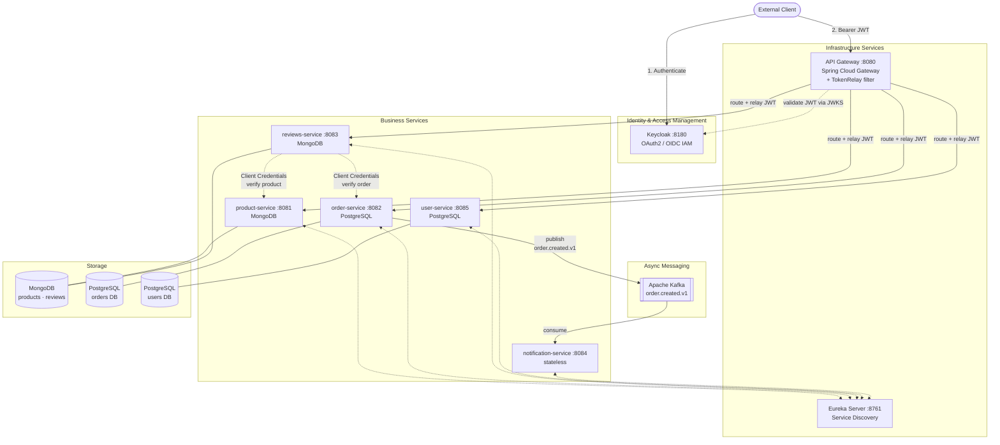
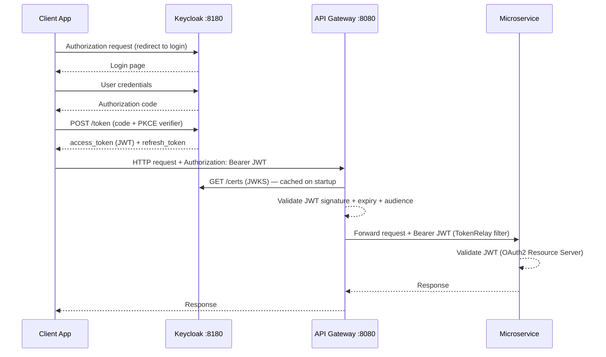
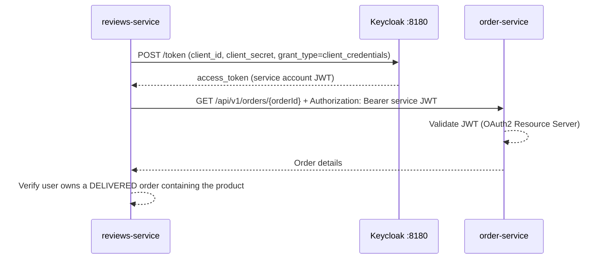
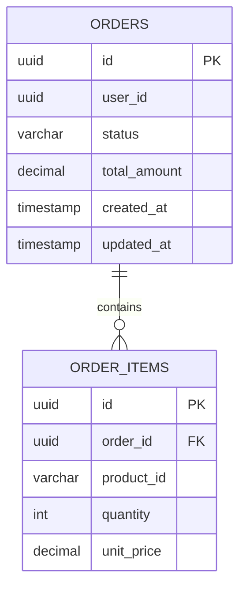
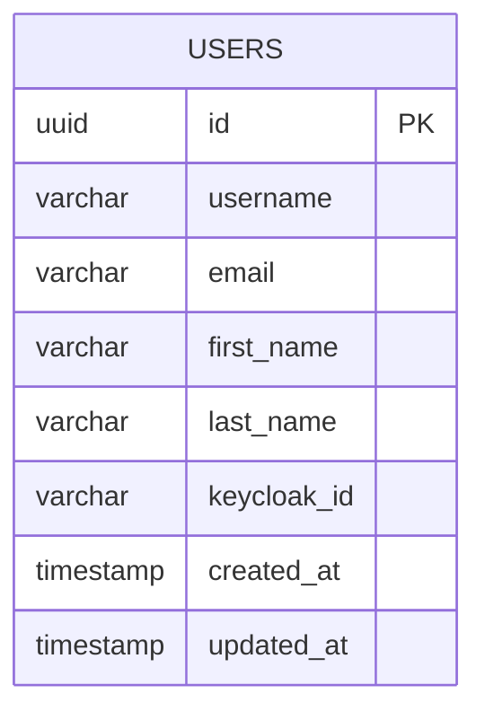

# E-Commerce Microservice Application

Spring Boot microservice-based e-commerce platform implementing:

- **Polyglot persistence** — MongoDB (products, reviews) and PostgreSQL (orders, users)
- **Event-driven architecture** — Apache Kafka (`order.created.v1`)
- **OAuth2 security** — Keycloak as IAM for client authentication and inter-service communication
- **Observability** — OpenTelemetry + Grafana LGTM stack (traces, metrics, logs)

## Table of Contents

- [Microservices Overview](#microservices-overview)
- [Architecture Diagram](#architecture-diagram)
- [Security: OAuth2 + Keycloak](#security-oauth2--keycloak)
- [Service Details](#service-details)
- [Kafka Events](#kafka-events)
- [Data Models](#data-models)
- [Observability](#observability)
- [Infrastructure](#infrastructure)
- [How to Run](#how-to-run)

---

## Microservices Overview

| Service | Port | Database | Responsibility |
|---------|------|----------|----------------|
| `api-gateway` | 8080 | — | Routes all external traffic; JWT validation and token relay |
| `eureka-server` | 8761 | — | Service registration and discovery (Netflix Eureka) |
| `keycloak` | 8180 | H2 (dev) / PostgreSQL (prod) | OAuth2/OIDC IAM — authentication, authorization, token issuance |
| `product-service` | 8081 | MongoDB | Product catalog — CRUD and inventory quantities |
| `order-service` | 8082 | PostgreSQL | Order lifecycle management; Kafka producer |
| `reviews-service` | 8083 | MongoDB | Product reviews and ratings — validated against order history |
| `notification-service` | 8084 | stateless | Order event notifications — Kafka consumer |
| `user-service` | 8085 | PostgreSQL | User profile management; delegates identity to Keycloak |

---

## Architecture Diagram



---

## Security: OAuth2 + Keycloak

### Overview

Security is centralized in **Keycloak**. No service stores user passwords. Every HTTP request — whether from an external client or between services — carries a signed JWT that each resource server independently validates using Keycloak's JWKS public keys.

### Keycloak Realm Configuration

| Setting | Value |
|---------|-------|
| Realm | `e-commerce` |
| JWKS endpoint | `http://keycloak:8180/realms/e-commerce/protocol/openid-connect/certs` |
| Token endpoint | `http://keycloak:8180/realms/e-commerce/protocol/openid-connect/token` |

One Keycloak client per service (all confidential, with service accounts enabled):

| Keycloak Client ID | Grant Types | Used By |
|--------------------|-------------|---------|
| `api-gateway` | Authorization Code + PKCE | API Gateway (public-facing) |
| `product-service` | Client Credentials | product-service resource server + service account |
| `order-service` | Client Credentials | order-service resource server + service account |
| `reviews-service` | Client Credentials | reviews-service resource server + service account |
| `user-service` | Client Credentials | user-service resource server + service account |
| `notification-service` | Client Credentials | notification-service resource server |

### Token Flow 1 — User Authentication (Authorization Code + PKCE)



### Token Flow 2 — Service-to-Service (Client Credentials Grant)

Used when a service calls another service in a background or validation context (e.g., Reviews Service verifying an order before allowing a review):



### Spring Boot Configuration Per Role

| Service Role | Dependency | Key `application.yaml` property |
|---|---|---|
| Resource Server (all services) | `spring-boot-starter-oauth2-resource-server` | `spring.security.oauth2.resourceserver.jwt.jwk-set-uri` |
| OAuth2 Client (service accounts) | `spring-boot-starter-oauth2-client` | `spring.security.oauth2.client.registration.<id>.grant-type=client_credentials` |
| Token Relay (API Gateway) | `spring-cloud-starter-gateway` | `TokenRelay` filter on all routes |

---

## Service Details

### product-service · port 8081 · MongoDB

Manages the product catalog.

**REST API**

| Method | Path | Description | Required Role |
|--------|------|-------------|---------------|
| `GET` | `/api/v1/products` | List products (paginated) | Any authenticated user |
| `GET` | `/api/v1/products/{id}` | Get product by ID | Any authenticated user |
| `POST` | `/api/v1/products` | Create product | `ADMIN` |
| `PUT` | `/api/v1/products/{id}` | Update product | `ADMIN` |
| `DELETE` | `/api/v1/products/{id}` | Delete product | `ADMIN` |

---

### order-service · port 8082 · PostgreSQL

Manages the full order lifecycle. Publishes a Kafka event on every new order.

**REST API**

| Method | Path | Description | Required Role |
|--------|------|-------------|---------------|
| `POST` | `/api/v1/orders` | Place a new order | Any authenticated user |
| `GET` | `/api/v1/orders/{id}` | Get order by ID | Owner or `ADMIN` |
| `GET` | `/api/v1/orders/user/{userId}` | List user's orders | Owner or `ADMIN` |
| `PUT` | `/api/v1/orders/{id}/status` | Update order status | `ADMIN` |

**Kafka event published:** `order.created.v1` — see [Kafka Events](#kafka-events).

---

### reviews-service · port 8083 · MongoDB

Stores product reviews. A review can only be submitted by a user who has a **delivered** order containing the reviewed product.

**REST API**

| Method | Path | Description | Required Role |
|--------|------|-------------|---------------|
| `GET` | `/api/v1/reviews/product/{productId}` | List reviews for a product | Any authenticated user |
| `POST` | `/api/v1/reviews` | Submit a review | Any authenticated user |
| `DELETE` | `/api/v1/reviews/{id}` | Delete own review | Owner |

**Business rule validation (via Client Credentials):**

1. Call `product-service` → verify the product exists
2. Call `order-service` → verify the `userId` (from JWT `sub` claim) has a `DELIVERED` order containing `productId`

---

### notification-service · port 8084 · stateless

Pure Kafka consumer. No REST API. No database. Receives order events and dispatches notifications (email / push / log).

| Property | Value |
|----------|-------|
| Topic | `order.created.v1` |
| Consumer group | `notification-group` |
| Action | Send email / push notification / write to observability pipeline |

---

### user-service · port 8085 · PostgreSQL

Stores user profile data. **Does not store passwords** — Keycloak manages credentials. The `keycloak_id` field links the profile to the Keycloak identity (JWT `sub` claim).

**REST API**

| Method | Path | Description | Required Role |
|--------|------|-------------|---------------|
| `GET` | `/api/v1/users/me` | Get own profile (resolved from JWT `sub`) | Any authenticated user |
| `GET` | `/api/v1/users/{id}` | Get user profile by ID | Any authenticated user |
| `PUT` | `/api/v1/users/{id}` | Update own profile | Owner |
| `POST` | `/api/v1/users` | Create user profile (post-registration hook) | Service account |

> **Profile registration flow:** After a user's first login through Keycloak, the client (or a Keycloak event listener) calls `POST /api/v1/users` to create the profile in user-service, linking it via the `keycloak_id` extracted from the JWT `sub` claim.

---

## Kafka Events

| Topic | Producer | Consumer | Description |
|-------|----------|----------|-------------|
| `order.created.v1` | `order-service` | `notification-service` | Fired when a new order is placed |

### `OrderCreatedEvent` payload

```json
{
  "orderId":     "550e8400-e29b-41d4-a716-446655440000",
  "userId":      "550e8400-e29b-41d4-a716-446655440001",
  "totalAmount": 149.98,
  "itemCount":   2,
  "createdAt":   "2026-04-23T10:00:00Z"
}
```

---

## Data Models

### PostgreSQL — orders DB



**`status` values:** `PENDING` → `CONFIRMED` → `SHIPPED` → `DELIVERED` | `CANCELLED`

---

### PostgreSQL — users DB



> `keycloak_id` — the `sub` UUID from Keycloak's JWT. This is the authoritative link between the user profile and the Keycloak identity.

---

### MongoDB — products collection

```json
{
  "_id":         "ObjectId",
  "name":        "string",
  "description": "string",
  "price":       "Decimal128",
  "category":    "string",
  "imageUrl":    "string",
  "stockQty":    "int32",
  "createdAt":   "Date",
  "updatedAt":   "Date"
}
```

### MongoDB — reviews collection

```json
{
  "_id":       "ObjectId",
  "productId": "string  (MongoDB ObjectId ref → products collection)",
  "orderId":   "string  (UUID ref → PostgreSQL orders.id)",
  "userId":    "string  (Keycloak sub UUID — extracted from JWT)",
  "rating":    "int32   (1–5)",
  "comment":   "string",
  "createdAt": "Date"
}
```

---

## Observability

All services export traces, metrics, and logs via the **OTLP protocol** to the Grafana LGTM all-in-one stack already configured in `compose.yaml`.

```
┌──────────────────────────────────────────────────────────────┐
│                      Grafana :3000                           │
│   Loki (Logs)    Tempo (Distributed Traces)    Prometheus    │
└──────────────────────────┬───────────────────────────────────┘
                           │ OTLP  HTTP :4318  /  gRPC :4317
              ┌────────────▼──────────────┐
              │   grafana/otel-lgtm       │
              │   (all-in-one collector)  │
              └────────────▲──────────────┘
                           │ OTLP export
  ┌────────────────────────┴──────────────────────────────────┐
  │  Spring Boot service (each microservice)                  │
  │  spring-boot-starter-opentelemetry                        │
  │  management.otlp.metrics.export.url = http://…:4318/v1/… │
  │  management.tracing.sampling.probability = 1.0            │
  └───────────────────────────────────────────────────────────┘
```

| Signal | Backend | Spring Boot integration |
|--------|---------|------------------------|
| **Traces** | Grafana Tempo | `spring-boot-starter-opentelemetry` — W3C TraceContext propagation |
| **Logs** | Grafana Loki | Logback `OpenTelemetryAppender` — logs correlated with trace IDs |
| **Metrics** | Prometheus | Micrometer via OTLP — JVM, HTTP server, Kafka consumer lag |

---

## Infrastructure

### Docker Compose Services

| Container | Image | Host Port | Description |
|-----------|-------|-----------|-------------|
| `keycloak` | `quay.io/keycloak/keycloak:latest` | 8180 | OAuth2 / OIDC IAM |
| `kafka` | `apache/kafka:latest` | 9092 | Message broker (KRaft mode — no Zookeeper) |
| `mongodb` | `mongo:7` | 27017 | Shared MongoDB for products and reviews |
| `db-orders` | `postgres:16` | 5432 | PostgreSQL for order-service |
| `db-users` | `postgres:16` | 5433 | PostgreSQL for user-service |
| `grafana-lgtm` | `grafana/otel-lgtm:latest` | 3000, 4317, 4318 | Observability stack (Loki, Tempo, Prometheus, Grafana) |

> **Database-per-service:** `db-orders` and `db-users` are independent PostgreSQL instances. Each service has exclusive ownership of its schema — a core microservice isolation principle.

> **Keycloak in production:** The default dev mode uses an embedded H2 database. For production, provision a dedicated `db-keycloak` PostgreSQL container.

---

## How to Run

### Prerequisites

- Docker & Docker Compose
- Java 25+
- Maven 3.9+

### 1. Start Infrastructure

```bash
docker compose up -d
```

Starts: Kafka, MongoDB, PostgreSQL (×2), Keycloak, and Grafana LGTM.

### 2. Configure Keycloak

1. Open `http://localhost:8180` → Admin Console (admin / admin)
2. Create realm: **`e-commerce`**
3. Create one confidential client per service (enable *Service Accounts Enabled*)
4. Create a test user and assign the `USER` role
5. Update each service's `application.yaml` with its `client-id` and `client-secret`

### 3. Start Services (local dev)

```bash
# 1. Service discovery first
cd eureka-server        && mvn spring-boot:run &

# 2. API Gateway
cd api-gateway          && mvn spring-boot:run &

# 3. Business services (any order)
cd user-service         && mvn spring-boot:run &
cd product-service      && mvn spring-boot:run &
cd order-service        && mvn spring-boot:run &
cd reviews-service      && mvn spring-boot:run &
cd notification-service && mvn spring-boot:run &
```

### 4. Access Points

| URL | Description |
|-----|-------------|
| `http://localhost:8080/swagger-ui.html` | API Gateway — Swagger UI |
| `http://localhost:8761` | Eureka Dashboard |
| `http://localhost:8180` | Keycloak Admin Console |
| `http://localhost:3000` | Grafana Dashboards |

---

*Built with Java 25 · Spring Boot 4 · Spring Cloud · Apache Kafka · MongoDB · PostgreSQL · Keycloak · OpenTelemetry*


