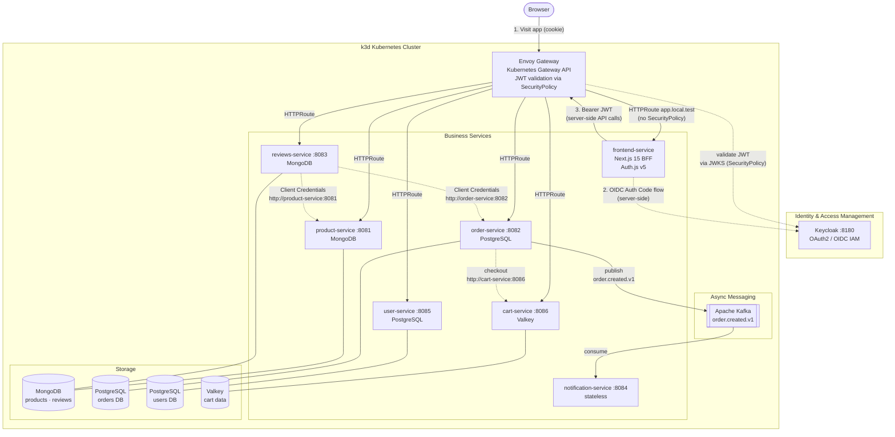
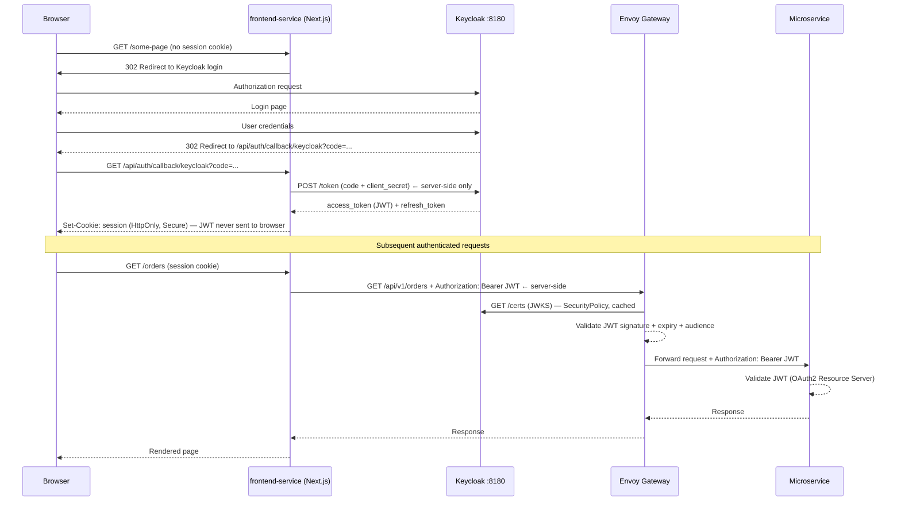
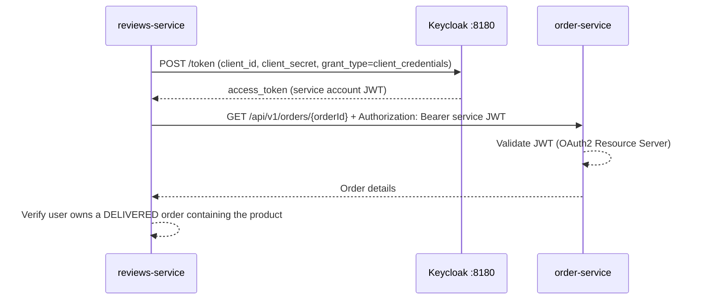
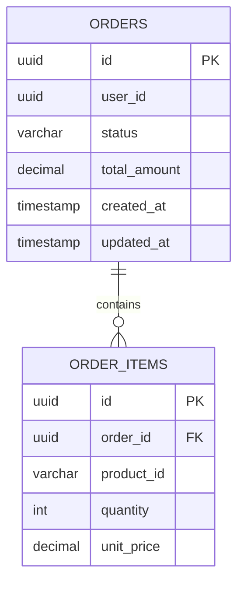
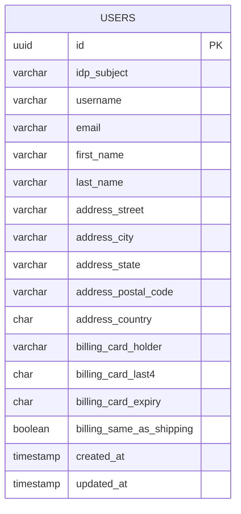
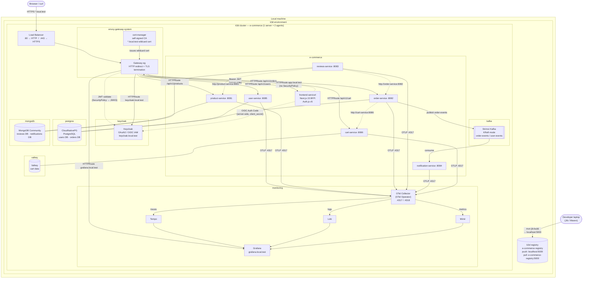

# E-Commerce Microservice Application

Spring Boot microservice-based e-commerce platform implementing:

- **Polyglot persistence** — MongoDB (products, reviews) and PostgreSQL (orders, users)
- **Event-driven architecture** — Apache Kafka (`order.created.v1`)
- **OAuth2 security** — Keycloak as IAM for client authentication and inter-service communication
- **Observability** — OpenTelemetry + Grafana LGTM stack (traces, metrics, logs)

## Table of Contents

- [Microservices Overview](#microservices-overview)
- [Architecture Diagram](#architecture-diagram)
- [Security: OAuth2 + Keycloak](#security-oauth2--keycloak)
- [Service Details](#service-details)
  - [frontend-service](#frontend-service--port-3001-local--stateless)
  - [product-service](#product-service--port-8081--mongodb)
  - [order-service](#order-service--port-8082--postgresql)
  - [reviews-service](#reviews-service--port-8083--mongodb)
  - [notification-service](#notification-service--port-8084--stateless)
  - [user-service](#user-service--port-8085--postgresql)
  - [cart-service](#cart-service--port-8086--valkey)
- [Kafka Events](#kafka-events)
- [Data Models](#data-models)
- [Observability](#observability)
- [Infrastructure](#infrastructure)
- [Prerequisites — mise](#prerequisites--mise)
- [How to Run](#how-to-run)

---

## Microservices Overview

| Service | Port | Database | Responsibility |
|---------|------|----------|----------------|
| `keycloak` | 8180 | H2 (dev) / PostgreSQL (prod) | OAuth2/OIDC IAM — authentication, authorization, token issuance |
| `frontend-service` | 3000 (container) / 3001 (local dev) | stateless | Next.js 15 BFF — server-side OIDC session (Auth.js v5); proxies API calls to microservices |
| `product-service` | 8081 | MongoDB | Product catalog — CRUD and inventory quantities |
| `order-service` | 8082 | PostgreSQL | Order lifecycle management; Kafka producer |
| `reviews-service` | 8083 | MongoDB | Product reviews and ratings — validated against order history |
| `notification-service` | 8084 | stateless | Order event notifications — Kafka consumer |
| `user-service` | 8085 | PostgreSQL | User profile management; delegates identity to Keycloak |
| `cart-service` | 8086 | Valkey | Shopping cart management; consumed by order-service at checkout |

> **Entry point:** External traffic enters through **Envoy Gateway** (Kubernetes Gateway API). There is no Spring Cloud Gateway service — Envoy handles JWT validation via a `SecurityPolicy` referencing the Keycloak JWKS endpoint, then routes directly to Kubernetes services. Service-to-service calls use plain Kubernetes Service DNS (`http://service-name:port`), resolved by kube-proxy — no service discovery library required.

---

## Architecture Diagram



> Service-to-service calls use plain Kubernetes Service DNS (`http://service-name:port`). kube-proxy handles server-side load balancing across pods — no client-side discovery library required. See [design/adr-002-plain-kubernetes-dns-service-calls.md](design/adr-002-plain-kubernetes-dns-service-calls.md) for the full rationale.

---

## Security: OAuth2 + Keycloak

### Overview

Security is centralized in **Keycloak**. No service stores user passwords. Every HTTP request — whether from an external client or between services — carries a signed JWT that each resource server independently validates using Keycloak's JWKS public keys.

### Keycloak Realm Configuration

| Setting | Value |
|---------|-------|
| Realm | `e-commerce` |
| JWKS endpoint | `http://keycloak:8180/realms/e-commerce/protocol/openid-connect/certs` |
| Token endpoint | `http://keycloak:8180/realms/e-commerce/protocol/openid-connect/token` |

One Keycloak client per service (all confidential, with service accounts enabled):

| Keycloak Client ID | Grant Types | Used By |
|--------------------|-------------|---------|
| `e-commerce-web` | Authorization Code (confidential BFF) | `frontend-service` Next.js server (Auth.js v5) |
| `product-service` | Client Credentials | product-service resource server + service account |
| `order-service` | Client Credentials | order-service resource server + service account |
| `reviews-service` | Client Credentials | reviews-service resource server + service account |
| `user-service` | Client Credentials | user-service resource server + service account |
| `notification-service` | Client Credentials | notification-service resource server |
| `cart-service` | Client Credentials | cart-service resource server + service account |

> **`e-commerce-web` is a confidential client** — the `client_secret` lives only in the Next.js server environment (`KEYCLOAK_CLIENT_SECRET`). The browser never sees the JWT; Auth.js manages the OIDC session server-side and issues an HttpOnly cookie to the browser. See [ADR-007](design/adr-007-nextjs-bff-frontend.md).

### Token Flow 1 — User Authentication (Authorization Code — BFF)



### Token Flow 2 — Service-to-Service (Client Credentials Grant)

Used when a service calls another service in a background or validation context (e.g., Reviews Service verifying an order before allowing a review):



### Spring Boot Configuration Per Role

| Service Role | Dependency | Key `application.yaml` property |
|---|---|---|
| Resource Server (all services) | `spring-boot-starter-oauth2-resource-server` | `spring.security.oauth2.resourceserver.jwt.jwk-set-uri` |
| OAuth2 Client (service accounts) | `spring-boot-starter-oauth2-client` | `spring.security.oauth2.client.registration.<id>.grant-type=client_credentials` |

---

## Service Details

### frontend-service · port 3001 (local) / 3000 (container) · stateless

Browser-facing Next.js 15 application implementing the BFF pattern. See [ADR-007](design/adr-007-nextjs-bff-frontend.md) for the full rationale.

| Aspect | Detail |
|--------|--------|
| Framework | Next.js 15 (App Router) |
| Auth library | Auth.js v5 |
| Session storage | Encrypted HttpOnly cookie (JWT never in browser) |
| Keycloak client | `e-commerce-web` (confidential — `client_secret` in server env only) |
| API calls | Server Components / Route Handlers forward `Authorization: Bearer <token>` server-side |
| Envoy HTTPRoute | `app.local.test` — **no `SecurityPolicy`** (Auth.js handles authentication) |
| Local dev port | 3001 (3000 is reserved for Grafana) |

---

### product-service · port 8081 · MongoDB

Manages the product catalog.

**REST API**

| Method | Path | Description | Required Role |
|--------|------|-------------|---------------|
| `GET` | `/api/v1/products` | List products (paginated) | Any authenticated user |
| `GET` | `/api/v1/products/{id}` | Get product by ID | Any authenticated user |
| `POST` | `/api/v1/products` | Create product | `ADMIN` |
| `PUT` | `/api/v1/products/{id}` | Update product | `ADMIN` |
| `DELETE` | `/api/v1/products/{id}` | Delete product | `ADMIN` |

---

### order-service · port 8082 · PostgreSQL

Manages the full order lifecycle. Publishes a Kafka event on every new order.

**REST API**

| Method | Path | Description | Required Role |
|--------|------|-------------|---------------|
| `POST` | `/api/v1/orders` | Place a new order | Any authenticated user |
| `GET` | `/api/v1/orders/{id}` | Get order by ID | Owner or `ADMIN` |
| `GET` | `/api/v1/orders/user/{userId}` | List user's orders | Owner or `ADMIN` |
| `PUT` | `/api/v1/orders/{id}/status` | Update order status | `ADMIN` |

**Kafka event published:** `order.created.v1` — see [Kafka Events](#kafka-events).

---

### reviews-service · port 8083 · MongoDB

Stores product reviews. A review can only be submitted by a user who has a **delivered** order containing the reviewed product.

**REST API**

| Method | Path | Description | Required Role |
|--------|------|-------------|---------------|
| `GET` | `/api/v1/reviews/product/{productId}` | List reviews for a product | Any authenticated user |
| `POST` | `/api/v1/reviews` | Submit a review | Any authenticated user |
| `DELETE` | `/api/v1/reviews/{id}` | Delete own review | Owner |

**Business rule validation (via Client Credentials):**

1. Extract JWT `sub` → call `user-service` resolve endpoint → obtain internal `userId` (cached locally)
2. Call `product-service` → verify the product exists
3. Call `order-service` → verify the internal `userId` has a `DELIVERED` order containing `productId`

---

### notification-service · port 8084 · stateless

Pure Kafka consumer. No REST API. No database. Receives order events and dispatches notifications (email / push / log).

| Property | Value |
|----------|-------|
| Topic | `order.created.v1` |
| Consumer group | `notification-group` |
| Action | Send email / push notification / write to observability pipeline |

---

### user-service · port 8085 · PostgreSQL

Stores user profile data. **Does not store passwords** — Keycloak manages credentials. The `idp_subject` field stores the IAM provider's `sub` UUID, used only within this service for identity resolution.

The profile also holds a **shipping address** and a **billing account** (card display metadata only) that `order-service` uses when processing a purchase order.

> **IAM portability:** `user-service` is the **only** service that knows about Keycloak's `sub`. All other services reference the internal `users.id` UUID. On a future IAM provider migration, only the `idp_subject` column in this one service needs updating. See [design/iam-portability.md](design/iam-portability.md).

**REST API**

| Method | Path | Description | Required Role |
|--------|------|-------------|---------------|
| `GET` | `/api/v1/users/me` | Get own profile (resolved from JWT `sub`) | Any authenticated user |
| `GET` | `/api/v1/users/{id}` | Get user profile by ID | Any authenticated user |
| `GET` | `/api/v1/users/resolve?idp_subject={sub}` | Resolve IAM `sub` → internal user profile | Service account only |
| `PUT` | `/api/v1/users/{id}` | Update own profile (name, address, billing) | Owner |
| `POST` | `/api/v1/users` | Create user profile (lazy registration) | Any authenticated user |

**`PUT /api/v1/users/{id}` request body (all fields optional / patch semantics)**

```json
{
  "firstName": "Jane",
  "lastName":  "Doe",
  "shippingAddress": {
    "street":     "123 Main St",
    "city":       "Springfield",
    "state":      "IL",
    "postalCode": "62701",
    "country":    "US"
  },
  "billingAccount": {
    "cardHolder":    "Jane Doe",
    "cardLast4":     "4242",
    "cardExpiry":    "12/28",
    "sameAsShipping": true
  }
}
```

> **Lazy registration flow:** On every call to `GET /api/v1/users/me`, `user-service` resolves the caller's profile in three steps: **(1)** look up by `idp_subject = sub` — found → return immediately; **(2)** not found → look up by `email` — found → re-link the existing row to the new `sub` and return (handles dev Keycloak resets or IAM migrations without losing user data); **(3)** no email match → create a new profile from the JWT claims (`email`, `given_name`, `family_name`, `preferred_username`). No explicit registration step required.

> **Per-service lazy resolution:** When `order-service` or `reviews-service` needs to associate a user with data, they extract the JWT `sub`, call `GET /api/v1/users/resolve?idp_subject={sub}` to obtain the internal `users.id`, then cache the mapping locally (TTL: 5–15 min). Subsequent requests for the same user skip the resolution call.

---

## Kafka Events

| Topic | Producer | Consumer | Description |
|-------|----------|----------|-------------|
| `order.created.v1` | `order-service` | `notification-service` | Fired when a new order is placed |

### `OrderCreatedEvent` payload

```json
{
  "orderId":     "550e8400-e29b-41d4-a716-446655440000",
  "userId":      "550e8400-e29b-41d4-a716-446655440001",
  "totalAmount": 149.98,
  "itemCount":   2,
  "createdAt":   "2026-04-23T10:00:00Z"
}
```

---

## Data Models

### PostgreSQL — orders DB



**`status` values:** `PENDING` → `CONFIRMED` → `SHIPPED` → `DELIVERED` | `CANCELLED`

---

### PostgreSQL — users DB



> `idp_subject` — the `sub` UUID issued by the IAM provider (Keycloak). Indexed for fast lookup. Used **only** inside `user-service` to link a JWT to the internal profile. Cross-service references always use `id` instead, keeping all other services IAM-agnostic.
>
> **Address** — shipping address used by `order-service` when dispatching orders. All columns are nullable; users fill them in from the Profile page.
>
> **Billing** — only the cardholder name, last-four card digits, and expiry (MM/YY) are stored for display purposes. Full PAN and CVV are **never** persisted.

---

### cart-service · port 8086 · Valkey

Manages the per-user shopping cart. Cart data is stored in **Valkey** (Redis-compatible in-memory cache) with a 7-day TTL keyed by `cart:{userId}`. `order-service` reads the cart at checkout and calls `DELETE /api/v1/cart` to clear it after a successful order placement.

**REST API**

| Method | Path | Description | Required Role |
|--------|------|-------------|---------------|
| `GET` | `/api/v1/cart` | Get own cart (resolved from JWT `sub`) | Any authenticated user |
| `PUT` | `/api/v1/cart/items/{productId}` | Add / update item (qty=0 removes the item) | Any authenticated user |
| `DELETE` | `/api/v1/cart/items/{productId}` | Remove a single item from the cart | Any authenticated user |
| `DELETE` | `/api/v1/cart` | Clear entire cart (called by order-service after checkout) | Any authenticated user |

**Cart data model (Valkey)**

Each cart is stored as a single JSON value under key `cart:{userId}` with a TTL of 7 days.

```json
{
  "userId":     "550e8400-e29b-41d4-a716-446655440001",
  "items": [
    {
      "productId":   "64b1f2c3d4e5f6a7b8c9d0e1",
      "productName": "Wireless Keyboard",
      "price":       49.99,
      "quantity":    2,
      "lineTotal":   99.98
    }
  ],
  "totalItems": 2,
  "grandTotal": 99.98,
  "expiresAt":  "2026-05-01T10:00:00Z"
}
```

---

### MongoDB — products collection

```json
{
  "_id":         "ObjectId",
  "name":        "string",
  "description": "string",
  "price":       "Decimal128",
  "category":    "string",
  "imageUrl":    "string",
  "stockQty":    "int32",
  "createdAt":   "Date",
  "updatedAt":   "Date"
}
```

### MongoDB — reviews collection

```json
{
  "_id":       "ObjectId",
  "productId": "string  (MongoDB ObjectId ref → products collection)",
  "orderId":   "string  (UUID ref → PostgreSQL orders.id)",
  "userId":    "string  (internal users.id UUID — resolved via user-service)",
  "rating":    "int32   (1–5)",
  "comment":   "string",
  "createdAt": "Date"
}
```

---

## Observability

All services export traces, metrics, and logs via the **OTLP protocol**. The pipeline differs between the two environments but the Spring Boot configuration remains the same in both — only the OTLP endpoint URL changes.

| Signal | Backend | Spring Boot integration |
|--------|---------|------------------------|
| **Traces** | Grafana Tempo | `spring-boot-starter-opentelemetry` — W3C TraceContext propagation |
| **Logs** | Grafana Loki | Logback `OpenTelemetryAppender` — logs correlated with trace IDs |
| **Metrics** | Grafana Mimir | Micrometer via OTLP — JVM, HTTP server, Kafka consumer lag |

---

### Local Development — `grafana/otel-lgtm` (all-in-one)

In the Docker Compose environment a single `grafana/otel-lgtm` container provides the full OTLP receiver, Loki, Tempo, Mimir (Prometheus-compatible), and Grafana UI. Services send OTLP directly to it.

```
  ┌──────────────────────────────────────────┐
  │  Spring Boot service                     │
  │  OTLP endpoint: http://localhost:4318    │
  └────────────────────┬─────────────────────┘
                       │ OTLP HTTP :4318 / gRPC :4317
          ┌────────────▼────────────┐
          │   grafana/otel-lgtm     │  ← Docker Compose  (profile: observability)
          │   all-in-one image      │
          │                         │
          │  ┌─────┐ ┌─────┐ ┌───┐ │
          │  │Loki │ │Tempo│ │ M │ │  M = Mimir (Prometheus-compatible)
          │  └─────┘ └─────┘ └───┘ │
          │       Grafana :3000     │
          └─────────────────────────┘
```

OTLP endpoint used by Spring Boot services: `http://localhost:4318`

---

### Staging (k3d) — OpenTelemetry Operator + lgtm-distributed

In the Kubernetes staging cluster, the **OpenTelemetry Operator** manages a central `OpenTelemetryCollector` deployment. Services send a single OTLP stream to the collector, which fans it out to the dedicated backends provided by the **`lgtm-distributed`** Helm chart.

```
  ┌──────────────────────────────────────────────────────┐
  │  Spring Boot service (namespace: e-commerce)         │
  │  OTLP endpoint: otel-collector.monitoring:4317       │
  └──────────────────────────┬───────────────────────────┘
                             │ OTLP gRPC :4317
          ┌──────────────────▼──────────────────────────┐
          │   OpenTelemetryCollector  (namespace: monitoring)  │
          │   managed by opentelemetry-operator          │
          │                                              │
          │  receivers:  otlp (gRPC :4317, HTTP :4318)  │
          │  processors: memory_limiter → batch          │
          │              → resource/staging              │
          └────┬────────────────┬──────────────┬─────────┘
               │ traces         │ logs         │ metrics
               ▼                ▼              ▼
  ┌────────────────┐  ┌──────────────┐  ┌────────────────────┐
  │ Tempo          │  │ Loki         │  │ Mimir              │
  │ distributor    │  │ gateway      │  │ nginx              │
  │ :4317 (gRPC)   │  │ :3100 (HTTP) │  │ :80/otlp (HTTP)    │
  └───────┬────────┘  └──────┬───────┘  └────────┬───────────┘
          └──────────────────┴──────────────────┘
                             │
                    ┌────────▼────────┐
                    │  Grafana UI     │
                    │  grafana.local.test  │
                    └─────────────────┘
```

All components run in the `monitoring` namespace:

| Component | Helm release | Service (cluster-internal) |
|-----------|-------------|---------------------------|
| OTel Collector | `opentelemetry-operator` (CR: `otel`) | `otel-collector.monitoring:4317/4318` |
| Loki gateway | `lgtm` (lgtm-distributed) | `lgtm-loki-gateway.monitoring:3100` |
| Tempo distributor | `lgtm` (lgtm-distributed) | `lgtm-tempo-distributor.monitoring:4317` |
| Mimir nginx | `lgtm` (lgtm-distributed) | `lgtm-mimir-distributed-nginx.monitoring:80` |
| Grafana UI | `lgtm` (lgtm-distributed) | `https://grafana.local.test` (via Envoy Gateway) |

---

## Infrastructure

### Local Development — Docker Compose

For local development without Kubernetes, all infrastructure runs via Docker Compose and services run directly with `mvn spring-boot:run` (via `make`). `compose.yaml` uses **profiles** so each microservice activates only the containers it needs.

| Container | Image | Host Port | Compose Profile | Description |
|-----------|-------|-----------|-----------------|-------------|
| `grafana-lgtm` | `grafana/otel-lgtm:latest` | 3000, 4317, 4318 | `observability` | Observability stack (Loki, Tempo, Prometheus, Grafana) |
| `postgres` | `postgres:16-alpine` | 5432 | `infra` | Single PostgreSQL instance — one database per service |
| `mongo` | `mongo:7` | 27017 | `infra` | Single MongoDB instance — one database per service |
| `valkey` | `valkey/valkey:8-alpine` | 6379 | `infra` | Valkey cache — shopping carts (TTL 7 days) |
| `keycloak` | `quay.io/keycloak/keycloak:26.0` | 8180 | `auth` | OAuth2 / OIDC IAM — realm `e-commerce` auto-imported |

> **Profiles:** `infra` starts the shared databases (PostgreSQL + MongoDB + Valkey); `auth` starts Keycloak; `observability` starts the Grafana LGTM stack. All three are started together via `make infra-up`.

> **Keycloak realm auto-import:** `docker/keycloak/realm-e-commerce.json` is volume-mounted into Keycloak's import directory. On first start Keycloak creates realm `e-commerce` with client scopes, clients, and test users automatically — no manual Admin Console steps required.

> **Database-per-service isolation:** Each service connects to its own named database within the shared PostgreSQL (or MongoDB) instance using dedicated credentials. The `docker/postgres/init-databases.sh` init script creates all databases and users on first container start. This preserves the database-per-service isolation principle while avoiding the overhead of multiple container instances.

---

### Kubernetes Deployment — k3d

The target deployment environment is a **k3d** cluster (k3s running inside Docker). k3d provides a full Kubernetes environment locally without a cloud provider.

#### Architecture diagram



#### Cluster layout

| Namespace | Contents |
|-----------|----------|
| `e-commerce` | All business microservices |
| `envoy-gateway-system` | Envoy Gateway controller + cert-manager |
| `keycloak` | Keycloak operator + instance |
| `kafka` | Strimzi operator + Kafka cluster |
| `mongodb` | MongoDB Community operator + replica set |
| `postgres` | CloudNativePG operator + PostgreSQL cluster |
| `valkey` | Valkey single-instance Deployment (cart cache) |
| `monitoring` | OTel Operator, OTel Collector, Grafana LGTM stack |

#### `k8s/` directory layout

```
k8s/
├── k3d-cluster.yaml                    ← k3d cluster definition (1 server, 2 agents)
├── namespaces.yaml                     ← all namespaces
├── helm/                               ← Helm values for each operator
│   ├── cert-manager-values.yaml
│   ├── envoy-gateway-values.yaml
│   ├── strimzi-operator-values.yaml
│   ├── cnpg-operator-values.yaml
│   ├── mongodb-operator-values.yaml
│   ├── keycloak-operator-values.yaml   ← install notes (no Helm chart)
│   ├── lgtm-distributed-values.yaml   ← Grafana LGTM (Loki + Tempo + Mimir + Grafana)
│   └── otel-operator-values.yaml      ← OpenTelemetry Operator
├── infra/                              ← Kustomize apps — operator-managed CRs
│   ├── cert-manager/
│   │   ├── kustomization.yaml
│   │   ├── cluster-issuer.yaml         ← self-signed bootstrap issuer + CA ClusterIssuer
│   │   └── wildcard-certificate.yaml   ← *.local.test wildcard TLS cert
│   ├── postgres/
│   │   ├── kustomization.yaml
│   │   ├── cluster.yaml                ← CNPG Cluster CR
│   │   └── databases.yaml              ← CNPG Database CRs (one per service)
│   ├── mongodb/
│   │   ├── kustomization.yaml
│   │   └── community.yaml              ← MongoDBCommunity CR
│   ├── kafka/
│   │   ├── kustomization.yaml
│   │   ├── cluster.yaml                ← Strimzi Kafka CR (KRaft mode)
│   │   └── topics.yaml                 ← KafkaTopic CRs
│   ├── keycloak/
│   │   ├── kustomization.yaml
│   │   ├── operator/                   ← Kustomize app — Keycloak Operator (CRDs + Deployment)
│   │   │   ├── kustomization.yaml
│   │   │   └── namespace.yaml
│   │   ├── keycloak.yaml               ← Keycloak CR
│   │   └── realm-import.yaml           ← KeycloakRealmImport CR
│   ├── otel-collector/
│   │   ├── kustomization.yaml
│   │   └── collector.yaml              ← OpenTelemetryCollector CR (OTLP → Tempo/Loki/Mimir)
│   └── valkey/
│       ├── kustomization.yaml
│       ├── deployment.yaml             ← single-replica Valkey Deployment (namespace: valkey)
│       └── service.yaml                ← ClusterIP Service :6379
├── envoy-gateway/                      ← Kustomize app — Gateway API resources
│   ├── kustomization.yaml
│   ├── gateway-class.yaml
│   ├── gateway.yaml                    ← HTTP redirect + HTTPS TLS termination
│   ├── httproutes.yaml                 ← HTTPRoute per service (frontend has no SecurityPolicy)
│   └── security-policy.yaml           ← JWT SecurityPolicy (Keycloak JWKS)
└── apps/                               ← Kustomize apps — business services
    ├── frontend-service/
    │   ├── base/                       ← Deployment, Service, Secret ref (AUTH_SECRET, AUTH_KEYCLOAK_SECRET)
    │   └── overlays/
    │       └── staging/               ← image tag patch + AUTH_KEYCLOAK_ISSUER env
    └── user-service/
        ├── base/                       ← Deployment, Service, ConfigMap, ServiceAccount, RBAC
        └── overlays/
            └── staging/               ← image tag patch + env-specific config
    └── cart-service/
        ├── base/                       ← Deployment, Service, ConfigMap, ServiceAccount
        └── overlays/
            └── staging/               ← image tag patch + env-specific config
```

#### Envoy Gateway routing

Envoy Gateway implements the [Kubernetes Gateway API](https://gateway-api.sigs.k8s.io/). A single `Gateway` resource in `envoy-gateway-system` terminates TLS (wildcard cert `*.local.test` issued by cert-manager) and exposes two listeners:

- **HTTP (:80)** — redirects all traffic to HTTPS
- **HTTPS (:443)** — terminates TLS and routes to services in the `e-commerce` namespace

JWT validation is enforced per `HTTPRoute` via a `SecurityPolicy` pointing to the Keycloak JWKS endpoint at `https://keycloak.local.test/realms/e-commerce/protocol/openid-connect/certs`. Each business service has a dedicated `HTTPRoute` matching its `/api/v1/<resource>` prefix.

#### Service-to-Service Calls

Services call each other using plain Kubernetes Service DNS (`http://service-name:port`). kube-proxy handles server-side load balancing across pods — no `spring-cloud-starter-kubernetes-client-loadbalancer` or Eureka required, and no RBAC permissions to the Kubernetes API are needed. See [design/adr-002-plain-kubernetes-dns-service-calls.md](design/adr-002-plain-kubernetes-dns-service-calls.md).

---

## Prerequisites — mise

All developer tools are version-pinned in [`.mise.toml`](.mise.toml) at the repository root (see [ADR-008](design/adr-008-mise-tool-version-management.md)). Install [mise](https://mise.jdx.dev) once, then run `mise install` to get every tool at the exact declared version — no `sudo`, no OS-specific steps.

```bash
# 1. Install mise (one-time, per machine)
curl https://mise.run | sh
echo 'eval "$(mise activate bash)"' >> ~/.bashrc
source ~/.bashrc

# 2. Install all project tools (re-run after pulling changes to .mise.toml)
mise install

# 3. Verify
mise doctor
```

**Tools installed by `.mise.toml`:**

| Tool | Pinned version | Used by |
|------|---------------|---------|
| `java` (Temurin) | 25 | All Spring Boot services |
| `maven` | 3.9 | Building / running services |
| `node` | 22 | frontend-service dev server + image build |
| `kubectl` | latest | Option B — k3d staging |
| `helm` | latest | Option B — operator install |
| `k3d` | latest | Option B — cluster management |
| `kustomize` | latest | Option B — k8s manifests |
| `jq` | latest | Makefile token helpers |

> **Docker** is the only prerequisite not managed by mise — the Docker daemon requires OS-level integration that a user-space tool manager cannot provide. Install it separately:
> ```bash
> curl -fsSL https://get.docker.com | sh
> sudo usermod -aG docker $USER   # re-login after this
> ```

---

## How to Run

### Option A — Local Development (Docker Compose + Makefile)

#### Prerequisites
- Docker & Docker Compose v2 (see above)
- All other tools via `mise install` (Java 25, Maven 3.9, Node.js 22, `jq`)
- `curl` (standard on Linux/macOS)

The root `Makefile` provides per-service targets. Run `make help` to see all targets.


#### user-service

```bash
# 1. Start infrastructure (postgres-users + keycloak + grafana-lgtm)
#    Blocks until all healthchecks pass (~60–90 s on first run)
make infra-up

# 2. Build JAR and run with Spring profile 'local'
#    (disables Kubernetes discovery; uses static URLs)
make us-run

# Shortcut: infra-up + run in one command
make us-dev
```

> The `local` Spring profile is no longer needed for service discovery (DiscoveryClient has been removed). Services use plain Kubernetes Service DNS in-cluster, and static `application.yaml` defaults for local development — no cluster required.

**Get a token and call the API:**

```bash
# User token — Authorization Code flow (opens browser for Keycloak login)
# Requires: oauth2c installed (via `mise install`)
TOKEN=$(make -s us-token)
curl -s -w "\nHTTP %{http_code}\n" -H "Authorization: Bearer $TOKEN" http://localhost:8085/api/v1/users/me

# Service-account token (client credentials — no browser required)
SA_TOKEN=$(make -s us-token-sa)
curl -H "Authorization: Bearer $SA_TOKEN" \
     "http://localhost:8085/api/v1/users/resolve?idp_subject=<sub>"
```

> `make us-token` uses [oauth2c](https://github.com/cloudentity/oauth2c) to perform the
> Authorization Code flow. A browser window opens to the Keycloak login page; after login,
> the token is captured automatically. See [ADR-011](design/adr-011-oauth2c-local-api-testing.md)
> for rationale (password grant is disabled on the BFF client).

**Access points:**

| URL | Description |
|-----|-------------|
| `http://localhost:3001` | frontend-service (Next.js dev server) |
| `http://localhost:8081/swagger-ui.html` | product-service Swagger UI |
| `http://localhost:8082/swagger-ui.html` | order-service Swagger UI |
| `http://localhost:8086/swagger-ui.html` | cart-service Swagger UI |
| `http://localhost:8180/swagger-ui.html` | Keycloak Admin Console |
| `http://localhost:3000` | Grafana Dashboards |

**Keycloak test accounts (auto-configured via realm import):**

| Username | Password | Client Role | Granted Scopes |
|----------|----------|-------------|----------------|
| `testuser` | `password` | `customer` on `e-commerce-web` | `openid profile email products:read orders:read orders:write reviews:read reviews:write users:read cart:read cart:write` |
| `otheruser` | `password` | `customer` on `e-commerce-web` | `openid profile email products:read orders:read orders:write reviews:read reviews:write users:read cart:read cart:write` |
| `e-commerce-service` (client) | `e-commerce-service-secret` | — (M2M client credentials) | `users:resolve` |

**Stopping infrastructure:**

```bash
make infra-down    # stop containers, keep data volumes
make infra-clean   # stop containers AND delete data volumes
```

---

#### product-service

```bash
# 1. Start infrastructure (mongodb + keycloak + grafana-lgtm)
make infra-up

# 2. Build JAR and run
make ps-run

# Shortcut: infra-up + run in one command
make ps-dev
```

**Seed the product catalog (books — sci-fi & fantasy):**

The MongoDB container auto-seeds on first start via `docker/mongo/init-products.js`. If the data volume already exists you can re-run the seed explicitly:

```bash
make ps-seed   # idempotent — skips silently if catalog already populated
```

To wipe and re-seed from scratch:

```bash
make infra-clean   # destroy volumes
make infra-up      # re-create containers → init script runs automatically
```

**Call the API (token from any running Keycloak session):**

```bash
# Obtain a user token via Authorization Code flow (reuses the same Keycloak as user-service)
TOKEN=$(make -s us-token)

# List all products (paginated)
curl -s -H "Authorization: Bearer $TOKEN" \
     "http://localhost:8081/api/v1/products" | jq .

# Filter by category
curl -s -H "Authorization: Bearer $TOKEN" \
     "http://localhost:8081/api/v1/products?category=science-fiction" | jq .
curl -s -H "Authorization: Bearer $TOKEN" \
     "http://localhost:8081/api/v1/products?category=fantasy" | jq .
```

**Stopping infrastructure:**

```bash
make infra-down    # stop containers, keep data volumes
make infra-clean   # stop containers AND delete data volumes
```

---

#### frontend-service

```bash
# 1. Copy the example env file and fill in required values
cd frontend-service
cp .env.local.example .env.local
# Edit .env.local:
#   AUTH_SECRET=<openssl rand -base64 32>
#   AUTH_KEYCLOAK_SECRET=<e-commerce-web client secret from Keycloak>

# 2. Install dependencies
npm install

# 3. Start the dev server on http://localhost:3001
npm run dev
```

Make sure Keycloak is running (`make us-infra-up`) before starting the frontend — Auth.js needs to reach the Keycloak OIDC discovery endpoint at `http://localhost:8180/realms/e-commerce`.
Make sure Keycloak is running (`make infra-up`) before starting the frontend — Auth.js needs to reach the Keycloak OIDC discovery endpoint at `http://localhost:8180/realms/e-commerce`.

**Frontend source layout:**

```
frontend-service/
├── .env.local.example     ← copy to .env.local; fill AUTH_SECRET + AUTH_KEYCLOAK_SECRET
├── Dockerfile             ← multi-stage build; output:standalone for k8s
├── next.config.ts         ← output:"standalone" enabled
├── package.json           ← Next.js 15, next-auth 5.0.0-beta (Auth.js v5), React 19; dev port 3001
└── src/
    ├── auth.ts            ← Auth.js v5: Keycloak provider, JWT/session callbacks, token refresh
    ├── middleware.ts      ← protects all routes (redirects to Keycloak login if no session)
    ├── types/
    │   └── next-auth.d.ts ← Session augmented with accessToken + error fields
    ├── lib/
    │   └── api.ts         ← apiFetch() — forwards Bearer JWT server-side to microservices
    └── app/
        ├── layout.tsx     ← root layout with Nav server component
        ├── page.tsx       ← home page (welcome + links)
        ├── api/auth/[...nextauth]/route.ts  ← Auth.js OIDC callback handler
        ├── components/
        │   └── nav.tsx    ← server component: shows user email + sign-out
        ├── products/
        │   └── page.tsx   ← server component: lists products from product-service
        └── orders/
            └── page.tsx   ← server component: lists user orders from order-service
```

---

### Option B — Kubernetes Staging (k3d)

The staging environment runs a full **k3d** cluster (k3s inside Docker) on your laptop. The cluster definition lives in `k8s/k3d-cluster.yaml`. All services are exposed via the `.local.test` domain, which resolves automatically on the local machine.

#### Prerequisites

All tools except Docker are installed via `mise install` (see [Prerequisites — mise](#prerequisites--mise)).

| Tool | Pinned in `.mise.toml` |
|------|------------------------|
| Docker 24+ | manual — `get.docker.com` |
| k3d | `latest` |
| kubectl | `latest` |
| helm | `latest` |
| kustomize | `latest` |
| Java 25 (Temurin) | `temurin-25` |
| Maven 3.9 | `3.9` |
| Node.js 22 | `22` |

#### 1. Create the cluster

```bash
make k3d-create
```

This creates cluster `e-commerce` (1 control-plane + 2 worker nodes) with:
- Ports 80/443 mapped to the k3d load-balancer (Envoy Gateway)
- Local image registry at `localhost:5000`
- Traefik disabled
- Host aliases for `api.local.test`, `keycloak.local.test`, `grafana.local.test`

#### 2. Install operators (once per cluster)

```bash
make k8s-operators
```

Installs via Helm / kubectl:

| Operator | Namespace | Method |
|----------|-----------|--------|
| cert-manager | `cert-manager` | Helm (`jetstack/cert-manager`) |
| Envoy Gateway | `envoy-gateway-system` | Helm OCI (`gateway-helm`) |
| Strimzi Kafka | `kafka` | Helm OCI (`strimzi-kafka-operator`) |
| CloudNativePG | `cnpg-system` | Helm (`cnpg/cloudnative-pg`) |
| MongoDB Community | `mongodb` | Helm (`mongodb/community-operator`) |
| Keycloak Operator | `keycloak` | `kubectl apply` (no Helm chart) |
| OpenTelemetry Operator | `monitoring` | Helm (`open-telemetry/opentelemetry-operator`) |

#### 3. Create required secrets

Before deploying infrastructure, create the secrets that are not committed to git:

```bash
# PostgreSQL superuser (CNPG bootstrap)
kubectl create secret generic postgres-superuser-secret \
  --from-literal=username=postgres --from-literal=password=<CHANGE_ME> \
  --namespace postgres

# Keycloak admin credentials
kubectl create secret generic keycloak-admin-secret \
  --from-literal=username=admin --from-literal=password=<CHANGE_ME> \
  --namespace keycloak

# Keycloak → PostgreSQL credentials
kubectl create secret generic keycloak-db-secret \
  --from-literal=username=keycloak_owner --from-literal=password=<CHANGE_ME> \
  --namespace keycloak

# MongoDB per-service credentials
kubectl create secret generic mongodb-reviews-secret \
  --from-literal=password=<CHANGE_ME> --namespace mongodb
kubectl create secret generic mongodb-notifications-secret \
  --from-literal=password=<CHANGE_ME> --namespace mongodb

# Grafana admin credentials
kubectl create secret generic grafana-admin-secret \
  --from-literal=username=admin --from-literal=password=<CHANGE_ME> \
  --namespace monitoring

# frontend-service — Auth.js session key + Keycloak BFF client secret
kubectl create secret generic frontend-service-secret \
  --from-literal=AUTH_SECRET=$(openssl rand -base64 32) \
  --from-literal=AUTH_KEYCLOAK_SECRET=<e-commerce-web-client-secret> \
  --namespace e-commerce
```

#### 4. Deploy infrastructure resources

```bash
make k8s-infra
```

Or deploy each component individually:

```bash
make k8s-infra-cert-manager    # self-signed CA + *.local.test wildcard cert
make k8s-infra-postgres        # CNPG PostgreSQL cluster + per-service databases
make k8s-infra-mongodb         # MongoDB replica set
make k8s-infra-valkey          # Valkey cache Deployment (namespace: valkey)
make k8s-infra-kafka           # Kafka cluster + topics
make k8s-infra-keycloak        # Keycloak instance + realm import
make k8s-infra-envoy-gateway   # GatewayClass, Gateway, HTTPRoutes, SecurityPolicy
make k8s-infra-monitoring      # Grafana LGTM stack
make k8s-infra-otel-collector  # OpenTelemetry Collector (fan-out to Tempo/Loki/Mimir)
```

#### 5. Build and push service images

```bash
# Build user-service image and push to the k3d local registry
make k8s-us-image

# Build cart-service image and push to the k3d local registry
make k8s-cs-image
```

#### 6. Deploy services

```bash
make k8s-apps-deploy
```

Or deploy an individual service:

```bash
make k8s-us-deploy   # user-service only
make k8s-cs-deploy   # cart-service only
```

#### One-shot full setup

```bash
make k8s-up   # k3d-create + k8s-operators + k8s-infra
```

#### Access points (staging)

| URL | Description |
|-----|-------------|
| `https://app.local.test` | frontend-service (Next.js BFF) |
| `https://api.local.test/api/v1/users` | user-service via Envoy Gateway |
| `https://api.local.test/api/v1/cart` | cart-service via Envoy Gateway |
| `https://keycloak.local.test` | Keycloak Admin Console |
| `https://grafana.local.test` | Grafana Dashboards |

> TLS is terminated at the Envoy Gateway using a self-signed `*.local.test` wildcard certificate issued by cert-manager. Add the CA to your browser trust store to avoid certificate warnings (see `k8s/infra/cert-manager/cluster-issuer.yaml`).

---

*Built with Java 25 · Spring Boot 4 · Next.js 15 · Auth.js v5 · Apache Kafka · MongoDB · PostgreSQL · Valkey · Keycloak · Envoy Gateway · OpenTelemetry · k3d*


