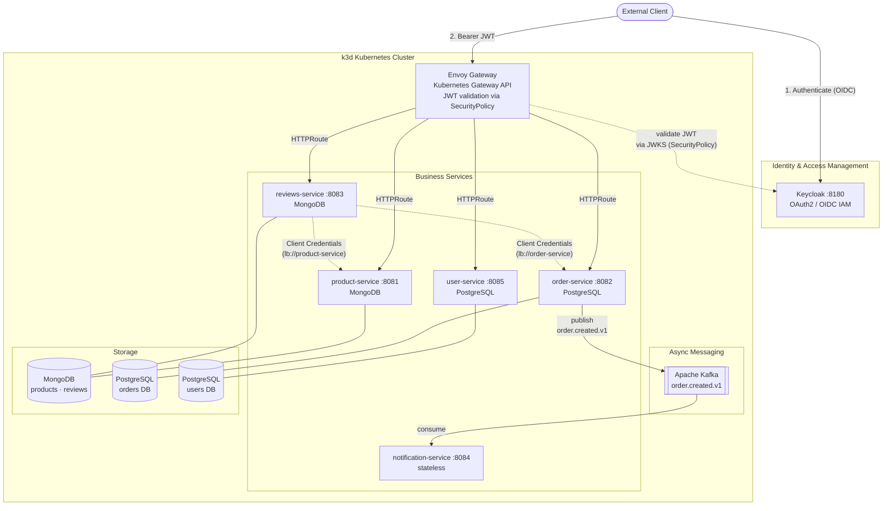
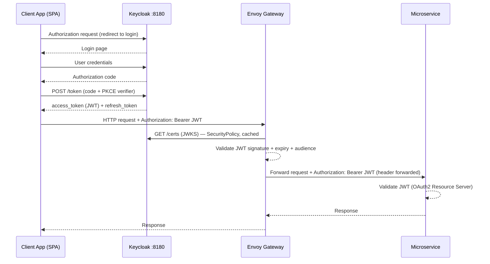
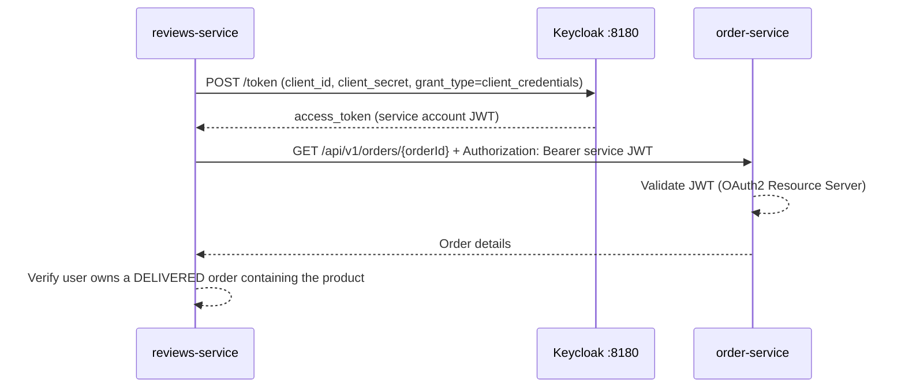
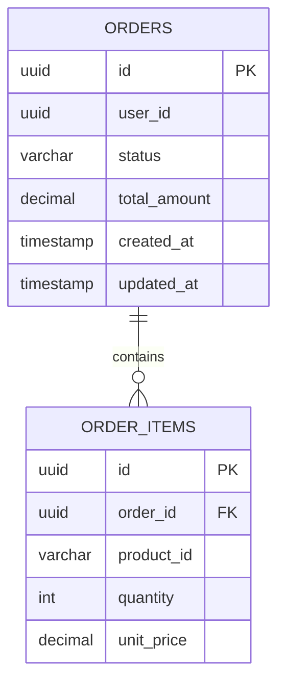
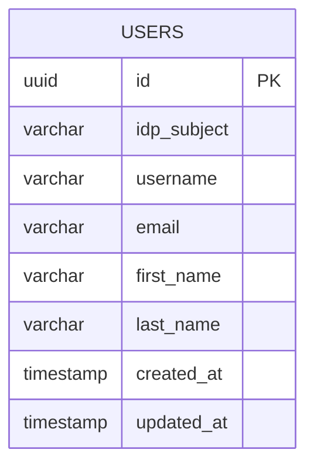

# E-Commerce Microservice Application

Spring Boot microservice-based e-commerce platform implementing:

- **Polyglot persistence** — MongoDB (products, reviews) and PostgreSQL (orders, users)
- **Event-driven architecture** — Apache Kafka (`order.created.v1`)
- **OAuth2 security** — Keycloak as IAM for client authentication and inter-service communication
- **Observability** — OpenTelemetry + Grafana LGTM stack (traces, metrics, logs)

## Table of Contents

- [Microservices Overview](#microservices-overview)
- [Architecture Diagram](#architecture-diagram)
- [Security: OAuth2 + Keycloak](#security-oauth2--keycloak)
- [Service Details](#service-details)
- [Kafka Events](#kafka-events)
- [Data Models](#data-models)
- [Observability](#observability)
- [Infrastructure](#infrastructure)
- [How to Run](#how-to-run)

---

## Microservices Overview

| Service | Port | Database | Responsibility |
|---------|------|----------|----------------|
| `keycloak` | 8180 | H2 (dev) / PostgreSQL (prod) | OAuth2/OIDC IAM — authentication, authorization, token issuance |
| `product-service` | 8081 | MongoDB | Product catalog — CRUD and inventory quantities |
| `order-service` | 8082 | PostgreSQL | Order lifecycle management; Kafka producer |
| `reviews-service` | 8083 | MongoDB | Product reviews and ratings — validated against order history |
| `notification-service` | 8084 | stateless | Order event notifications — Kafka consumer |
| `user-service` | 8085 | PostgreSQL | User profile management; delegates identity to Keycloak |

> **Entry point:** External traffic enters through **Envoy Gateway** (Kubernetes Gateway API). There is no Spring Cloud Gateway service — Envoy handles JWT validation via a `SecurityPolicy` referencing the Keycloak JWKS endpoint, then routes directly to Kubernetes services. Service-to-service calls use Spring Cloud Kubernetes DiscoveryClient (`lb://` URIs).

---

## Architecture Diagram



> `lb://service-name` URIs in service-to-service calls are resolved by **Spring Cloud Kubernetes DiscoveryClient**, which reads Kubernetes `Service` and `Endpoints` resources from the cluster API — no Eureka server required.

---

## Security: OAuth2 + Keycloak

### Overview

Security is centralized in **Keycloak**. No service stores user passwords. Every HTTP request — whether from an external client or between services — carries a signed JWT that each resource server independently validates using Keycloak's JWKS public keys.

### Keycloak Realm Configuration

| Setting | Value |
|---------|-------|
| Realm | `e-commerce` |
| JWKS endpoint | `http://keycloak:8180/realms/e-commerce/protocol/openid-connect/certs` |
| Token endpoint | `http://keycloak:8180/realms/e-commerce/protocol/openid-connect/token` |

One Keycloak client per service (all confidential, with service accounts enabled):

| Keycloak Client ID | Grant Types | Used By |
|--------------------|-------------|---------|
| `product-service` | Client Credentials | product-service resource server + service account |
| `order-service` | Client Credentials | order-service resource server + service account |
| `reviews-service` | Client Credentials | reviews-service resource server + service account |
| `user-service` | Client Credentials | user-service resource server + service account |
| `notification-service` | Client Credentials | notification-service resource server |

> **No `api-gateway` Keycloak client** — the frontend SPA handles the OIDC Authorization Code + PKCE flow directly with Keycloak. Envoy Gateway validates the resulting JWT via the Keycloak JWKS endpoint (no client secret required on the gateway).

### Token Flow 1 — User Authentication (Authorization Code + PKCE)



### Token Flow 2 — Service-to-Service (Client Credentials Grant)

Used when a service calls another service in a background or validation context (e.g., Reviews Service verifying an order before allowing a review):



### Spring Boot Configuration Per Role

| Service Role | Dependency | Key `application.yaml` property |
|---|---|---|
| Resource Server (all services) | `spring-boot-starter-oauth2-resource-server` | `spring.security.oauth2.resourceserver.jwt.jwk-set-uri` |
| OAuth2 Client (service accounts) | `spring-boot-starter-oauth2-client` | `spring.security.oauth2.client.registration.<id>.grant-type=client_credentials` |
| Kubernetes service discovery (all services) | `spring-cloud-starter-kubernetes-client-loadbalancer` | `spring.cloud.kubernetes.discovery.enabled=true` |

---

## Service Details

### product-service · port 8081 · MongoDB

Manages the product catalog.

**REST API**

| Method | Path | Description | Required Role |
|--------|------|-------------|---------------|
| `GET` | `/api/v1/products` | List products (paginated) | Any authenticated user |
| `GET` | `/api/v1/products/{id}` | Get product by ID | Any authenticated user |
| `POST` | `/api/v1/products` | Create product | `ADMIN` |
| `PUT` | `/api/v1/products/{id}` | Update product | `ADMIN` |
| `DELETE` | `/api/v1/products/{id}` | Delete product | `ADMIN` |

---

### order-service · port 8082 · PostgreSQL

Manages the full order lifecycle. Publishes a Kafka event on every new order.

**REST API**

| Method | Path | Description | Required Role |
|--------|------|-------------|---------------|
| `POST` | `/api/v1/orders` | Place a new order | Any authenticated user |
| `GET` | `/api/v1/orders/{id}` | Get order by ID | Owner or `ADMIN` |
| `GET` | `/api/v1/orders/user/{userId}` | List user's orders | Owner or `ADMIN` |
| `PUT` | `/api/v1/orders/{id}/status` | Update order status | `ADMIN` |

**Kafka event published:** `order.created.v1` — see [Kafka Events](#kafka-events).

---

### reviews-service · port 8083 · MongoDB

Stores product reviews. A review can only be submitted by a user who has a **delivered** order containing the reviewed product.

**REST API**

| Method | Path | Description | Required Role |
|--------|------|-------------|---------------|
| `GET` | `/api/v1/reviews/product/{productId}` | List reviews for a product | Any authenticated user |
| `POST` | `/api/v1/reviews` | Submit a review | Any authenticated user |
| `DELETE` | `/api/v1/reviews/{id}` | Delete own review | Owner |

**Business rule validation (via Client Credentials):**

1. Extract JWT `sub` → call `user-service` resolve endpoint → obtain internal `userId` (cached locally)
2. Call `product-service` → verify the product exists
3. Call `order-service` → verify the internal `userId` has a `DELIVERED` order containing `productId`

---

### notification-service · port 8084 · stateless

Pure Kafka consumer. No REST API. No database. Receives order events and dispatches notifications (email / push / log).

| Property | Value |
|----------|-------|
| Topic | `order.created.v1` |
| Consumer group | `notification-group` |
| Action | Send email / push notification / write to observability pipeline |

---

### user-service · port 8085 · PostgreSQL

Stores user profile data. **Does not store passwords** — Keycloak manages credentials. The `idp_subject` field stores the IAM provider's `sub` UUID, used only within this service for identity resolution.

> **IAM portability:** `user-service` is the **only** service that knows about Keycloak's `sub`. All other services reference the internal `users.id` UUID. On a future IAM provider migration, only the `idp_subject` column in this one service needs updating. See [design/iam-portability.md](design/iam-portability.md).

**REST API**

| Method | Path | Description | Required Role |
|--------|------|-------------|---------------|
| `GET` | `/api/v1/users/me` | Get own profile (resolved from JWT `sub`) | Any authenticated user |
| `GET` | `/api/v1/users/{id}` | Get user profile by ID | Any authenticated user |
| `GET` | `/api/v1/users/resolve?idp_subject={sub}` | Resolve IAM `sub` → internal user profile | Service account only |
| `PUT` | `/api/v1/users/{id}` | Update own profile | Owner |
| `POST` | `/api/v1/users` | Create user profile (lazy registration) | Any authenticated user |

> **Lazy registration flow:** On the first call to `GET /api/v1/users/me`, if no profile exists for the JWT `sub`, `user-service` auto-creates it using claims from the JWT (`email`, `given_name`, `family_name`, `preferred_username`). No explicit registration step required.

> **Per-service lazy resolution:** When `order-service` or `reviews-service` needs to associate a user with data, they extract the JWT `sub`, call `GET /api/v1/users/resolve?idp_subject={sub}` to obtain the internal `users.id`, then cache the mapping locally (TTL: 5–15 min). Subsequent requests for the same user skip the resolution call.

---

## Kafka Events

| Topic | Producer | Consumer | Description |
|-------|----------|----------|-------------|
| `order.created.v1` | `order-service` | `notification-service` | Fired when a new order is placed |

### `OrderCreatedEvent` payload

```json
{
  "orderId":     "550e8400-e29b-41d4-a716-446655440000",
  "userId":      "550e8400-e29b-41d4-a716-446655440001",
  "totalAmount": 149.98,
  "itemCount":   2,
  "createdAt":   "2026-04-23T10:00:00Z"
}
```

---

## Data Models

### PostgreSQL — orders DB



**`status` values:** `PENDING` → `CONFIRMED` → `SHIPPED` → `DELIVERED` | `CANCELLED`

---

### PostgreSQL — users DB



> `idp_subject` — the `sub` UUID issued by the IAM provider (Keycloak). Indexed for fast lookup. Used **only** inside `user-service` to link a JWT to the internal profile. Cross-service references always use `id` instead, keeping all other services IAM-agnostic.

---

### MongoDB — products collection

```json
{
  "_id":         "ObjectId",
  "name":        "string",
  "description": "string",
  "price":       "Decimal128",
  "category":    "string",
  "imageUrl":    "string",
  "stockQty":    "int32",
  "createdAt":   "Date",
  "updatedAt":   "Date"
}
```

### MongoDB — reviews collection

```json
{
  "_id":       "ObjectId",
  "productId": "string  (MongoDB ObjectId ref → products collection)",
  "orderId":   "string  (UUID ref → PostgreSQL orders.id)",
  "userId":    "string  (internal users.id UUID — resolved via user-service)",
  "rating":    "int32   (1–5)",
  "comment":   "string",
  "createdAt": "Date"
}
```

---

## Observability

All services export traces, metrics, and logs via the **OTLP protocol** to the Grafana LGTM all-in-one stack already configured in `compose.yaml`.

```
┌──────────────────────────────────────────────────────────────┐
│                      Grafana :3000                           │
│   Loki (Logs)    Tempo (Distributed Traces)    Prometheus    │
└──────────────────────────┬───────────────────────────────────┘
                           │ OTLP  HTTP :4318  /  gRPC :4317
              ┌────────────▼──────────────┐
              │   grafana/otel-lgtm       │
              │   (all-in-one collector)  │
              └────────────▲──────────────┘
                           │ OTLP export
  ┌────────────────────────┴──────────────────────────────────┐
  │  Spring Boot service (each microservice)                  │
  │  spring-boot-starter-opentelemetry                        │
  │  management.otlp.metrics.export.url = http://…:4318/v1/… │
  │  management.tracing.sampling.probability = 1.0            │
  └───────────────────────────────────────────────────────────┘
```

| Signal | Backend | Spring Boot integration |
|--------|---------|------------------------|
| **Traces** | Grafana Tempo | `spring-boot-starter-opentelemetry` — W3C TraceContext propagation |
| **Logs** | Grafana Loki | Logback `OpenTelemetryAppender` — logs correlated with trace IDs |
| **Metrics** | Prometheus | Micrometer via OTLP — JVM, HTTP server, Kafka consumer lag |

---

## Infrastructure

### Local Development — Docker Compose

For local development without Kubernetes, all infrastructure runs via Docker Compose and services run directly with `mvn spring-boot:run` (via `make`). `compose.yaml` uses **profiles** so each microservice activates only the containers it needs.

| Container | Image | Host Port | Compose Profile | Description |
|-----------|-------|-----------|-----------------|-------------|
| `grafana-lgtm` | `grafana/otel-lgtm:latest` | 3000, 4317, 4318 | `observability` | Observability stack (Loki, Tempo, Prometheus, Grafana) |
| `postgres` | `postgres:16-alpine` | 5432 | `infra` | Single PostgreSQL instance — one database per service |
| `mongo` | `mongo:7` | 27017 | `infra` | Single MongoDB instance — one database per service |
| `keycloak` | `quay.io/keycloak/keycloak:26.0` | 8180 | `auth` | OAuth2 / OIDC IAM — realm `e-commerce` auto-imported |

> **Profiles:** `infra` starts the shared databases (PostgreSQL + MongoDB); `auth` starts Keycloak; `observability` starts the Grafana LGTM stack. All three are started together via `make us-infra-up`.

> **Keycloak realm auto-import:** `docker/keycloak/realm-e-commerce.json` is volume-mounted into Keycloak's import directory. On first start Keycloak creates realm `e-commerce` with roles, clients, test users, and JWT protocol mappers automatically — no manual Admin Console steps required.

> **Database-per-service isolation:** Each service connects to its own named database within the shared PostgreSQL (or MongoDB) instance using dedicated credentials. The `docker/postgres/init-databases.sh` init script creates all databases and users on first container start. This preserves the database-per-service isolation principle while avoiding the overhead of multiple container instances.

---

### Kubernetes Deployment — k3d

The target deployment environment is a **k3d** cluster (k3s running inside Docker). k3d provides a full Kubernetes environment locally without a cloud provider.

#### Cluster layout

| Namespace | Contents |
|-----------|----------|
| `e-commerce` | All business microservices |
| `e-commerce-infra` | Keycloak, Kafka, MongoDB, PostgreSQL (staging/prod) |
| `envoy-gateway-system` | Envoy Gateway controller (installed via Helm) |
| `monitoring` | Grafana LGTM stack |

#### Kubernetes resources per service

```
k8s/
├── namespace.yaml
├── envoy-gateway/
│   ├── gateway.yaml            ← GatewayClass + Gateway resource
│   ├── httproutes.yaml         ← HTTPRoute per business service
│   └── security-policy.yaml   ← JWT SecurityPolicy (Keycloak JWKS)
├── product-service/
│   ├── deployment.yaml
│   ├── service.yaml
│   ├── configmap.yaml
│   └── serviceaccount.yaml    ← RBAC for Kubernetes DiscoveryClient
├── order-service/
├── reviews-service/
├── notification-service/
├── user-service/
└── infra/                      ← staging/prod only
    ├── keycloak/
    ├── kafka/
    ├── mongodb/
    └── postgres/
```

#### Envoy Gateway routing

Envoy Gateway implements the [Kubernetes Gateway API](https://gateway-api.sigs.k8s.io/). JWT validation is enforced cluster-wide via a `SecurityPolicy` resource pointing to the Keycloak JWKS endpoint:

```yaml
apiVersion: gateway.envoyproxy.io/v1alpha1
kind: SecurityPolicy
metadata:
  name: jwt-authn
  namespace: e-commerce
spec:
  targetRef:
    group: gateway.networking.k8s.io
    kind: Gateway
    name: eg
  jwt:
    providers:
      - name: keycloak
        issuer: http://keycloak.e-commerce-infra.svc.cluster.local:8180/realms/e-commerce
        remoteJWKS:
          uri: http://keycloak.e-commerce-infra.svc.cluster.local:8180/realms/e-commerce/protocol/openid-connect/certs
```

Each business service has an `HTTPRoute` entry:

```yaml
apiVersion: gateway.networking.k8s.io/v1
kind: HTTPRoute
metadata:
  name: product-service
  namespace: e-commerce
spec:
  parentRefs:
    - name: eg
      namespace: envoy-gateway-system
  rules:
    - matches:
        - path:
            type: PathPrefix
            value: /api/v1/products
      backendRefs:
        - name: product-service
          port: 8081
```

#### Spring Cloud Kubernetes DiscoveryClient

Each service uses `spring-cloud-starter-kubernetes-client-loadbalancer` so that `lb://service-name` URIs (used by `RestClient` for peer-to-peer calls) are resolved via the Kubernetes API instead of Eureka. Each service must have a `ServiceAccount` with the following RBAC permissions:

```yaml
apiVersion: rbac.authorization.k8s.io/v1
kind: Role
metadata:
  name: discovery-role
  namespace: e-commerce
rules:
  - apiGroups: [""]
    resources: ["services", "endpoints", "pods"]
    verbs: ["get", "list", "watch"]
```

---

## How to Run

### Option A — Local Development (Docker Compose + Makefile)

#### Prerequisites
- Docker & Docker Compose v2
- Java 25+
- Maven 3.9+
- `curl`, `jq` (token acquisition targets)

The root `Makefile` provides per-service targets. Run `make help` to see all targets.

#### user-service

```bash
# 1. Start infrastructure (postgres-users + keycloak + grafana-lgtm)
#    Blocks until all healthchecks pass (~60–90 s on first run)
make us-infra-up

# 2. Build JAR and run with Spring profile 'local'
#    (disables Kubernetes discovery; uses static URLs)
make us-run

# Shortcut: infra-up + run in one command
make us-dev
```

> The `local` Spring profile disables Kubernetes DiscoveryClient (`spring.cloud.kubernetes.enabled=false`) and falls back to static `application.yaml` URLs — no cluster required.

**Get a token and call the API:**

```bash
# User token (password grant — testuser / password)
TOKEN=$(make -s us-token)
curl -H "Authorization: Bearer $TOKEN" http://localhost:8085/users/me

# Service-account token (client credentials — for /users/resolve)
SA_TOKEN=$(make -s us-token-sa)
curl -H "Authorization: Bearer $SA_TOKEN" \
     "http://localhost:8085/users/resolve?idp_subject=<sub>"
```

**Access points:**

| URL | Description |
|-----|-------------|
| `http://localhost:8081/swagger-ui.html` | product-service Swagger UI |
| `http://localhost:8082/swagger-ui.html` | order-service Swagger UI |
| `http://localhost:8180/swagger-ui.html` | Keycloak Admin Console |
| `http://localhost:3000` | Grafana Dashboards |

**Keycloak test accounts (auto-configured via realm import):**

| Username | Password | Roles |
|----------|----------|-------|
| `testuser` | `password` | `user` |
| `otheruser` | `password` | `user` |
| `e-commerce-service` (client) | `e-commerce-service-secret` | `service-account` (service account) |

**Stopping infrastructure:**

```bash
make us-infra-down    # stop containers, keep data volumes
make us-infra-clean   # stop containers AND delete data volumes
```

---

### Option B — Kubernetes Deployment (k3d)

#### Prerequisites
- [k3d](https://k3d.io) and `kubectl` installed
- Docker
- Java 25+ and Maven 3.9+

#### 1. Create k3d Cluster

```bash
# Create cluster with port mappings for Envoy Gateway (80) and Keycloak (8180)
k3d cluster create e-commerce \
  --port "80:80@loadbalancer" \
  --port "8180:8180@loadbalancer" \
  --registry-create e-commerce-registry:0.0.0.0:5000
```

#### 2. Install Envoy Gateway

```bash
helm install eg oci://docker.io/envoyproxy/gateway-helm \
  --version v1.3.0 \
  --namespace envoy-gateway-system \
  --create-namespace

# Wait for the controller to be ready
kubectl wait --namespace envoy-gateway-system \
  --for=condition=Available deployment/envoy-gateway \
  --timeout=90s
```

#### 3. Build and Import Images

```bash
# Build all service images and push to the k3d local registry
mvn compile jib:build -Ddocker.registry=localhost:5000

# Import into k3d cluster nodes
for svc in product-service order-service reviews-service notification-service user-service; do
  k3d image import localhost:5000/${svc}:latest -c e-commerce
done
```

#### 4. Configure Keycloak

```bash
# Deploy infra namespace and Keycloak
kubectl apply -f k8s/namespace.yaml
kubectl apply -f k8s/infra/keycloak/

# Wait for Keycloak, then configure realm via Admin Console at http://localhost:8180
# (same Keycloak setup as local dev — realm e-commerce, one client per service)
```

#### 5. Deploy Services

```bash
# Create namespaces + apply all service manifests
kubectl apply -f k8s/namespace.yaml
kubectl apply -f k8s/infra/
kubectl apply -f k8s/product-service/
kubectl apply -f k8s/order-service/
kubectl apply -f k8s/reviews-service/
kubectl apply -f k8s/notification-service/
kubectl apply -f k8s/user-service/
kubectl apply -f k8s/envoy-gateway/
```

#### 6. Access Points (k3d)

| URL | Description |
|-----|-------------|
| `http://localhost/api/v1/products` | product-service via Envoy Gateway |
| `http://localhost/api/v1/orders` | order-service via Envoy Gateway |
| `http://localhost/api/v1/users` | user-service via Envoy Gateway |
| `http://localhost/api/v1/reviews` | reviews-service via Envoy Gateway |
| `http://localhost:8180` | Keycloak Admin Console |
| `http://localhost:3000` | Grafana Dashboards |

---

*Built with Java 25 · Spring Boot 4 · Spring Cloud · Apache Kafka · MongoDB · PostgreSQL · Keycloak · Envoy Gateway · OpenTelemetry · k3d*


