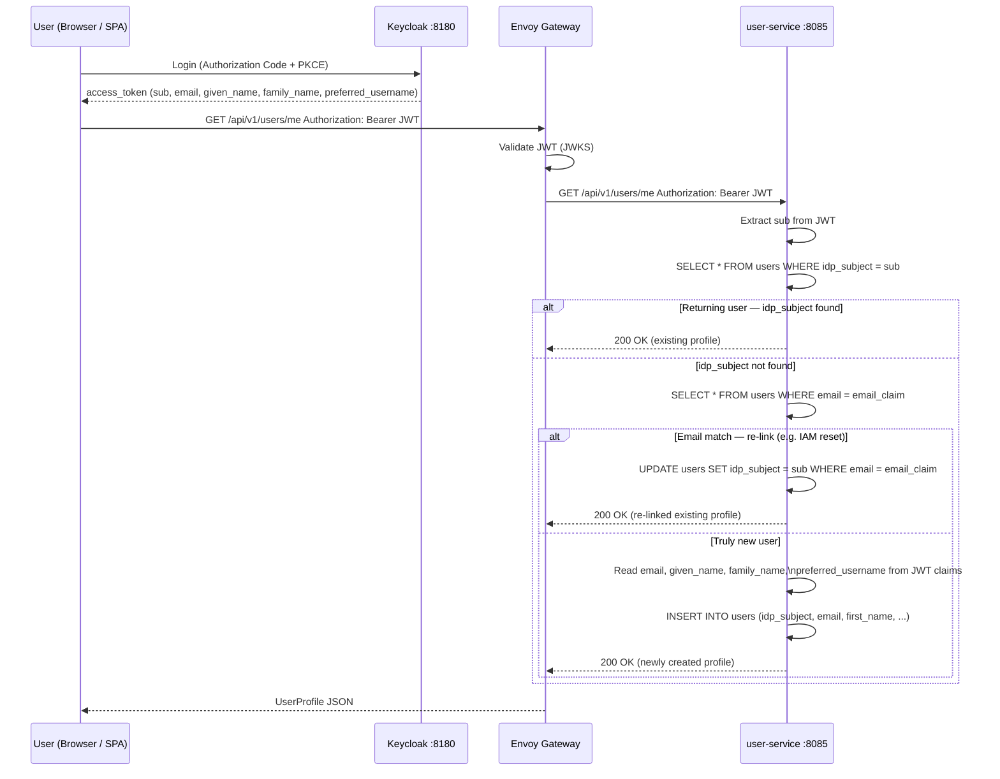

# ADR-005 — User Profile Lazy Registration on First Login

**Date:** 2026-04-25  
**Status:** Accepted  
**Deciders:** Project team

---

## Context

Keycloak owns the **identity** (credentials, email as login credential, `sub` UUID).  
`user-service` owns the **profile** (names, preferences, internal `users.id` UUID).

When a brand-new user logs in for the first time, Keycloak has a record but `user-service` has
nothing. Something must bridge the two systems.

Three options exist for synchronising a profile into `user-service` when a new user appears:

1. **Option A — Lazy registration** — `user-service` creates the profile automatically on the first
   inbound API call (`GET /api/v1/users/me`), using claims already present in the JWT
2. **Option B — Explicit registration endpoint** — the client application detects first login and
   explicitly calls `POST /api/v1/users` with an onboarding form body
3. **Option C — Keycloak Event Listener SPI** — a custom Keycloak extension fires a `REGISTER`
   event that calls `user-service` synchronously at registration time, before the user's first JWT
   is even issued

See [user-service-keycloak-registration-flow.md](user-service-keycloak-registration-flow.md) for
full sequence diagrams for all three options.

---

## Decision

Use **Option A — client-side lazy registration** triggered by `GET /api/v1/users/me`.

On the first call to `/users/me`, if no profile row exists for the JWT `sub`, `user-service`:

1. Reads profile data (email, first name, last name, preferred username) directly from the JWT
   claims — no extra Keycloak API call needed
2. Inserts a new row into `users` with `idp_subject = sub`
3. Returns the newly created profile as `200 OK`

All subsequent calls from the same user hit the database directly with no creation logic.

---

## Rationale

### JWT claims carry all required profile data

Standard OIDC scopes (`openid profile email`) populate the following claims in every access token
issued by `e-commerce-web`:

| JWT Claim | Maps to `users` column | Notes |
|-----------|------------------------|-------|
| `sub` | `idp_subject` | Permanent UUID assigned by Keycloak |
| `email` | `email` | Present when `email` scope requested |
| `given_name` | `first_name` | Present when `profile` scope requested |
| `family_name` | `last_name` | Present when `profile` scope requested |
| `preferred_username` | `username` | Keycloak username (not email) |

Because these claims are already in the token that `user-service` validates on every request, no
secondary HTTP call to Keycloak's `/userinfo` endpoint is needed. The profile creation is a single
database `INSERT` — fast and atomic.

### Zero extra components required

Options B and C both require additional moving parts:

- **Option B** requires the frontend application to include an onboarding step and call `POST /api/v1/users` with a body, adding client complexity and the risk of dangling half-registered users (user closes the browser between Keycloak registration and completing the onboarding form).
- **Option C** requires writing, testing, and deploying a Keycloak SPI extension JAR into the Keycloak container image. Maintaining a Keycloak extension adds significant operational complexity and ties the deployment pipeline to Keycloak internals.

For the current development and MVP phase, Option A achieves the same result (a profile always exists
after any authenticated API call) with zero extra infrastructure.

### Consistent with the IAM portability strategy

ADR-004 mandates that only `user-service` stores the Keycloak `sub` (in `users.idp_subject`). Lazy
registration in `user-service` is the natural implementation: the first `GET /users/me` call creates
the `idp_subject → users.id` mapping that all other services subsequently rely on for cross-service
resolution.

### Upgrade path is clear

The recommendation in the architecture documentation is to upgrade to **Option C (SPI listener)**
when moving to production, where guaranteeing profile existence *before* the user's first API call
matters (e.g., backend processes triggered at registration). This ADR does not preclude that upgrade
— lazy registration and the SPI listener use identical data structures. Migrating later only requires
adding the Keycloak extension; no data migration is needed.

---

## Consequences

### Positive

- **Zero extra components** — no Keycloak extension, no onboarding form, no `POST /api/v1/users` call from the client
- **Automatic** — works transparently on every authenticated call to `/users/me`
- **Idempotent** — a `SELECT … WHERE idp_subject = sub` check before `INSERT` prevents duplicates even under concurrent first calls (database `UNIQUE` constraint on `idp_subject` as the final guard)
- **Re-link on IAM reset** — if the IAM provider is reset (e.g. Keycloak dev volume wiped) and the same user logs in with a new `sub`, the email-based fallback re-links the existing profile row rather than failing with a unique-email constraint violation. The user's internal `id` and all associated data are preserved.
- **JWT self-contained** — profile seeding uses only data the service already has; no extra network round-trip

### Neutral

- `GET /api/v1/users/me` has slightly higher latency on the very first call (one extra `INSERT`). Subsequent calls are a plain `SELECT`.
- The `idp_subject` column must be indexed (`UNIQUE` index) to make the lookup fast. This is part of the normal schema design.

### Negative / Trade-offs

- **Profile drift** — if a user updates their name or email in Keycloak, `user-service` does not automatically sync the change. The stored profile data reflects the state at first login. Mitigations:
  - Provide a `PUT /api/v1/users/me` endpoint so users can update their profile via the application
  - Optionally, re-read claims from the JWT on each `GET /users/me` and overwrite if different (a deliberate product decision, not a technical constraint)
- **Profile existence is not guaranteed before first API call** — background processes that need a profile row immediately at registration (e.g., "send welcome email" Kafka event) cannot rely on lazy registration. For those use cases, upgrade to Option C (SPI listener).

---

## Alternatives Considered

### Option B — Explicit `POST /api/v1/users` (client-driven)

Rejected for the current phase. It adds client-side complexity (detecting first login, rendering an onboarding form) and introduces a window during which the user has a Keycloak account but no `user-service` profile. Useful when the onboarding flow collects extra data not present in the JWT (e.g., a custom display name or user preferences).

### Option C — Keycloak Event Listener SPI

Not adopted yet. It is the target for production once the MVP is stable. It provides profile guarantee at registration time and enables event-driven flows (welcome emails, etc.) but requires a custom Keycloak extension JAR — a non-trivial operational commitment.

---

## Implementation Notes

- `user-service` endpoint: `GET /api/v1/users/me`
- Logic:
  1. `SELECT users WHERE idp_subject = :sub` → found → return profile
  2. Not found → `SELECT users WHERE email = :email`
     - Found → update `idp_subject` to new `sub` and save (re-link after IAM reset or provider migration)
     - Not found → `INSERT` new profile from JWT claims
- Database constraint: `users.idp_subject` is `UNIQUE` (prevents race-condition duplicates)
- Required JWT scopes on `e-commerce-web` client: `openid profile email`
- See [user-service-keycloak-registration-flow.md](user-service-keycloak-registration-flow.md) for full option comparison and sequence diagrams
- Related: [ADR-004](adr-004-iam-portability-user-service-isolation.md) — `idp_subject` is stored only in `user-service`; other services use `users.id`
