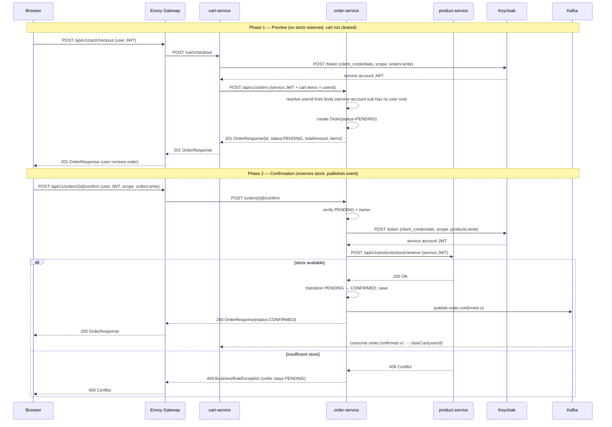

# ADR-013 — Two-Phase Checkout Flow

**Status:** Accepted  
**Date:** 2025  
**Deciders:** Project team

---

## Context

When a user wants to place an order, several things must happen:

1. The cart must be read.
2. An order record must be created.
3. Stock must be reserved in product-service.
4. The cart must be cleared.
5. A notification must be dispatched.

A naive single-step checkout (e.g., a direct `POST /orders` endpoint that the frontend calls) causes problems:

- **No preview** — the user cannot review the order before committing.
- **Circular dependency** — if `cart-service` calls `order-service` *and* `order-service` calls `cart-service` to clear the cart, both services depend on each other synchronously. This is a circular HTTP dependency that makes independent deployment and resilience testing fragile.
- **Stock reservation timing** — reserving stock at `POST /orders` creation time means stock is locked for every preview, including orders the user never confirms.

---

## Decision

Implement checkout as **two explicit phases** separated by a user confirmation step, with cart clearing decoupled via Kafka.

### Phase 1 — Preview (`POST /cart/checkout`)

- **Caller:** browser → Envoy Gateway → `cart-service`
- **Actor:** `cart-service`
- Reads the current cart for the authenticated user (resolved from JWT `sub` via user-service → internal `userId`).
- Calls `POST /api/v1/orders` on `order-service` using a Client Credentials token (`cart-service` Keycloak client, scope `orders:write`).
  - The request body includes the `userId` UUID already resolved by `cart-service`. This is required because the token is a service-account (machine identity) token — its `sub` is the Keycloak client UUID, not a real user. `order-service` detects the 404 from user-service when trying to resolve the `sub` and falls back to `userId` from the request body.
- `order-service` creates the order with status **`PENDING`** (no stock reservation yet).
- Returns the `OrderResponse` (with `id`, `status: PENDING`, `totalAmount`, `items`) to the browser.
- **Cart is NOT cleared** at this point.

### Phase 2 — Confirmation (`POST /orders/{id}/confirm`)

- **Caller:** browser → Envoy Gateway → `order-service` (user JWT, scope `orders:write`)
- **Actor:** `order-service`
- Verifies the order is in `PENDING` status and is owned by the calling user.
- Calls `POST /api/v1/products/stock/reserve` on `product-service` using a Client Credentials token (`order-service` Keycloak client, scope `products:write`) with the list of `{productId, quantity}` pairs.
  - If any product has insufficient stock → product-service returns `409 Conflict` → order stays `PENDING`, cart stays intact → user sees a 409 error with the offending product.
  - If product-service is unreachable → Resilience4j circuit breaker trips → `503 Service Unavailable` → order stays `PENDING`.
- On successful stock reservation: transitions order to **`CONFIRMED`**, saves to PostgreSQL.
- Publishes `order.confirmed.v1` to Kafka.
- Returns the updated `OrderResponse` (`status: CONFIRMED`).

### Cart Clearing — Kafka-driven

- `cart-service` runs a Kafka consumer (group `cart-service-group`) on the `order.confirmed.v1` topic.
- On receiving the event, it calls `cartService.clearCart(event.userId())` internally (no HTTP call).
- Kafka's at-least-once delivery guarantees the cart is eventually cleared even if cart-service is temporarily down at confirmation time.

---

## Sequence Diagram

---

## Why Not a Single-Step Checkout?

| Option | Problem |
|--------|---------|
| `order-service` calls `cart-service` to clear after `POST /orders` | Circular HTTP dependency: `cart-service` → `order-service` → `cart-service` |
| `cart-service` clears immediately at `POST /cart/checkout` | Cart lost if order creation fails; no recovery path |
| Stock reserved at `POST /orders` creation | Stock locked for every preview, including abandoned checkouts |

---

## Consequences

### Positive

- **No circular dependency** — `cart-service` calls `order-service` (sync); `order-service` never calls `cart-service` (uses Kafka instead). Each service can be deployed and scaled independently.
- **User preview** — the user sees the exact order total before committing; changing their mind before confirming costs nothing.
- **Resilient cart clearing** — Kafka consumer retries automatically if cart-service is down at confirmation time; no manual reconciliation needed.
- **Stock only reserved on real intent** — abandoned `PENDING` orders do not permanently consume inventory.

### Negative / Trade-offs

- **`PENDING` orders accumulate** — a background job or TTL mechanism should eventually cancel unconfirmed `PENDING` orders and release any reserved stock if the confirm step never arrives (future work).
- **Two round-trips for the browser** — checkout + confirm is two HTTP calls instead of one. This is intentional UX (review screen), but adds latency if the frontend skips the review.
- **Cart clears asynchronously** — if the user navigates back to the cart immediately after confirming, they may briefly see the old cart before the Kafka event is processed. The frontend should optimistically clear the cart on receipt of a `CONFIRMED` response.

---

## Keycloak Scope Configuration

Each service uses its own Keycloak client for M2M calls. A scope appears in a Client Credentials token only when **two conditions** are both satisfied:
1. The scope is in the `defaultClientScopes` for that client (or explicitly requested in the `scope` parameter).
2. The service-account user for that client has the matching **client role** on `e-commerce-web` (enforced via `clientScopeMappings`).

| Keycloak Client | Required client role on `e-commerce-web` | Scope it enables | Calls |
|---|---|---|---|
| `cart-service` | `orders:write` | `orders:write` | order-service (create PENDING order) |
| `order-service` | `products:write` | `products:write` | product-service (stock reserve) |
| `cart-service`, `order-service` | _(via `defaultClientScopes`)_ | `users:resolve` | user-service (resolve) |

The service-account role assignments are persisted in `docker/keycloak/realm-e-commerce.json` under the `users` array as entries with `serviceAccountClientId` and `clientRoles`. They are applied on the **first** Keycloak container start. Run `make infra-clean && make infra-min-up` to re-apply after changing the JSON.

See [design/keycloak-configuration.md](keycloak-configuration.md) for the full scope catalogue.

---

## Related

- [ADR-002 — Plain Kubernetes DNS service calls](adr-002-plain-kubernetes-dns-service-calls.md)
- [ADR-004 — IAM portability / user-service isolation](adr-004-iam-portability-user-service-isolation.md)
- [ADR-006 — Scope-based authorization](adr-006-scope-based-authorization.md)
- [design/development-guidelines.md §10 — Kafka Messaging](development-guidelines.md)
