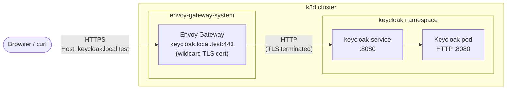
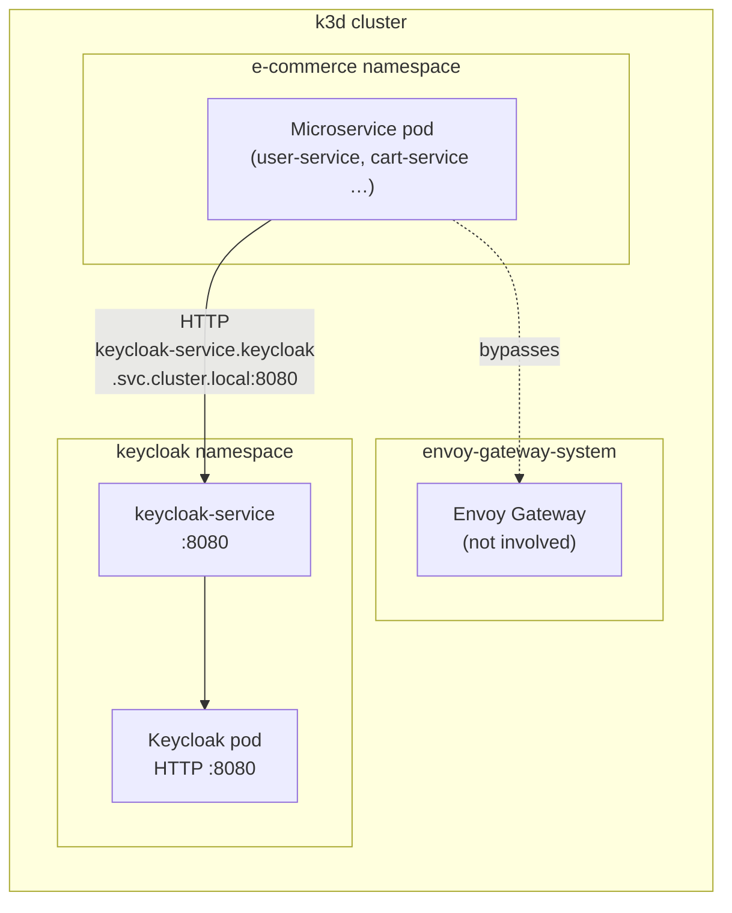
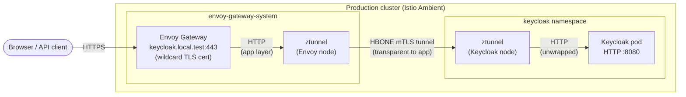
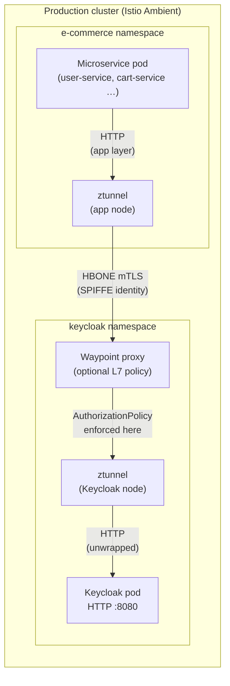

# ADR-016 — Keycloak Runs HTTP Internally; TLS Terminated at the Gateway

**Date:** 2026-05-14  
**Status:** Accepted  
**Deciders:** Project team  
**Related:** [ADR-001](adr-001-envoy-gateway-as-api-gateway.md), [ADR-003](adr-003-keycloak-as-iam.md), [ADR-015](adr-015-microservices-not-exposed-externally.md)

---

## Context

Keycloak supports two deployment modes regarding TLS:

1. **TLS passthrough / TLS termination at Keycloak** — Keycloak handles its own TLS certificate
   (`http.tlsSecret`), listening on HTTPS port 8443. Any caller (Envoy Gateway or internal
   microservice) must establish a TLS connection and trust the certificate.

2. **HTTP internally, TLS at the edge** — Keycloak listens on plain HTTP port 8080. External TLS
   is handled by the gateway (Envoy Gateway terminates HTTPS), and internal pod-to-pod traffic
   is either plain HTTP (staging) or secured by a service mesh (production).

Mode 1 was initially adopted to avoid transmitting tokens in plaintext inside the cluster.
However, it introduced significant operational complexity:

- A dedicated `Certificate` CR is required in the `keycloak` namespace, separate from the
  wildcard cert used by Envoy Gateway.
- Envoy Gateway requires a `BackendTLSPolicy` pointing to a CA bundle ConfigMap so it can
  validate Keycloak's certificate.
- The CA bundle must be distributed to the `keycloak` namespace via
  [trust-manager](https://cert-manager.io/docs/trust/trust-manager/), which requires its own
  Helm installation, a `Bundle` CR, and a namespace label selector.
- In a k3d ephemeral staging cluster, namespace label selectors proved fragile: the Keycloak
  Operator's `operator/namespace.yaml` was re-applying the namespace manifest on every
  reconciliation, overwriting the `trust.cert-manager.io/bundle: keycloak-ca` label that
  trust-manager relied on. The CA ConfigMap never appeared after cluster restarts.
- Production will use Istio, which provides automatic mTLS between pods via sidecar injection.
  Setting up TLS at the application layer would duplicate Istio's responsibility.

---

## Decision

**Keycloak is configured with HTTP only internally.** TLS is not terminated at the Keycloak pod.

The Keycloak Operator CR is set as follows:

```yaml
http:
  httpEnabled: true      # plain HTTP on port 8080; no tlsSecret

hostname:
  hostname: https://keycloak.local.test   # full URL required when backchannelDynamic: true
  strict: false                           # accept requests on any Host header
  backchannelDynamic: true                # derive backchannel URL from the incoming request
```

**`strict: false`** allows internal microservices to reach Keycloak via cluster DNS
(`http://keycloak-service.keycloak.svc.cluster.local:8080`) without being rejected because the
`Host` header does not match `keycloak.local.test`.

**`backchannelDynamic: true`** ensures backchannel base URLs (e.g., token endpoint URLs returned
in OIDC metadata) reflect the actual request URL. Internal callers get
`http://keycloak-service.keycloak.svc.cluster.local:8080` as the base; external callers via
Envoy get `https://keycloak.local.test`.

External TLS is provided by Envoy Gateway:

- The `keycloak.local.test` `HTTPRoute` terminates HTTPS at Envoy (wildcard cert from
  cert-manager) and forwards plain HTTP to `keycloak-service:8080`.
- All browser and external API interactions with Keycloak are encrypted in transit.

Internal pod-to-pod traffic in the cluster is plain HTTP in staging. In production, Istio mTLS
will secure all east-west communication automatically, including traffic to Keycloak, without any
application-level TLS configuration.

---

## Traffic Flow Diagrams

### Staging — External access (browser / developer tools)

A browser or CLI tool authenticates via `keycloak.local.test`. TLS is terminated at Envoy
Gateway; the connection from Envoy to the Keycloak pod is plain HTTP.



### Staging — Internal access (microservice → Keycloak)

A microservice (e.g. `user-service`) fetches the JWKS to validate incoming JWTs, or exchanges a
client-credentials token. It calls the Keycloak service directly via cluster DNS, bypassing
Envoy Gateway entirely.



### Production — External access (with Istio Ambient)

Envoy Gateway still terminates external TLS. The cluster-internal hop from Envoy to Keycloak is
now secured automatically by Istio ztunnel via the HBONE mTLS overlay — no application-level
TLS configuration required.



### Production — Internal access (with Istio Ambient)

Microservices call Keycloak via cluster DNS exactly as in staging. Istio ztunnel intercepts the
outbound connection and wraps it in an HBONE mTLS tunnel transparently. An `AuthorizationPolicy`
at the waypoint (or ztunnel L4) restricts which service accounts may call Keycloak.



> **Key:** in all four flows Keycloak always receives plain HTTP on port 8080. The security layer
> (TLS, mTLS) is handled by the infrastructure component closest to the traffic boundary — Envoy
> Gateway for external traffic, Istio ztunnel for internal traffic in production.

---

## Consequences

### Accepted

- **Staging (k3d):** Intra-cluster traffic to Keycloak is unencrypted. This is acceptable for a
  local developer laptop cluster with no sensitive data.
- **Production:** Istio mTLS secures all pod-to-pod traffic before this architecture is deployed
  to any environment with real data. No additional Keycloak TLS configuration is needed.

### Benefits

- Eliminates the `Certificate` CR, `BackendTLSPolicy`, trust-manager installation, `Bundle` CR,
  and namespace label management — roughly five moving parts removed.
- Keycloak pod starts faster (no TLS handshake overhead on every health-check probe).
- Internal microservice JWKS endpoint configuration is a simple HTTP URL:
  `http://keycloak-service.keycloak.svc.cluster.local:8080/realms/e-commerce/protocol/openid-connect/certs`
- Consistent with ADR-015: internal traffic stays inside the cluster without touching the
  external gateway.

### Risks mitigated

- The `hostname.strict: false` setting would allow any pod in the cluster to reach Keycloak on
  any hostname. This is mitigated in production by Istio `AuthorizationPolicy`, which restricts
  which service accounts are permitted to call the Keycloak service.
