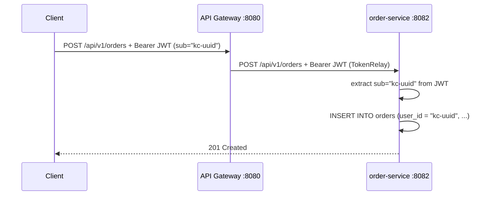
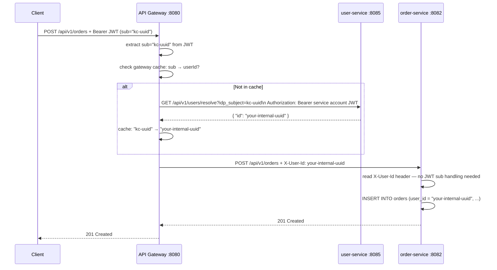
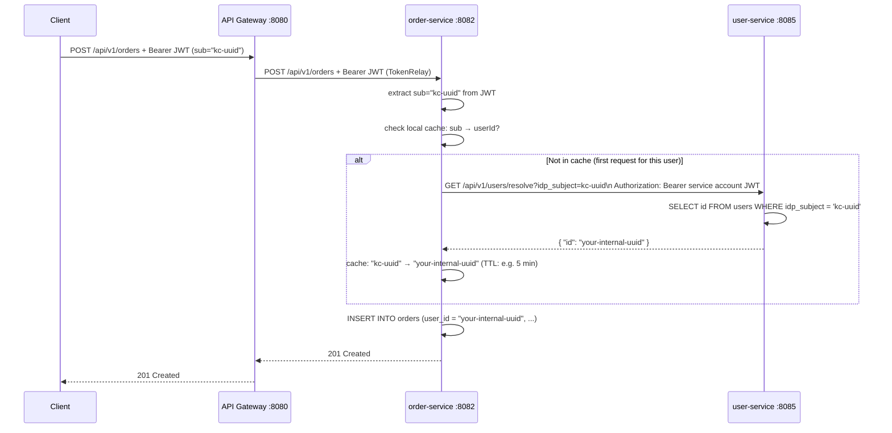

# IAM Portability: Why Services Must Not Use the IAM Provider's `sub` as a Cross-Service Key

## The Problem

When Keycloak issues a JWT, the `sub` claim contains an internal UUID:

```
sub: "f47ac10b-58cc-4372-a567-0e02b2c3d479"
```

The naive approach is to use this UUID directly as the `userId` stored in every service. This creates a hidden coupling to Keycloak:

| Service | Where `sub` would be stored |
|---------|------------------------------|
| `user-service` | `users.keycloak_id` |
| `order-service` | `orders.user_id` |
| `reviews-service` | `reviews.userId` |

If you switch IAM providers (Keycloak → Auth0, Okta, AWS Cognito), the new provider issues **different `sub` values** for the same users. Every service that stored the old `sub` has stale, unmatchable references. The migration blast radius spans every service and every table.

---

## The Solution: Use Your Own Internal UUID

All three options below share one foundation: replace the IAM provider's `sub` with your **own `users.id` UUID** as the stable cross-service identifier. They differ only in *where* the `sub` → internal UUID resolution happens.

```
JWT (sub = IAM provider UUID)
        │
        ▼
  user-service                          ← only service that knows about the IAM provider
  ┌──────────────────────────────┐
  │ id           (your UUID) ◄───┼──┐  ← stable internal ID used everywhere
  │ idp_subject  (IAM sub)       │  │  ← IAM-specific column, indexed for lookup
  │ email                        │  │
  └──────────────────────────────┘  │
                                    │  cross-service reference (IAM-agnostic)
  order-service / reviews-service   │
  ┌──────────────────────────────┐  │
  │ user_id ─────────────────────┼──┘  ← your internal UUID, NOT the IAM sub
  └──────────────────────────────┘
```

---

## Option 1 — IAM `sub` as Cross-Service Key (Naive — Not Recommended)

Each service reads the JWT `sub` directly and stores it as the user reference.



No extra calls. Zero complexity. But every service is now coupled to Keycloak's identity space.

| | |
|---|---|
| **Pros** | Simplest possible implementation |
| **Cons** | On IAM migration, every service's data needs updating; IAM provider `sub` leaks into every table across the entire system |

---

## Option 2 — API Gateway Enrichment

The API Gateway is the single point responsible for resolving `sub` → internal `userId`. It calls `user-service` once (cached), then injects an `X-User-Id` header before forwarding all requests downstream. Services trust this header and never touch the JWT `sub`.



| | |
|---|---|
| **Pros** | Resolution logic is in one place only; business services are completely decoupled from IAM concepts |
| **Cons** | Gateway becomes a stateful component with a cache dependency; `X-User-Id` header must be trusted (requires mTLS or internal network isolation to prevent spoofing); bypasses JWT-level user identity in services |

---

## Option 3 — Per-Service Lazy Resolution (Chosen)

Each service resolves `sub` → internal `userId` independently on first encounter, then caches
the result locally. The JWT is still the authoritative identity carrier; `user-service` is the
single source of truth for the mapping.



| | |
|---|---|
| **Pros** | No gateway-level state; each service is independently deployable; JWT remains the authoritative identity source; low complexity per service |
| **Cons** | Resolution logic duplicated in every service (mitigated by a shared library); small latency hit on first request per user per service instance |

---

## Options Comparison

| | Option 1 — IAM sub as key | Option 2 — Gateway Enrichment | Option 3 — Per-Service Lazy (chosen) |
|---|---|---|---|
| IAM migration blast radius | All services + all data | `user-service` only | `user-service` only |
| Resolution logic location | Nowhere (direct use) | API Gateway (centralised) | Each service (distributed) |
| Gateway stateful? | No | Yes (cache) | No |
| Services handle JWT sub? | Yes | No (`X-User-Id` header) | Yes (once, then cached) |
| Spoofing risk | Low (JWT signed) | Medium (header trust) | Low (JWT signed) |
| Extra complexity | None | Gateway cache + header contract | Per-service cache + resolve call |
| **Recommended for** | MVP / throwaway | Strict service isolation needed | **General microservice architecture** |

---

## Chosen Approach: Per-Service Lazy Resolution

When a service receives a JWT and needs the internal `userId` for the first time, it calls `user-service` to resolve `sub` → internal UUID, then caches the result locally. Only `user-service` ever knows about the IAM provider's `sub`. All other services reference `users.id` — an ID that belongs to your system, not to any IAM provider.

### Resolution Endpoint

`user-service` exposes a dedicated internal endpoint:

| Method | Path | Description | Required Role |
|--------|------|-------------|---------------|
| `GET` | `/api/v1/users/resolve` | Resolve `idp_subject` → internal user profile | Service account only |

Query parameter: `idp_subject` (the JWT `sub` value).  
Returns: full user profile including the internal `id`.

---

## `users` Table Schema

```sql
CREATE TABLE users (
    id           UUID PRIMARY KEY DEFAULT gen_random_uuid(),
    idp_subject  VARCHAR(255) NOT NULL UNIQUE,   -- IAM provider's sub (indexed)
    email        VARCHAR(255) NOT NULL UNIQUE,
    username     VARCHAR(100) NOT NULL,
    first_name   VARCHAR(100),
    last_name    VARCHAR(100),
    created_at   TIMESTAMP NOT NULL DEFAULT now(),
    updated_at   TIMESTAMP NOT NULL DEFAULT now()
);

CREATE INDEX idx_users_idp_subject ON users (idp_subject);
```

**Column naming rationale:** `idp_subject` (Identity Provider Subject) is IAM-agnostic. Avoid `keycloak_id` — it leaks the current provider choice into the schema and makes a future migration feel higher-risk than it is.

---

## On IAM Migration With This Design

If you switch from Keycloak to Auth0:

1. Export users from Keycloak; bulk-import into Auth0 — most providers support seeding a custom `sub` during import, so you can **preserve existing UUIDs** (no data changes needed at all)
2. If preserving UUIDs is not possible: **only `user-service`'s `idp_subject` column needs updating** — one table, one service, one migration script
3. `order-service`, `reviews-service`, and all other services are **completely unaffected** — they only store your internal `users.id`, which never changes

---

## `idp_subject` vs `email` as the IAM Link — Why Not Email?

| Property | `idp_subject` (sub UUID) | `email` |
|----------|--------------------------|---------|
| Mutable? | No — set once, permanent | Yes — users can change it |
| PII? | No — opaque UUID | Yes — GDPR right to erasure applies |
| Unique? | Yes — guaranteed by IAM provider | Yes — but only at a point in time |
| Safe as FK? | Yes | No — breaks on email change |

Storing email as the cross-service join key means a user changing their email in Keycloak would silently orphan their orders and reviews. `idp_subject` never changes.

---

## Caching Recommendations

Each service that performs lazy resolution maintains a local in-memory cache:

| Property | Recommendation |
|----------|----------------|
| Cache key | `idp_subject` (JWT `sub`) |
| Cache value | Internal `userId` UUID |
| TTL | 5–15 minutes |
| Invalidation | On 404 from `user-service` (user deleted), evict and propagate error |
| Implementation | Caffeine (`com.github.ben-manes.caffeine`) or Spring's `@Cacheable` with a local cache manager |

---

## Summary

| Approach | IAM migration blast radius | Complexity | Chosen |
|---|---|---|---|
| IAM `sub` as cross-service key | All services + all data | Low | No |
| Own UUID + API Gateway enrichment | `user-service` only | Medium | No |
| Own UUID + per-service lazy resolution | `user-service` only | Low–Medium | **Yes** |

The per-service lazy resolution approach pays a small one-time cost per service (one extra call on first user encounter, then cached) in exchange for full IAM portability and clean separation between your internal data model and the IAM provider's identity system.
