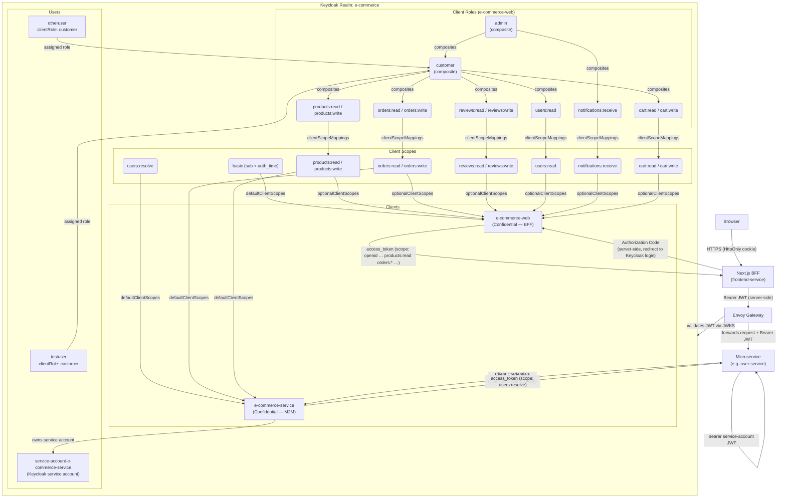
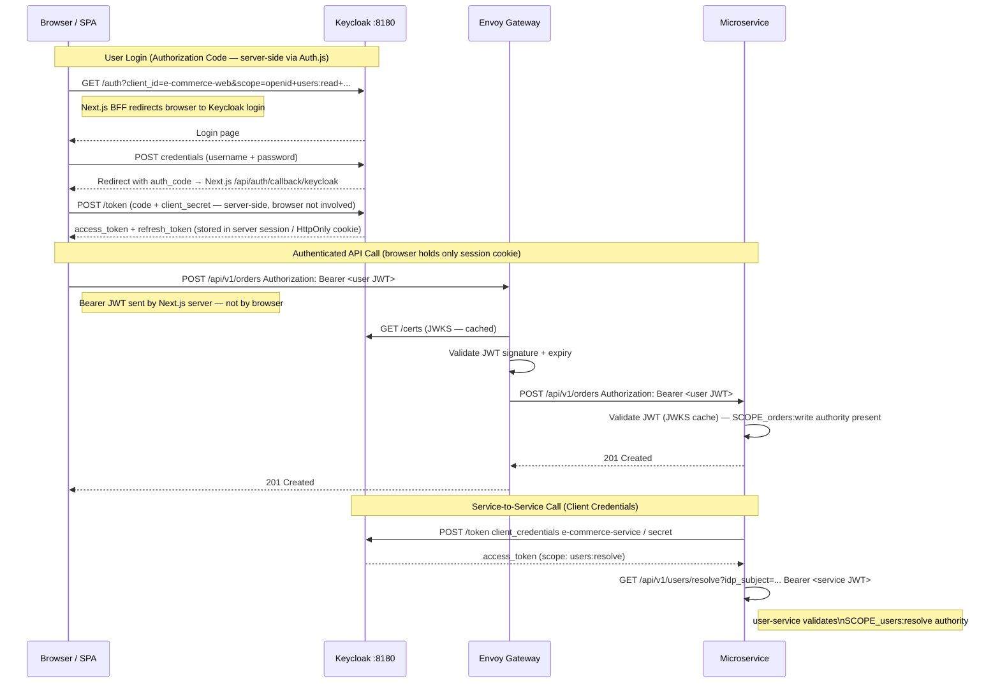

# Keycloak Configuration Reference

This document describes the complete Keycloak setup for the `e-commerce` realm — what exists today in
`docker/keycloak/realm-e-commerce.json` (auto-imported on `docker compose up`) — and how each piece
connects to the microservice architecture.

---

## Overview Diagram



---

## Realm Settings

| Setting | Value | Notes |
|---------|-------|-------|
| Realm name | `e-commerce` | All OIDC URLs use this realm slug |
| Display name | `E-Commerce Platform` | Shown on the Keycloak login page |
| SSL required | `none` | Dev only — TLS is handled by Envoy Gateway in staging |
| Self-registration | Disabled | Users are created via lazy registration in `user-service` (see [ADR-004](adr-004-iam-portability-user-service-isolation.md)) |
| Login with email | Enabled | Users can authenticate with either username or email |
| Duplicate emails | Forbidden | One account per email address |
| Default signature algorithm | `RS256` | All JWTs are RS256-signed; public keys served via JWKS |

### Key OIDC endpoints

```
Discovery:   http://localhost:8180/realms/e-commerce/.well-known/openid-configuration
JWKS:        http://localhost:8180/realms/e-commerce/protocol/openid-connect/certs
Token:       http://localhost:8180/realms/e-commerce/protocol/openid-connect/token
Auth:        http://localhost:8180/realms/e-commerce/protocol/openid-connect/auth
Logout:      http://localhost:8180/realms/e-commerce/protocol/openid-connect/logout
Admin UI:    http://localhost:8180/admin/master/console/#/e-commerce
```

In staging (k3d), replace `http://localhost:8180` with `https://keycloak.local.test`.

---

## Client Scopes

Authorization uses standard OAuth2 **resource scopes** (RFC 6749 §3.3).  
Spring Security reads the `scope` claim from the JWT and maps each space-separated token to a
`SCOPE_<name>` authority — no custom converter or Keycloak-specific claim mapping required.

See [ADR-006 — Scope-Based Authorization](adr-006-scope-based-authorization.md) for the full rationale.

### Scope Catalogue

| Scope | Description | Granted to |
|-------|-------------|------------|
| `basic` | `sub` (user UUID) + `auth_time` — required for lazy registration | `e-commerce-web` (default) |
| `products:read` | Read product catalog | `e-commerce-web` (optional) |
| `products:write` | Create/update products (admin) | `e-commerce-web` (optional) |
| `orders:read` | Read own orders | `e-commerce-web` (optional) |
| `orders:write` | Place and update orders | `e-commerce-web` (optional) |
| `reviews:read` | Read product reviews | `e-commerce-web` (optional) |
| `reviews:write` | Submit and edit reviews | `e-commerce-web` (optional) |
| `users:read` | Read own user profile | `e-commerce-web` (optional) |
| `users:resolve` | Resolve IDP subject → internal user ID (M2M only) | `e-commerce-service` (default) |
| `orders:write` | Place and confirm orders (M2M: cart-service → order-service) | `e-commerce-web` (optional), `e-commerce-service` (default) |
| `products:write` | Create/update products; reserve stock (M2M: order-service → product-service) | `e-commerce-web` (optional), `e-commerce-service` (default) |
| `notifications:receive` | Receive notification events | `e-commerce-web` (optional) |
| `cart:read` | Read own shopping cart | `e-commerce-web` (optional) |
| `cart:write` | Add, update, and remove items in own shopping cart | `e-commerce-web` (optional) |

> **Keycloak 26 — `basic` scope and the `sub` claim**: In Keycloak 26, the `sub` claim (user UUID)
was moved out of the hard-coded token builder and into a dedicated `basic` client scope containing
an `oidc-sub-mapper`. The `basic` scope must be defined in `clientScopes` and listed in
`defaultClientScopes` of every client that needs the `sub` claim in its access token. Without it,
`sub` is absent from the JWT, which breaks any service that uses it to identify users (e.g.,
`user-service` lazy registration reads `sub` as `idp_subject`). This scope is **not auto-created**
when importing a partial realm — it must be explicitly defined in the realm JSON.

> **Note — Keycloak CE limitation**: Keycloak Community Edition does not natively support
> "role → optional scope auto-promotion" via simple realm configuration. Keycloak's
> `clientScopeMappings` controls which *roles* appear in the token when a scope is requested, not
> the reverse. Achieving per-role scope differentiation (e.g., `customer` gets fewer scopes than
> `admin`) requires Keycloak Authorization Services or a custom protocol mapper script, which adds
> operational complexity. For this project the resource scopes are therefore `optionalClientScopes`
> on `e-commerce-web` and the **SPA/client is responsible for explicitly requesting the scopes it
> needs** in the `scope` parameter of each authorization or token request. This is the standard
> OAuth2 mechanism for scope negotiation (RFC 6749 §3.3) and keeps scope control on the client side.
>
> The client roles (`customer`, `admin`) defined in the realm are kept for informational purposes and
> future use if Authorization Services are enabled.

### Client Roles on `e-commerce-web` *(informational)*

| Role | Type | Includes |
|------|------|----------|
| `products:read` | atomic | — |
| `products:write` | atomic | — |
| `orders:read` | atomic | — |
| `orders:write` | atomic | — |
| `reviews:read` | atomic | — |
| `reviews:write` | atomic | — |
| `users:read` | atomic | — |
| `notifications:receive` | atomic | — |
| `cart:read` | atomic | — |
| `cart:write` | atomic | — |
| `customer` | composite | `products:read`, `orders:read`, `orders:write`, `reviews:read`, `reviews:write`, `users:read`, `cart:read`, `cart:write` |
| `admin` | composite | all `customer` scopes + `products:write` + `notifications:receive` |

### Usage in services

Spring Security default `JwtGrantedAuthoritiesConverter` reads the `scope` claim (space-separated)
and creates one `SCOPE_<name>` authority per token. No custom `JwtAuthenticationConverter` is needed:

```java
// SecurityConfig.java — uses Spring Security defaults
.oauth2ResourceServer(oauth2 -> oauth2.jwt(Customizer.withDefaults()));

// Controller method security
@PreAuthorize("hasAuthority('SCOPE_users:resolve')")
public ResponseEntity<UserResponse> resolveUser(String idpSubject) { ... }

@PreAuthorize("hasAuthority('SCOPE_users:read')")
public ResponseEntity<UserResponse> getMyProfile(Authentication auth) { ... }
```

---

## Clients

### `e-commerce-web` — Confidential BFF Client

> **Changed from Public SPA to Confidential BFF** — see [ADR-007](adr-007-nextjs-bff-frontend.md).
> The `client_secret` is stored only in the Next.js server environment variable
> `KEYCLOAK_CLIENT_SECRET` and is never exposed to the browser.

```
clientId:               e-commerce-web
type:                   Confidential (client_secret held in Next.js server env only)
standardFlowEnabled:    true    ← Authorization Code (no PKCE required — server holds secret)
implicitFlowEnabled:    false   ← disabled (deprecated, insecure)
directAccessGrantsEnabled: false
serviceAccountsEnabled: false
fullScopeAllowed:       false   ← client must explicitly request every scope it needs
redirectUris:           http://localhost:3001/api/auth/callback/keycloak  (local dev — Auth.js)
                        https://app.local.test/api/auth/callback/keycloak (staging — Auth.js)
                        http://localhost:9876/callback                     (local dev — oauth2c CLI)
webOrigins:             http://localhost:3001, https://app.local.test
defaultClientScopes:    openid, basic, profile, email
optionalClientScopes:   products:read, products:write, orders:read, orders:write,
                        reviews:read, reviews:write, users:read, notifications:receive,
                        cart:read, cart:write
```

#### When is this used?

The **Next.js BFF** (`frontend-service`) uses this client to authenticate users server-side:

```
1. Auth.js middleware intercepts an unauthenticated browser request and redirects to:
   GET /realms/e-commerce/protocol/openid-connect/auth
       ?client_id=e-commerce-web
       &redirect_uri=http://localhost:3001/api/auth/callback/keycloak
       &response_type=code
       &scope=openid email profile products:read orders:read orders:write reviews:read reviews:write users:read cart:read cart:write
       (no PKCE — confidential client holds the secret)

2. User logs in on the Keycloak login page.

3. Keycloak redirects back to the Next.js callback Route Handler:
   http://localhost:3001/api/auth/callback/keycloak?code=<auth_code>

4. Auth.js exchanges the code server-side:
   POST /realms/e-commerce/protocol/openid-connect/token
   code=<auth_code>
   &client_id=e-commerce-web
   &client_secret=<KEYCLOAK_CLIENT_SECRET>   ← server-side only
   &redirect_uri=http://localhost:3001/api/auth/callback/keycloak
   &grant_type=authorization_code

5. Keycloak returns:
   { "access_token": "eyJ...", "refresh_token": "eyJ...", ... }
   Auth.js stores the tokens in the server-side session (encrypted HttpOnly cookie).
   The browser never sees the JWT.

6. Next.js Route Handlers forward the access_token server-side to microservices:
   Authorization: Bearer <access_token>  (never sent from browser)
```

All the scopes it needs must be included in the `scope` parameter of the authorization request — Keycloak only includes optional scopes that are explicitly requested. Keycloak will only grant scopes that are listed in `optionalClientScopes` (or `defaultClientScopes`) on the client.

> **No password grant**: `directAccessGrantsEnabled` is `false` on this client. For local API testing use the `e-commerce-service` client credentials token (which grants `users:resolve`) or start the frontend dev server and obtain a token from the browser session.

#### JWT payload (user token from this client)

```json
{
  "sub":               "f47ac10b-...",
  "iss":               "http://localhost:8180/realms/e-commerce",
  "aud":               "account",
  "preferred_username": "testuser",
  "email":             "testuser@example.com",
  "given_name":        "Test",
  "family_name":       "User",
  "scope":             "openid profile email products:read orders:read orders:write reviews:read reviews:write users:read cart:read cart:write",
  "exp":               1745600000,
  "iat":               1745596400
}
```

---

### `e-commerce-service` — Confidential M2M Client

```
clientId:               e-commerce-service
type:                   Confidential
secret:                 e-commerce-service-secret
standardFlowEnabled:    false   ← no browser login
directAccessGrantsEnabled: false
serviceAccountsEnabled: true    ← Client Credentials grant
defaultClientScopes:    users:resolve
```

#### When is this used?

Any microservice that needs to call another microservice (e.g., `reviews-service` calling
`user-service` to resolve a user ID) authenticates using this client's credentials:

```bash
# Obtain a service account token (Client Credentials grant)
curl -s -X POST http://localhost:8180/realms/e-commerce/protocol/openid-connect/token \
  -d "grant_type=client_credentials" \
  -d "client_id=e-commerce-service" \
  -d "client_secret=e-commerce-service-secret" | jq .access_token
```

In Spring Boot, `OAuth2ClientHttpRequestInterceptor` handles this automatically (see
[development-guidelines.md](development-guidelines.md) Section 5 and Section 9).

#### JWT payload (service account token from this client)

```json
{
  "sub":                "service-account-uuid",
  "iss":                "http://localhost:8180/realms/e-commerce",
  "preferred_username": "service-account-e-commerce-service",
  "scope":              "users:resolve",
  "exp":                1745600000,
  "iat":                1745596400
}
```

> **Future expansion**: As additional microservices are implemented (`order-service`, `product-service`,
> etc.), each should get its own Keycloak client (`client_id: order-service`, etc.) with its own
> `client_secret` and the scopes it needs to call downstream services. See [ADR-003](adr-003-keycloak-as-iam.md).

---

## Users

### `testuser`

| Attribute | Value |
|-----------|-------|
| Username | `testuser` |
| Email | `testuser@example.com` |
| First name | `Test` |
| Last name | `User` |
| Password | `password` |
| Temporary password | No |

A standard test customer account. Assigned the `customer` client role on `e-commerce-web`
(informational — used for future Authorization Services). The JWT will contain the scopes
explicitly requested by the client: `products:read orders:read orders:write reviews:read reviews:write users:read`.

### `otheruser`

| Attribute | Value |
|-----------|-------|
| Username | `otheruser` |
| Email | `otheruser@example.com` |
| First name | `Other` |
| Last name | `Person` |
| Password | `password` |
| Temporary password | No |

A second test customer account. Assigned the `customer` client role on `e-commerce-web`.
Useful for testing cross-user isolation (e.g., verifying that `otheruser` cannot read `testuser`'s orders).

### `service-account-e-commerce-service` *(Keycloak internal)*

| Attribute | Value |
|-----------|-------|
| Username | `service-account-e-commerce-service` |
| Email | `service-account-e-commerce-service@placeholder.org` |
| Type | Keycloak service account (auto-created when `serviceAccountsEnabled: true`) |

This user is not a real human. Keycloak automatically creates it when `serviceAccountsEnabled: true` is
set on the `e-commerce-service` client. The JWT issued via Client Credentials grant has `sub` equal to
this user's internal UUID, `preferred_username: service-account-e-commerce-service`, and
`scope: users:resolve`.

Services receiving a request from this account detect it via `hasAuthority('SCOPE_users:resolve')`.

---

## Authentication Flows Summary



---

## Realm JSON Location and Auto-Import

The realm is defined in a single file:

```
docker/keycloak/realm-e-commerce.json
```

Keycloak starts with `--import-realm` and the file is volume-mounted at
`/opt/keycloak/data/import/`. On first startup, Keycloak imports the realm automatically. No Admin
Console steps are needed.

> **Keycloak 26 import behaviour**: If the realm already exists in the embedded H2 database,
> `--import-realm` silently skips it — even if the realm JSON has changed. `docker compose restart`
> preserves the `keycloak-data` volume, so the realm is **not** re-imported.
>
> The H2 database files are stored in the named volume `keycloak-data` (mounted at
> `/opt/keycloak/data/h2`). To force a fresh realm import after modifying the realm JSON, remove
> that volume:
> ```bash
> docker compose --profile auth down keycloak -v
> docker compose --profile auth up -d keycloak
> ```
> Or to reset the entire local stack (Keycloak + Postgres + Mongo) at once:
> ```bash
> make infra-clean   # docker compose ... down -v
> make infra-up
> ```
> `make infra-clean` runs `docker compose down -v` which removes **all** named volumes
> (`keycloak-data`, `postgres-data`, `mongo-data`). Use it when you want a full environment reset.

---

## Local API Testing — Getting Tokens

Since `e-commerce-web` is a confidential BFF client (`directAccessGrantsEnabled: false`), a user
token can only be obtained through the **Authorization Code** flow, which requires a browser
login step. Two CLI tools support this from a terminal.

### Recommended: `oauth2c`

[`oauth2c`](https://github.com/cloudentity/oauth2c) (Cloudentity / SecureAuthCorp, 900+ stars,
Go binary, Apache-2.0) is the most widely used OAuth2 CLI tool. It handles the full Authorization
Code flow: opens a browser automatically, listens on a local callback port, and prints the token
response JSON to stdout. Verbose request/response logs go to stderr, keeping stdout clean for
shell variable capture (`TOKEN=$(make -s us-token)`).

**Install:**

```bash
# Linux
curl -sSfL https://raw.githubusercontent.com/cloudentity/oauth2c/master/install.sh | \
  sudo sh -s -- -b /usr/local/bin latest

# macOS
brew install cloudentity/tap/oauth2c
```

> `http://localhost:9876/callback` (oauth2c's default) is already included in `e-commerce-web`'s
> `redirectUris` in `realm-e-commerce.json`.

**Get a user access token and call an API:**

```bash
TOKEN=$(oauth2c http://localhost:8180/realms/e-commerce \
  --client-id e-commerce-web \
  --client-secret e-commerce-web-secret \
  --grant-type authorization_code \
  --auth-method client_secret_post \
  --response-types code \
  --response-mode query \
  --scopes "openid profile email products:read orders:read orders:write reviews:read reviews:write users:read" \
  --redirect-url http://localhost:9876/callback \
  | jq -r .access_token)

curl -s -w "\nHTTP %{http_code}\n" -H "Authorization: Bearer $TOKEN" http://localhost:8085/api/v1/users/me
```

Or via the Makefile shortcut (requires `oauth2c` + `jq` installed):

```bash
TOKEN=$(make -s us-token) && \
  curl -s -w "\nHTTP %{http_code}\n" -H "Authorization: Bearer $TOKEN" http://localhost:8085/api/v1/users/me
```

`oauth2c` opens a browser for the Keycloak login page. Once the user authenticates, Keycloak
redirects to `http://localhost:9876/callback` and oauth2c captures the code, exchanges it for a
token server-side, and prints the response JSON to stdout.

### Alternative: `oidc-client.sh` (bash-only, no binary required)

[`oidc-client.sh`](https://github.com/please-openit/oidc-bash-client) is a pure-bash OIDC client
that uses `nc` (netcat) to listen for the redirect. No compiled binary required. Supports PKCE.

```bash
# Download once
curl -sLO https://raw.githubusercontent.com/please-openit/oidc-bash-client/master/oidc-client.sh
chmod +x oidc-client.sh

# Obtain a user token — prints the authorize URL; open it in a browser to log in
./oidc-client.sh \
  --operation authorization_code_grant \
  --openid-endpoint "http://localhost:8180/realms/e-commerce/.well-known/openid-configuration" \
  --client-id e-commerce-web \
  --client-secret e-commerce-web-secret \
  --redirect-uri "http://localhost:8080" \
  --scope "openid profile email products:read orders:read orders:write reviews:read reviews:write users:read" \
  --field .access_token \
  --redirect-http-port 8080
```

> To use `oidc-client.sh`, add `http://localhost:8080` to `e-commerce-web`'s `redirectUris` in
> `realm-e-commerce.json` and restart Keycloak to re-import the realm.

### Service account token (Client Credentials — no browser needed)

`e-commerce-service` still supports Client Credentials. The token grants only
`scope: users:resolve` — suitable for calling `/users/resolve`, not user-facing endpoints
like `/users/me` (which requires `users:read`).

```bash
# Via Makefile shortcut (requires jq):
TOKEN=$(make -s us-token-sa)

# Or directly:
TOKEN=$(curl -sf -X POST \
  http://localhost:8180/realms/e-commerce/protocol/openid-connect/token \
  -H "Content-Type: application/x-www-form-urlencoded" \
  -d "grant_type=client_credentials&client_id=e-commerce-service&client_secret=e-commerce-service-secret" \
  | jq -r .access_token)
```

---

## Adding a New Service Client (Checklist)

When a new microservice is implemented, follow this pattern to add its Keycloak identity:

**Step 1 — Define any new client scopes in `clientScopes[]`** (if not already present):

```json
{
  "name": "notifications:receive",
  "description": "Receive notification events",
  "protocol": "openid-connect",
  "attributes": { "include.in.token.scope": "true", "display.on.consent.screen": "true" }
}
```

**Step 2 — Add an atomic client role on `e-commerce-web`** (for SPA users) or on the calling
service's client (for M2M). Example for a new SPA scope:

```json
// In roles.client.e-commerce-web
{ "name": "notifications:receive", "description": "Receive notification events" }
```

Then add it to the relevant composite role(s) (e.g., add to `admin`'s `composites.client.e-commerce-web`).

**Step 3 — Add a `clientScopeMappings` entry** so the new role auto-promotes its optional scope:

```json
// In clientScopeMappings.e-commerce-web
{ "clientScope": "notifications:receive", "roles": ["notifications:receive"] }
```

**Step 4 — Add the new scope to `optionalClientScopes`** of `e-commerce-web`:

```json
"optionalClientScopes": [
  ... existing scopes ...,
  "notifications:receive"
]
```

**Step 5 — Add the M2M client in `clients[]`** (if the new feature requires a dedicated service client):

```json
{
  "clientId": "notification-service",
  "name": "Notification Service (M2M)",
  "enabled": true,
  "publicClient": false,
  "secret": "notification-service-secret",
  "standardFlowEnabled": false,
  "directAccessGrantsEnabled": false,
  "serviceAccountsEnabled": true,
  "defaultClientScopes": ["notifications:receive"],
  "optionalClientScopes": []
}
```

**Step 6 — Pin the service account user in `users[]`** (optional but ensures reproducible imports):

```json
{
  "username": "service-account-notification-service",
  "enabled": true,
  "email": "service-account-notification-service@placeholder.org",
  "serviceAccountClientId": "notification-service"
}
```

**Step 7 — Configure the calling service's `application.yaml`**:

```yaml
spring:
  security:
    oauth2:
      client:
        registration:
          user-service:                         # logical name for the downstream service
            client-id: notification-service     # this service's Keycloak client ID
            client-secret: ${NOTIFICATION_SERVICE_CLIENT_SECRET:notification-service-secret}
            authorization-grant-type: client_credentials
            scope: notifications:receive        # request only the scopes needed
        provider:
          user-service:
            token-uri: ${KEYCLOAK_URL:http://localhost:8180}/realms/e-commerce/protocol/openid-connect/token
```

**Step 8 — Protect the endpoint in the service with `@PreAuthorize`**:

```java
@PreAuthorize("hasAuthority('SCOPE_notifications:receive')")
public ResponseEntity<Void> receiveNotification(...) { ... }
```

**Step 9 — Restart Keycloak** to re-import (or use `--override=true`).

---

## Related Documents

- [ADR-003 — Keycloak as IAM](adr-003-keycloak-as-iam.md) — rationale for choosing Keycloak
- [ADR-004 — IAM Portability](adr-004-iam-portability-user-service-isolation.md) — why only `user-service` stores the Keycloak `sub`
- [ADR-006 — Scope-Based Authorization](adr-006-scope-based-authorization.md) — decision to use fine-grained OAuth2 scopes instead of realm roles
- [development-guidelines.md §9 Security](development-guidelines.md) — Spring Security / OAuth2 Resource Server config pattern
