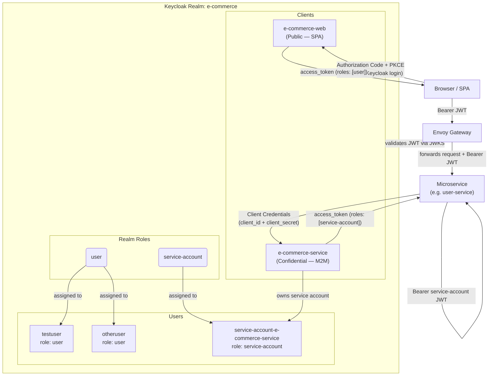
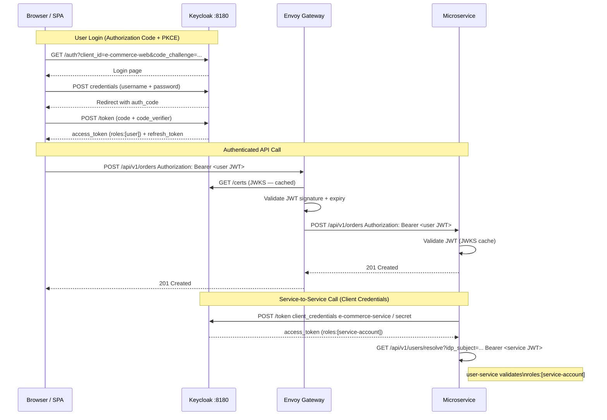

# Keycloak Configuration Reference

This document describes the complete Keycloak setup for the `e-commerce` realm — what exists today in
`docker/keycloak/realm-e-commerce.json` (auto-imported on `docker compose up`) — and how each piece
connects to the microservice architecture.

---

## Overview Diagram



---

## Realm Settings

| Setting | Value | Notes |
|---------|-------|-------|
| Realm name | `e-commerce` | All OIDC URLs use this realm slug |
| Display name | `E-Commerce Platform` | Shown on the Keycloak login page |
| SSL required | `none` | Dev only — TLS is handled by Envoy Gateway in staging |
| Self-registration | Disabled | Users are created via lazy registration in `user-service` (see [ADR-004](adr-004-iam-portability-user-service-isolation.md)) |
| Login with email | Enabled | Users can authenticate with either username or email |
| Duplicate emails | Forbidden | One account per email address |
| Default signature algorithm | `RS256` | All JWTs are RS256-signed; public keys served via JWKS |

### Key OIDC endpoints

```
Discovery:   http://localhost:8180/realms/e-commerce/.well-known/openid-configuration
JWKS:        http://localhost:8180/realms/e-commerce/protocol/openid-connect/certs
Token:       http://localhost:8180/realms/e-commerce/protocol/openid-connect/token
Auth:        http://localhost:8180/realms/e-commerce/protocol/openid-connect/auth
Logout:      http://localhost:8180/realms/e-commerce/protocol/openid-connect/logout
Admin UI:    http://localhost:8180/admin/master/console/#/e-commerce
```

In staging (k3d), replace `http://localhost:8180` with `https://keycloak.local.test`.

---

## Realm Roles

Two realm-level roles exist. They are mapped to JWTs via the `realm-roles-flat` protocol mapper (see [Protocol Mappers](#protocol-mappers) below).

### `user`

```json
{ "name": "user", "description": "Standard customer role" }
```

Assigned to: all human users (`testuser`, `otheruser` and any future registered users).

Usage in services:

```java
// Require at least the 'user' role to access any endpoint
.anyRequest().authenticated()

// Or explicitly with method security:
@PreAuthorize("hasRole('user')")
public ResponseEntity<ProfileResponse> getMyProfile() { ... }
```

Services extract roles from the `roles` claim in the JWT:

```java
// SecurityConfig — maps 'roles' claim → ROLE_ prefix
converter.setAuthoritiesClaimName("roles");
converter.setAuthorityPrefix("ROLE_");
```

Spring Security then allows `hasRole("user")` to match `ROLE_user`.

### `service-account`

```json
{ "name": "service-account", "description": "Internal service-to-service calls (resolveUser endpoint)" }
```

Assigned to: the Keycloak service account for the `e-commerce-service` client
(`service-account-e-commerce-service`).

Usage: The `GET /api/v1/users/resolve` endpoint in `user-service` is restricted to callers bearing a
JWT with `roles: ["service-account"]`. This prevents regular users from resolving arbitrary `sub` values
to internal user IDs.

```java
@GetMapping("/resolve")
@PreAuthorize("hasRole('service-account')")
public ResponseEntity<UserSummary> resolveByIdpSubject(@RequestParam String idp_subject) { ... }
```

---

## Clients

### `e-commerce-web` — Public SPA Client

```
clientId:               e-commerce-web
type:                   Public (no secret)
standardFlowEnabled:    true    ← Authorization Code + PKCE
implicitFlowEnabled:    false   ← disabled (deprecated, insecure)
directAccessGrantsEnabled: true ← password grant — for local curl/Postman testing only
serviceAccountsEnabled: false
redirectUris:           http://localhost:*, http://127.0.0.1:*
webOrigins:             + (same as redirectUris — CORS allowed)
```

#### When is this used?

A browser-based SPA (React, Angular, etc.) uses this client to authenticate users:

```
1. SPA redirects browser to:
   GET /realms/e-commerce/protocol/openid-connect/auth
       ?client_id=e-commerce-web
       &redirect_uri=http://localhost:3000/callback
       &response_type=code
       &scope=openid email profile
       &code_challenge=<SHA256 of code_verifier>     ← PKCE
       &code_challenge_method=S256

2. User logs in on Keycloak login page.

3. Keycloak redirects back to SPA:
   http://localhost:3000/callback?code=<auth_code>

4. SPA exchanges code for tokens:
   POST /realms/e-commerce/protocol/openid-connect/token
   code=<auth_code>
   &code_verifier=<original code_verifier>           ← PKCE
   &client_id=e-commerce-web
   &redirect_uri=http://localhost:3000/callback
   &grant_type=authorization_code

5. Keycloak returns:
   { "access_token": "eyJ...", "refresh_token": "eyJ...", ... }

6. SPA attaches access_token as Authorization: Bearer header on API calls.
```

`directAccessGrantsEnabled: true` allows a password grant for local testing:

```bash
# Obtain a user token via password grant (dev/testing only)
curl -s -X POST http://localhost:8180/realms/e-commerce/protocol/openid-connect/token \
  -d "grant_type=password" \
  -d "client_id=e-commerce-web" \
  -d "username=testuser" \
  -d "password=password" \
  -d "scope=openid" | jq .access_token
```

#### JWT payload (user token from this client)

```json
{
  "sub":               "f47ac10b-...",
  "iss":               "http://localhost:8180/realms/e-commerce",
  "aud":               "account",
  "preferred_username": "testuser",
  "email":             "testuser@example.com",
  "given_name":        "Test",
  "family_name":       "User",
  "roles":             ["user"],
  "exp":               1745600000,
  "iat":               1745596400
}
```

---

### `e-commerce-service` — Confidential M2M Client

```
clientId:               e-commerce-service
type:                   Confidential
secret:                 e-commerce-service-secret
standardFlowEnabled:    false   ← no browser login
directAccessGrantsEnabled: false
serviceAccountsEnabled: true    ← Client Credentials grant
```

#### When is this used?

Any microservice that needs to call another microservice (e.g., `reviews-service` calling
`user-service` to resolve a user ID) authenticates using this client's credentials:

```bash
# Obtain a service account token (Client Credentials grant)
curl -s -X POST http://localhost:8180/realms/e-commerce/protocol/openid-connect/token \
  -d "grant_type=client_credentials" \
  -d "client_id=e-commerce-service" \
  -d "client_secret=e-commerce-service-secret" | jq .access_token
```

In Spring Boot, `OAuth2ClientHttpRequestInterceptor` handles this automatically (see
[development-guidelines.md](development-guidelines.md) Section 5 and Section 9).

#### JWT payload (service account token from this client)

```json
{
  "sub":                "service-account-uuid",
  "iss":                "http://localhost:8180/realms/e-commerce",
  "preferred_username": "service-account-e-commerce-service",
  "roles":              ["service-account"],
  "exp":                1745600000,
  "iat":                1745596400
}
```

> **Future expansion**: As additional microservices are implemented (`order-service`, `product-service`,
> etc.), each should get its own Keycloak client (`client_id: order-service`, `client_id:
> product-service`, etc.) with its own `client_secret`. Currently a single shared `e-commerce-service`
> client is used for development simplicity. See [ADR-003](adr-003-keycloak-as-iam.md) for the
> target architecture.

---

## Users

### `testuser`

| Attribute | Value |
|-----------|-------|
| Username | `testuser` |
| Email | `testuser@example.com` |
| First name | `Test` |
| Last name | `User` |
| Password | `password` |
| Realm roles | `user` |
| Temporary password | No |

A standard test customer account. Use this account to simulate normal user flows (placing orders,
writing reviews, browsing products).

### `otheruser`

| Attribute | Value |
|-----------|-------|
| Username | `otheruser` |
| Email | `otheruser@example.com` |
| First name | `Other` |
| Last name | `Person` |
| Password | `password` |
| Realm roles | `user` |
| Temporary password | No |

A second test customer account. Useful for testing cross-user isolation (e.g., verifying that
`otheruser` cannot read `testuser`'s orders).

### `service-account-e-commerce-service` *(Keycloak internal)*

| Attribute | Value |
|-----------|-------|
| Username | `service-account-e-commerce-service` |
| Email | `service-account-e-commerce-service@placeholder.org` |
| Realm roles | `service-account` |
| Type | Keycloak service account (automatically created for `e-commerce-service` client) |

This user is not a real human. Keycloak automatically creates it when `serviceAccountsEnabled: true` is
set on the `e-commerce-service` client. The JWT issued via Client Credentials grant has `sub` equal to
this user's internal UUID and `preferred_username: service-account-e-commerce-service`.

Services receiving a request from this account can detect it via `hasRole('service-account')`.

---

## Protocol Mappers

Both clients share the same `realm-roles-flat` protocol mapper. It is defined on each client (not at
the realm level) to control which claims appear in each client's tokens.

```json
{
  "name": "realm-roles-flat",
  "protocol": "openid-connect",
  "protocolMapper": "oidc-usermodel-realm-role-mapper",
  "config": {
    "multivalued":         "true",
    "claim.name":          "roles",
    "access.token.claim":  "true",
    "id.token.claim":      "true",
    "userinfo.token.claim":"false",
    "jsonType.label":       "String"
  }
}
```

| Config key | Value | Meaning |
|-----------|-------|---------|
| `claim.name` | `roles` | The JWT claim name is `roles` (not the default `realm_access.roles`) |
| `multivalued` | `true` | The claim is a JSON array of strings |
| `access.token.claim` | `true` | Included in the `access_token` (the one services validate) |
| `id.token.claim` | `true` | Also in the `id_token` (used by the SPA) |
| `userinfo.token.claim` | `false` | Not in the `userinfo` endpoint response (not needed) |
| `jsonType.label` | `String` | Each element is a plain string, not a nested object |

This flat structure (`"roles": ["user"]` instead of `"realm_access": {"roles": ["user"]}`) matches the
Spring Security configuration used across all services:

```java
converter.setAuthoritiesClaimName("roles");   // flat array, not nested object
```

---

## Authentication Flows Summary



---

## Realm JSON Location and Auto-Import

The realm is defined in a single file:

```
docker/keycloak/realm-e-commerce.json
```

Keycloak starts with `--import-realm` and the file is volume-mounted at
`/opt/keycloak/data/import/`. On first startup, Keycloak imports the realm automatically. No Admin
Console steps are needed.

To add a new client (when a new service is implemented):

1. Add a new entry to `clients[]` in `realm-e-commerce.json`
2. Add the corresponding service account user to `users[]` (or let Keycloak create it — but pinning it
   in the JSON ensures reproducibility)
3. Restart Keycloak (`docker compose restart keycloak`) to re-import

> **Keycloak 26 import behaviour**: If the realm already exists, `--import-realm` skips it unless you
> add `--override=true`. For dev environments, deleting the Keycloak volume (`docker compose down -v`)
> and re-running `docker compose up` re-imports from scratch.

---

## Adding a New Service Client (Checklist)

When a new microservice is implemented, follow this pattern to add its Keycloak identity:

```json
// In realm-e-commerce.json  clients[]
{
  "clientId": "order-service",
  "name": "Order Service (M2M)",
  "enabled": true,
  "publicClient": false,
  "secret": "order-service-secret",
  "standardFlowEnabled": false,
  "directAccessGrantsEnabled": false,
  "serviceAccountsEnabled": true,
  "protocolMappers": [
    {
      "name": "realm-roles-flat",
      "protocol": "openid-connect",
      "protocolMapper": "oidc-usermodel-realm-role-mapper",
      "consentRequired": false,
      "config": {
        "multivalued": "true",
        "id.token.claim": "true",
        "access.token.claim": "true",
        "userinfo.token.claim": "false",
        "claim.name": "roles",
        "jsonType.label": "String"
      }
    }
  ]
}
```

```json
// In realm-e-commerce.json  users[]
{
  "username": "service-account-order-service",
  "enabled": true,
  "email": "service-account-order-service@placeholder.org",
  "serviceAccountClientId": "order-service",
  "realmRoles": ["service-account"]
}
```

Then in the service's `application.yaml`:

```yaml
spring:
  security:
    oauth2:
      client:
        registration:
          user-service:                         # logical name for the downstream service
            client-id: order-service            # this service's Keycloak client ID
            client-secret: ${ORDER_SERVICE_CLIENT_SECRET:order-service-secret}
            authorization-grant-type: client_credentials
            scope: openid
        provider:
          user-service:
            token-uri: ${KEYCLOAK_URL:http://localhost:8180}/realms/e-commerce/protocol/openid-connect/token
```

---

## Related Documents

- [ADR-003 — Keycloak as IAM](adr-003-keycloak-as-iam.md) — rationale for choosing Keycloak
- [ADR-004 — IAM Portability](adr-004-iam-portability-user-service-isolation.md) — why only `user-service` stores the Keycloak `sub`
- [development-guidelines.md §9 Security](development-guidelines.md) — Spring Security / OAuth2 Resource Server config pattern
- [iam-portability.md](iam-portability.md) — detailed sequence diagrams for `sub` → internal UUID resolution
- [user-service-keycloak-registration-flow.md](user-service-keycloak-registration-flow.md) — lazy registration flow on first login
