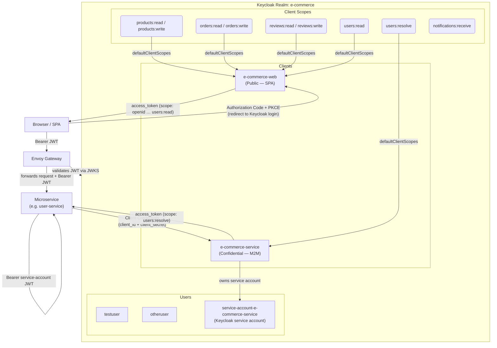
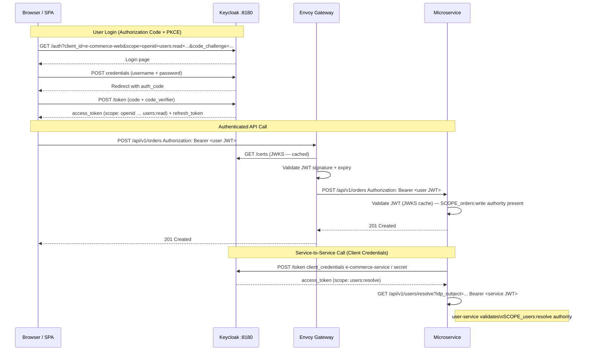

# Keycloak Configuration Reference

This document describes the complete Keycloak setup for the `e-commerce` realm — what exists today in
`docker/keycloak/realm-e-commerce.json` (auto-imported on `docker compose up`) — and how each piece
connects to the microservice architecture.

---

## Overview Diagram



---

## Realm Settings

| Setting | Value | Notes |
|---------|-------|-------|
| Realm name | `e-commerce` | All OIDC URLs use this realm slug |
| Display name | `E-Commerce Platform` | Shown on the Keycloak login page |
| SSL required | `none` | Dev only — TLS is handled by Envoy Gateway in staging |
| Self-registration | Disabled | Users are created via lazy registration in `user-service` (see [ADR-004](adr-004-iam-portability-user-service-isolation.md)) |
| Login with email | Enabled | Users can authenticate with either username or email |
| Duplicate emails | Forbidden | One account per email address |
| Default signature algorithm | `RS256` | All JWTs are RS256-signed; public keys served via JWKS |

### Key OIDC endpoints

```
Discovery:   http://localhost:8180/realms/e-commerce/.well-known/openid-configuration
JWKS:        http://localhost:8180/realms/e-commerce/protocol/openid-connect/certs
Token:       http://localhost:8180/realms/e-commerce/protocol/openid-connect/token
Auth:        http://localhost:8180/realms/e-commerce/protocol/openid-connect/auth
Logout:      http://localhost:8180/realms/e-commerce/protocol/openid-connect/logout
Admin UI:    http://localhost:8180/admin/master/console/#/e-commerce
```

In staging (k3d), replace `http://localhost:8180` with `https://keycloak.local.test`.

---

## Client Scopes

Authorization uses standard OAuth2 **resource scopes** (RFC 6749 §3.3).  
Spring Security reads the `scope` claim from the JWT and maps each space-separated token to a
`SCOPE_<name>` authority — no custom converter or Keycloak-specific claim mapping required.

See [ADR-006 — Scope-Based Authorization](adr-006-scope-based-authorization.md) for the full rationale.

### Scope Catalogue

| Scope | Description | Granted to |
|-------|-------------|-----------|
| `products:read` | Read product catalog | `e-commerce-web` (default) |
| `products:write` | Create/update products (admin) | `e-commerce-web` (optional) |
| `orders:read` | Read own orders | `e-commerce-web` (default) |
| `orders:write` | Place and update orders | `e-commerce-web` (default) |
| `reviews:read` | Read product reviews | `e-commerce-web` (default) |
| `reviews:write` | Submit and edit reviews | `e-commerce-web` (default) |
| `users:read` | Read own user profile | `e-commerce-web` (default) |
| `users:resolve` | Resolve IDP subject → internal user ID (M2M only) | `e-commerce-service` (default) |
| `notifications:receive` | Receive notification events | `e-commerce-web` (optional) |

### Usage in services

Spring Security default `JwtGrantedAuthoritiesConverter` reads the `scope` claim (space-separated)
and creates one `SCOPE_<name>` authority per token. No custom `JwtAuthenticationConverter` is needed:

```java
// SecurityConfig.java — uses Spring Security defaults
.oauth2ResourceServer(oauth2 -> oauth2.jwt(Customizer.withDefaults()));

// Controller method security
@PreAuthorize("hasAuthority('SCOPE_users:resolve')")
public ResponseEntity<UserResponse> resolveUser(String idpSubject) { ... }

@PreAuthorize("hasAuthority('SCOPE_users:read')")
public ResponseEntity<UserResponse> getMyProfile(Authentication auth) { ... }
```

---

## Clients

### `e-commerce-web` — Public SPA Client

```
clientId:               e-commerce-web
type:                   Public (no secret)
standardFlowEnabled:    true    ← Authorization Code + PKCE
implicitFlowEnabled:    false   ← disabled (deprecated, insecure)
directAccessGrantsEnabled: true ← password grant — for local curl/Postman testing only
serviceAccountsEnabled: false
redirectUris:           http://localhost:*, http://127.0.0.1:*
webOrigins:             + (same as redirectUris — CORS allowed)
defaultClientScopes:    openid, profile, email, products:read, orders:read, orders:write,
                        reviews:read, reviews:write, users:read
optionalClientScopes:   products:write
```

#### When is this used?

A browser-based SPA (React, Angular, etc.) uses this client to authenticate users:

```
1. SPA redirects browser to:
   GET /realms/e-commerce/protocol/openid-connect/auth
       ?client_id=e-commerce-web
       &redirect_uri=http://localhost:3000/callback
       &response_type=code
       &scope=openid email profile products:read orders:read orders:write reviews:read reviews:write users:read
       &code_challenge=<SHA256 of code_verifier>     ← PKCE
       &code_challenge_method=S256

2. User logs in on Keycloak login page.

3. Keycloak redirects back to SPA:
   http://localhost:3000/callback?code=<auth_code>

4. SPA exchanges code for tokens:
   POST /realms/e-commerce/protocol/openid-connect/token
   code=<auth_code>
   &code_verifier=<original code_verifier>           ← PKCE
   &client_id=e-commerce-web
   &redirect_uri=http://localhost:3000/callback
   &grant_type=authorization_code

5. Keycloak returns:
   { "access_token": "eyJ...", "refresh_token": "eyJ...", ... }

6. SPA attaches access_token as Authorization: Bearer header on API calls.
```

`directAccessGrantsEnabled: true` allows a password grant for local testing:

```bash
# Obtain a user token via password grant (dev/testing only)
curl -s -X POST http://localhost:8180/realms/e-commerce/protocol/openid-connect/token \
  -d "grant_type=password" \
  -d "client_id=e-commerce-web" \
  -d "username=testuser" \
  -d "password=password" \
  -d "scope=openid profile email users:read orders:read orders:write reviews:read reviews:write products:read" \
  | jq .access_token
```

#### JWT payload (user token from this client)

```json
{
  "sub":               "f47ac10b-...",
  "iss":               "http://localhost:8180/realms/e-commerce",
  "aud":               "account",
  "preferred_username": "testuser",
  "email":             "testuser@example.com",
  "given_name":        "Test",
  "family_name":       "User",
  "scope":             "openid profile email products:read orders:read orders:write reviews:read reviews:write users:read",
  "exp":               1745600000,
  "iat":               1745596400
}
```

---

### `e-commerce-service` — Confidential M2M Client

```
clientId:               e-commerce-service
type:                   Confidential
secret:                 e-commerce-service-secret
standardFlowEnabled:    false   ← no browser login
directAccessGrantsEnabled: false
serviceAccountsEnabled: true    ← Client Credentials grant
defaultClientScopes:    users:resolve
```

#### When is this used?

Any microservice that needs to call another microservice (e.g., `reviews-service` calling
`user-service` to resolve a user ID) authenticates using this client's credentials:

```bash
# Obtain a service account token (Client Credentials grant)
curl -s -X POST http://localhost:8180/realms/e-commerce/protocol/openid-connect/token \
  -d "grant_type=client_credentials" \
  -d "client_id=e-commerce-service" \
  -d "client_secret=e-commerce-service-secret" | jq .access_token
```

In Spring Boot, `OAuth2ClientHttpRequestInterceptor` handles this automatically (see
[development-guidelines.md](development-guidelines.md) Section 5 and Section 9).

#### JWT payload (service account token from this client)

```json
{
  "sub":                "service-account-uuid",
  "iss":                "http://localhost:8180/realms/e-commerce",
  "preferred_username": "service-account-e-commerce-service",
  "scope":              "users:resolve",
  "exp":                1745600000,
  "iat":                1745596400
}
```

> **Future expansion**: As additional microservices are implemented (`order-service`, `product-service`,
> etc.), each should get its own Keycloak client (`client_id: order-service`, etc.) with its own
> `client_secret` and the scopes it needs to call downstream services. See [ADR-003](adr-003-keycloak-as-iam.md).

---

## Users

### `testuser`

| Attribute | Value |
|-----------|-------|
| Username | `testuser` |
| Email | `testuser@example.com` |
| First name | `Test` |
| Last name | `User` |
| Password | `password` |
| Temporary password | No |

A standard test customer account. The JWT issued for this user will contain the scopes granted by
`e-commerce-web`'s `defaultClientScopes`. Use this account to simulate normal user flows.

### `otheruser`

| Attribute | Value |
|-----------|-------|
| Username | `otheruser` |
| Email | `otheruser@example.com` |
| First name | `Other` |
| Last name | `Person` |
| Password | `password` |
| Temporary password | No |

A second test customer account. Useful for testing cross-user isolation (e.g., verifying that
`otheruser` cannot read `testuser`'s orders).

### `service-account-e-commerce-service` *(Keycloak internal)*

| Attribute | Value |
|-----------|-------|
| Username | `service-account-e-commerce-service` |
| Email | `service-account-e-commerce-service@placeholder.org` |
| Type | Keycloak service account (auto-created when `serviceAccountsEnabled: true`) |

This user is not a real human. Keycloak automatically creates it when `serviceAccountsEnabled: true` is
set on the `e-commerce-service` client. The JWT issued via Client Credentials grant has `sub` equal to
this user's internal UUID, `preferred_username: service-account-e-commerce-service`, and
`scope: users:resolve`.

Services receiving a request from this account detect it via `hasAuthority('SCOPE_users:resolve')`.

---

## Authentication Flows Summary



---

## Realm JSON Location and Auto-Import

The realm is defined in a single file:

```
docker/keycloak/realm-e-commerce.json
```

Keycloak starts with `--import-realm` and the file is volume-mounted at
`/opt/keycloak/data/import/`. On first startup, Keycloak imports the realm automatically. No Admin
Console steps are needed.

> **Keycloak 26 import behaviour**: If the realm already exists, `--import-realm` skips it unless you
> add `--override=true`. For dev environments, deleting the Keycloak volume (`docker compose down -v`)
> and re-running `docker compose up` re-imports from scratch.

---

## Adding a New Service Client (Checklist)

When a new microservice is implemented, follow this pattern to add its Keycloak identity:

**Step 1 — Define the scopes the new service needs in `clientScopes[]`** (if not already present):

```json
{
  "name": "notifications:receive",
  "description": "Receive notification events",
  "protocol": "openid-connect",
  "attributes": { "include.in.token.scope": "true", "display.on.consent.screen": "true" }
}
```

**Step 2 — Add the client in `clients[]`**:

```json
{
  "clientId": "notification-service",
  "name": "Notification Service (M2M)",
  "enabled": true,
  "publicClient": false,
  "secret": "notification-service-secret",
  "standardFlowEnabled": false,
  "directAccessGrantsEnabled": false,
  "serviceAccountsEnabled": true,
  "defaultClientScopes": ["notifications:receive"],
  "optionalClientScopes": []
}
```

**Step 3 — Pin the service account user in `users[]`** (optional but ensures reproducible imports):

```json
{
  "username": "service-account-notification-service",
  "enabled": true,
  "email": "service-account-notification-service@placeholder.org",
  "serviceAccountClientId": "notification-service"
}
```

**Step 4 — Configure the calling service's `application.yaml`**:

```yaml
spring:
  security:
    oauth2:
      client:
        registration:
          user-service:                         # logical name for the downstream service
            client-id: notification-service     # this service's Keycloak client ID
            client-secret: ${NOTIFICATION_SERVICE_CLIENT_SECRET:notification-service-secret}
            authorization-grant-type: client_credentials
            scope: notifications:receive        # request only the scopes needed
        provider:
          user-service:
            token-uri: ${KEYCLOAK_URL:http://localhost:8180}/realms/e-commerce/protocol/openid-connect/token
```

**Step 5 — Protect the endpoint in the service with `@PreAuthorize`**:

```java
@PreAuthorize("hasAuthority('SCOPE_notifications:receive')")
public ResponseEntity<Void> receiveNotification(...) { ... }
```

**Step 6 — Restart Keycloak** to re-import (or use `--override=true`).

---

## Related Documents

- [ADR-003 — Keycloak as IAM](adr-003-keycloak-as-iam.md) — rationale for choosing Keycloak
- [ADR-004 — IAM Portability](adr-004-iam-portability-user-service-isolation.md) — why only `user-service` stores the Keycloak `sub`
- [ADR-006 — Scope-Based Authorization](adr-006-scope-based-authorization.md) — decision to use fine-grained OAuth2 scopes instead of realm roles
- [development-guidelines.md §9 Security](development-guidelines.md) — Spring Security / OAuth2 Resource Server config pattern
