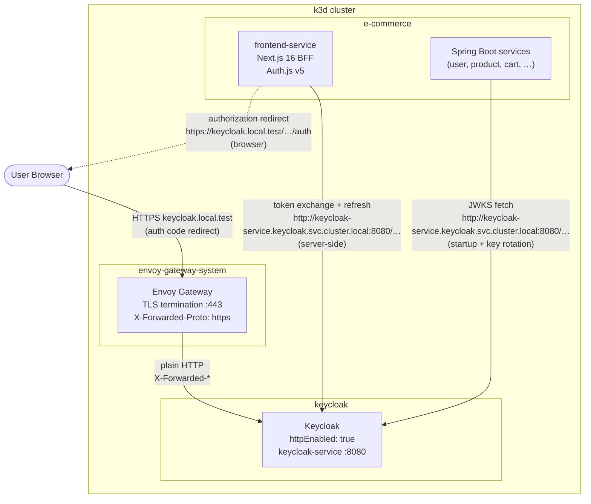
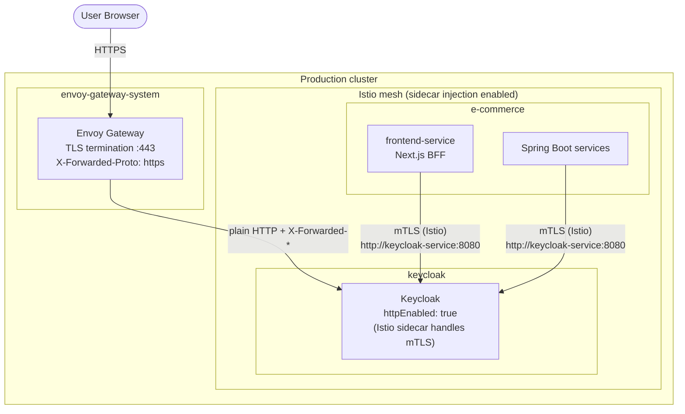

# Keycloak Architecture Guide: Envoy Gateway, Flux CD & Next.js BFF

This guide documents the Keycloak deployment architecture across two environments:

| Environment | Internal transport | Sections |
|-------------|-------------------|----------|
| **Staging / local k3d** | Plain HTTP (no service mesh) | §1–§7 |
| **Production** | Istio strict mTLS between all pods | §8 |

**Sections §1–§7** cover the staging k3d setup: **Envoy Gateway** for external TLS termination, **Flux CD** `postBuild` variable substitution for GitOps-managed configuration, and the **Next.js (Auth.js) / Spring Boot** BFF pattern. **Section §8** documents the additional Istio mTLS overlay applied in production.

---

## 1. Architectural Overview



- **External traffic** — TLS is terminated at Envoy Gateway. The `proxy-headers: xforwarded` Keycloak option makes it trust `X-Forwarded-Proto: https` so that issued tokens carry the correct external `iss`.
- **Internal traffic** — plain HTTP over Kubernetes Service DNS. No Istio or sidecar mesh is used. Services call Keycloak directly at `http://keycloak-service.keycloak.svc.cluster.local:8080`.
- **`backchannelDynamic: true`** — when an internal call arrives, Keycloak's OIDC discovery document returns **internal** `token_endpoint` / `jwks_uri` URLs, while `issuer` stays the external hostname (matching the `iss` claim in issued JWTs).

---

## 2. Keycloak Operator CR

The `Keycloak` CR lives in `gitops/infrastructure/keycloak/config/base/keycloak.yaml` and is deployed to the `keycloak` namespace by Flux. `${CLUSTER_DOMAIN}` is substituted at deploy time by Flux's `postBuild.substituteFrom` referencing the `cluster-settings` ConfigMap.

```yaml
apiVersion: k8s.keycloak.org/v2beta1
kind: Keycloak
metadata:
  name: keycloak
  namespace: keycloak
spec:
  instances: 1
  http:
    httpEnabled: true          # plain HTTP inside the cluster; TLS handled by Envoy Gateway
  hostname:
    hostname: https://keycloak.${CLUSTER_DOMAIN}   # embedded in JWT iss claim
    strict: false              # accept requests on any Host header (internal DNS, localhost)
    backchannelDynamic: true   # derive backchannel URLs from the incoming request Host
  db:
    vendor: postgres
    host: postgres-rw.databases.svc.cluster.local
    port: 5432
    database: keycloak
  additionalOptions:
    - name: proxy-headers
      value: xforwarded        # trust X-Forwarded-Proto/For from Envoy Gateway
    - name: features
      value: "opentelemetry,opentelemetry-metrics,opentelemetry-logs"
    - name: telemetry-endpoint
      value: "http://otel-collector.monitoring.svc.cluster.local:4317"
```

> **Why `httpEnabled: true` + `backchannelDynamic: true`?**
> Keycloak runs without native TLS because Envoy Gateway owns TLS termination. The `backchannelDynamic` flag tells Keycloak to derive OIDC endpoint URLs from the incoming request's `Host` header: internal requests receive internal URLs, external requests receive external URLs. `strict: false` prevents Keycloak from rejecting requests that arrive on `keycloak-service.keycloak.svc.cluster.local` instead of the configured `keycloak.local.test` hostname.

---

## 3. Flux CD Variable Substitution

### `cluster-settings.yaml` (cluster entry-point ConfigMap)

`gitops/clusters/staging/cluster-settings.yaml` defines per-cluster variables that Flux injects into every Kustomization via `postBuild.substituteFrom`:

```yaml
apiVersion: v1
kind: ConfigMap
metadata:
  name: cluster-settings
  namespace: flux-system
data:
  CLUSTER_DOMAIN: "local.test"
  ENVIRONMENT: "staging"
```

### Flux Kustomization for Keycloak (`infra-security.yaml`)

`gitops/clusters/staging/infra-security.yaml` defines the two Flux Kustomizations that deploy Keycloak. Each one references `cluster-settings` for variable substitution:

```yaml
apiVersion: kustomize.toolkit.fluxcd.io/v1
kind: Kustomization
metadata:
  name: infra-keycloak-app
  namespace: flux-system
spec:
  interval: 10m
  path: ./gitops/infrastructure/keycloak/app/overlays/staging
  prune: true
  sourceRef:
    kind: GitRepository
    name: flux-system
  dependsOn:
    - name: infra-databases-config   # Keycloak DB must exist first
  postBuild:
    substituteFrom:
      - kind: ConfigMap
        name: cluster-settings
---
apiVersion: kustomize.toolkit.fluxcd.io/v1
kind: Kustomization
metadata:
  name: infra-keycloak-config
  namespace: flux-system
spec:
  interval: 10m
  path: ./gitops/infrastructure/keycloak/config/overlays/staging
  prune: true
  sourceRef:
    kind: GitRepository
    name: flux-system
  dependsOn:
    - name: infra-keycloak-app
  postBuild:
    substituteFrom:
      - kind: ConfigMap
        name: cluster-settings
```

---

## 4. Frontend — Next.js BFF (Auth.js v5)

### Why `wellKnown` does not work inside Kubernetes

Auth.js v5 (next-auth 5) passes the `issuer` URL to `oauth4webapi`'s `discoveryRequest()`, which sends an HTTP `GET` to `${issuer}/.well-known/openid-configuration`. Inside a k3d pod, the external hostname `keycloak.local.test` is not resolvable — it only exists in the host machine's `/etc/hosts`. The fetch fails with `TypeError: fetch failed`.

**Setting `wellKnown` to an alternative URL has no effect** — Auth.js ignores it and always derives the discovery URL from `issuer`.

### Solution: explicit endpoint configuration

Configure all three OIDC endpoint URLs directly. When all three are present, `oauth4webapi` skips the discovery request entirely:

```typescript
// frontend-service/src/auth.ts
import NextAuth from "next-auth";
import Keycloak from "next-auth/providers/keycloak";
import type { JWT } from "next-auth/jwt";

const KEYCLOAK_EXTERNAL_ISSUER = process.env.AUTH_KEYCLOAK_ISSUER!;
// AUTH_KEYCLOAK_INTERNAL_ISSUER = http://keycloak-service.keycloak.svc.cluster.local:8080/realms/e-commerce
const KEYCLOAK_INTERNAL_ISSUER =
  process.env.AUTH_KEYCLOAK_INTERNAL_ISSUER ?? KEYCLOAK_EXTERNAL_ISSUER;

export const { handlers, auth, signIn, signOut } = NextAuth({
  providers: [
    Keycloak({
      // authorization.url uses the EXTERNAL issuer — this is a browser redirect
      authorization: {
        url: `${KEYCLOAK_EXTERNAL_ISSUER}/protocol/openid-connect/auth`,
        params: { scope: "openid profile email users:read orders:read ..." },
      },
      // token + userinfo use the INTERNAL issuer — these are server-side fetches
      token:    `${KEYCLOAK_INTERNAL_ISSUER}/protocol/openid-connect/token`,
      userinfo: `${KEYCLOAK_INTERNAL_ISSUER}/protocol/openid-connect/userinfo`,
    }),
  ],
  // … jwt/session callbacks
});

async function refreshAccessToken(token: JWT): Promise<JWT> {
  const tokenEndpoint = `${KEYCLOAK_INTERNAL_ISSUER}/protocol/openid-connect/token`;
  // fetch with grant_type=refresh_token …
}
```

### Why `oauth4webapi` does not need `jwks_uri`

Auth.js calls `oauth4webapi`'s `validateJwt()` to validate the ID token received during the callback. This function checks JWT claims (`iss`, `aud`, `exp`, `nbf`) but **does NOT verify the JWT signature** — it performs no HTTP calls to `jwks_uri`. Signature verification is not needed here because the ID token is received directly from Keycloak in the server-side token exchange (not from an untrusted source).

JWKS signature verification is the responsibility of each Spring Boot service's `NimbusJwtDecoder` (configured via `jwk-set-uri`).

### Kubernetes ConfigMap for the frontend

`gitops/apps/frontend-service/base/configmap.yaml`:

```yaml
data:
  AUTH_KEYCLOAK_ISSUER: "https://keycloak.${CLUSTER_DOMAIN}/realms/e-commerce"
  AUTH_KEYCLOAK_INTERNAL_ISSUER: "http://keycloak-service.keycloak.svc.cluster.local:8080/realms/e-commerce"
```

---

## 5. Backend — Spring Boot Resource Servers

### `application.yaml` pattern (all services)

```yaml
spring:
  security:
    oauth2:
      resourceserver:
        jwt:
          # jwk-set-uri: server-side JWKS fetch — use internal URL to avoid DNS failure
          jwk-set-uri: ${KEYCLOAK_INTERNAL_URL:${KEYCLOAK_URL:http://localhost:8180}}/realms/e-commerce/protocol/openid-connect/certs
          # issuer-uri: JWT iss claim comparison only — no outbound HTTP call when jwk-set-uri is set
          issuer-uri: ${KEYCLOAK_URL:http://localhost:8180}/realms/e-commerce
```

**Key design points:**

| Property | URL type | Why |
|---|---|---|
| `jwk-set-uri` | **Internal** (`KEYCLOAK_INTERNAL_URL`) | Spring Security fetches the JWKS at startup and on key rotation. Must be reachable from inside the pod. |
| `issuer-uri` | **External** (`KEYCLOAK_URL`) | Used **only** for JWT `iss` claim comparison — no HTTP call is made when `jwk-set-uri` is set. Must match the `iss` value in the JWT (which is the external hostname Keycloak embeds). |

The nested placeholder `${KEYCLOAK_INTERNAL_URL:${KEYCLOAK_URL:http://localhost:8180}}` means:
1. Use `KEYCLOAK_INTERNAL_URL` if set (Kubernetes: internal DNS)
2. Fall back to `KEYCLOAK_URL` if set (local dev: external URL)
3. Fall back to `http://localhost:8180` (local dev default)

### Kubernetes ConfigMap for Java services

`gitops/apps/<service>/base/configmap.yaml` for each service:

```yaml
data:
  KEYCLOAK_URL: "https://keycloak.${CLUSTER_DOMAIN}"
  KEYCLOAK_INTERNAL_URL: "http://keycloak-service.keycloak.svc.cluster.local:8080"
  KEYCLOAK_REALM: "e-commerce"
```

---

## 6. TLS Architecture

```
Browser ──HTTPS──► Envoy Gateway (envoy-gateway-system ns)
                        │  cert-manager wildcard cert *.local.test
                        │  TLS terminated here
                        │  X-Forwarded-Proto: https
                        │  X-Forwarded-For: <client-ip>
                        ▼
                   Keycloak (keycloak ns)
                   plain HTTP :8080
                   proxy-headers: xforwarded
                   hostname: https://keycloak.local.test  ← used in iss claim
                   strict: false
                   backchannelDynamic: true
```

- **cert-manager** issues a self-signed wildcard `Certificate` for `*.local.test` stored in the `envoy-gateway-system` namespace.
- **Envoy Gateway** terminates TLS using that certificate and routes plain HTTP to backend services.
- **No internal TLS** — all pod-to-pod traffic within the cluster is plain HTTP. There is no Istio or any other service mesh.
- Keycloak's `proxy-headers: xforwarded` setting causes it to derive the external scheme/host from `X-Forwarded-*` headers injected by Envoy, ensuring the `iss` claim in JWTs equals `https://keycloak.local.test/realms/e-commerce` even though Keycloak itself speaks plain HTTP.

---

## 7. End-to-End Request Cycle

1. **Login initiation** — user clicks "Sign in" in the Next.js frontend. Auth.js builds the authorization redirect URL using `KEYCLOAK_EXTERNAL_ISSUER` (e.g. `https://keycloak.local.test/realms/e-commerce/protocol/openid-connect/auth`) and returns a `302` to the browser.

2. **User authentication** — the browser follows the redirect to Envoy Gateway → Keycloak. The user enters credentials. Keycloak redirects back to `https://app.local.test/api/auth/callback/keycloak` with an authorization code.

3. **Token exchange** (server-side) — Auth.js running inside the Next.js pod sends a `POST` to `http://keycloak-service.keycloak.svc.cluster.local:8080/realms/e-commerce/protocol/openid-connect/token`. Because the request arrives on the internal hostname, `backchannelDynamic: true` causes Keycloak to respond with internal `token_endpoint` / `jwks_uri` values in its OIDC discovery document — but the `issuer` field remains `https://keycloak.local.test/realms/e-commerce`.

4. **ID token validation** — `oauth4webapi` validates the ID token claims (`iss`, `aud`, `exp`). The `iss` value `https://keycloak.local.test/realms/e-commerce` matches `AUTH_KEYCLOAK_ISSUER`. No JWKS fetch is performed at this step.

5. **API requests** — the Next.js BFF attaches the access token as a `Bearer` header to calls to Spring Boot services over Kubernetes DNS (`http://service-name.e-commerce.svc.cluster.local:port`).

6. **JWT verification** (Spring Boot) — each service's `NimbusJwtDecoder` fetches the JWKS from `http://keycloak-service.keycloak.svc.cluster.local:8080/realms/e-commerce/protocol/openid-connect/certs` (set via `KEYCLOAK_INTERNAL_URL`) and verifies the token signature. The `iss` claim is compared against `KEYCLOAK_URL` (external URL) — they match because Keycloak embedded the external hostname when it issued the token.

---

## 8. Production: Istio mTLS Mesh

> **This section applies to production environments only.** The staging k3d cluster described in §1–§7 does not run Istio. In production, Istio sidecar proxies are injected into every pod, which means all pod-to-pod traffic (including calls to `keycloak-service`) is automatically upgraded to mutual TLS without any change to application code.

### 8.1 Architecture with Istio



Keycloak still runs with `httpEnabled: true` and `backchannelDynamic: true` — the application-level configuration is **identical** to staging. Istio sidecars transparently encrypt all pod-to-pod traffic on the wire without any code change. The Keycloak CR (`spec.http.httpEnabled: true`) remains correct because Istio intercepts traffic before it reaches the Keycloak process.

### 8.2 Istio PeerAuthentication — strict mTLS

This manifest forces all pods in the `keycloak` namespace to communicate exclusively via Istio mTLS. Unencrypted traffic from outside the mesh is rejected.

```yaml
apiVersion: security.istio.io/v1beta1
kind: PeerAuthentication
metadata:
  name: keycloak-strict-mtls
  namespace: keycloak
spec:
  mtls:
    mode: STRICT
```

Apply an equivalent `PeerAuthentication` in each service namespace (`e-commerce`, etc.) to enforce mesh-wide strict mTLS.

### 8.3 Flux `dependsOn` for production

In production, Keycloak and application Kustomizations must declare a dependency on the Istio control-plane Kustomization so that sidecar injection is available before any workload pods start:

```yaml
apiVersion: kustomize.toolkit.fluxcd.io/v1
kind: Kustomization
metadata:
  name: infra-keycloak-app
  namespace: flux-system
spec:
  interval: 10m
  path: ./gitops/infrastructure/keycloak/app/overlays/production
  prune: true
  sourceRef:
    kind: GitRepository
    name: flux-system
  dependsOn:
    - name: infra-istio          # Istio control plane must be ready first
    - name: infra-databases-config
  postBuild:
    substituteFrom:
      - kind: ConfigMap
        name: cluster-settings
```

### 8.4 What does NOT change in production

| Component | Staging | Production |
|-----------|---------|------------|
| Keycloak CR (`httpEnabled`, `backchannelDynamic`, `strict`) | same | same |
| `KEYCLOAK_INTERNAL_URL` ConfigMap value | same | same |
| `AUTH_KEYCLOAK_INTERNAL_ISSUER` ConfigMap value | same | same |
| Auth.js explicit endpoint config (`auth.ts`) | same | same |
| Spring Boot `jwk-set-uri` / `issuer-uri` pattern | same | same |
| Pod-to-pod wire encryption | none (plain HTTP) | Istio mTLS (transparent) |