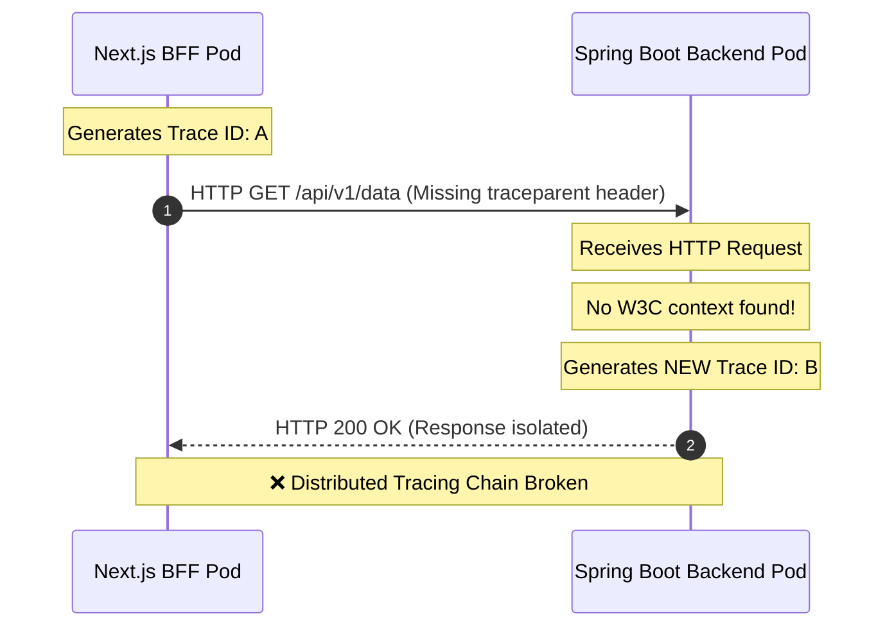

# Troubleshooting: Broken Distributed Tracing between Next.js BFF and Spring Boot in Kubernetes

## Issue Description
After migrating from a local Docker Compose setup (using the Grafana `otel-lgtm` image) to a multi-pod Kubernetes environment, distributed tracing correlation is broken. 

Although individual traces are generated for both the Frontend/BFF and Backend layers, they do not share the same `traceId`. The Next.js BFF initiates a trace, but the Spring Boot backend creates a brand-new `traceId` for downstream operations, breaking the end-to-end transaction tree.

---

## Architectural Root Cause

The failure stems from a design limitation in the default setup of `@vercel/otel` combined with strict network boundaries in Kubernetes:

1. **`@vercel/otel` Requires Explicit URL Targets for Outbound Context:**
   By default, `@vercel/otel` captures incoming requests and internal Next.js server actions. However, it does **not** propagate tracing headers to outgoing `fetch` calls unless the target service URLs or domains are explicitly whitelisted in its configuration.
2. **Spring Boot 4 OpenTelemetry Starter Requirements:**
   The Spring Boot 4 / Micrometer OpenTelemetry ecosystem strictly expects incoming HTTP requests to contain the standardized W3C Trace Context header (`traceparent`). Because Next.js sends plain HTTP requests without this header, Spring Boot treats the request as a root transaction and provisions a new `traceId`.
3. **The Docker Local Illusion (`otel-lgtm` vs K8s):**
   In local Docker configurations, containers often share networking layers or environment variables that can mask context propagation failures. When moving to Kubernetes, actual network boundaries isolate the Pods completely, forcing physical reliance on HTTP request headers.

### Trace Interruption Flow



---

## Technical Specifications & References

The solution aligns with official OpenTelemetry standards and package architectures:
* **Context Propagation Protocol:** W3C Trace Context Specification ([W3C Recommendation](https://w3.org)).
* **Frontend Instrumentations:** OpenTelemetry JS API via Vercel Trace Wrapper Framework ([Vercel `@vercel/otel` Instrumentation Docs](https://vercel.com/docs/tracing/instrumentation)).
* **Backend Framework:** Spring Boot 4 Starter OpenTelemetry Integration Engine leveraging Micrometer Tracing.

---

## Resolution Guide

To fix this issue, you must use the native `instrumentationConfig` in `@vercel/otel` to instruct the built-in fetch instrumentation to propagate the tracing context to your Kubernetes internal backend services.

### Step 1: Update `instrumentation.ts` in Next.js BFF
Modify your initialization logic to include the internal cluster endpoints of your Spring Boot services under the `propagateContextUrls` array.

```typescript
// instrumentation.ts
import { registerOTel } from '@vercel/otel';

export function register() {
  registerOTel({
    serviceName: 'nextjs-bff-service',
    instrumentationConfig: {
      fetch: {
        // Explicitly define which backend endpoints receive the W3C tracing context
        propagateContextUrls: [
          // Matches your internal Kubernetes service endpoints
          'springboot-backend-svc.monitoring.svc.cluster.local',
          // You can also use environment variables or regex matching if necessary
          process.env.BACKEND_API_URL || ''
        ],
      },
    },
  });
}
```

### Step 2: Harmonize Propagators via Environment Variables
Ensure both application layers match the context-handling language protocols. Inject the standard W3C propagator configurations directly into the Kubernetes Manifest workloads.

Update your **Next.js BFF** and **Spring Boot Backend** Deployment specs (`deployment.yaml`):

```yaml
spec:
  template:
    spec:
      containers:
        - name: app-container
          env:
            - name: OTEL_PROPAGATORS
              value: "tracecontext,baggage"
```

---

## Verification Matrix

1. **Inspect Network Payloads:** Verify outbound calls leaving the Next.js pod carry the matching `traceparent` syntax header:
   ```text
   traceparent: 00-4bf92f3577b34da6a3ce929d0e0e4736-00f067aa0ba902b7-01
   ```
2. **Review Spring Boot Log Stream:** Confirm the logs outputted by Spring Boot mirror the identical `traceId` initialized by the Frontend.
3. **Validate in Grafana Tempo:** Open the Grafana Dashboards and trace the execution path. You should now observe a single unified execution hierarchy cleanly mapping elements spanning from Next.js server actions straight into internal Spring Boot controller methods.
