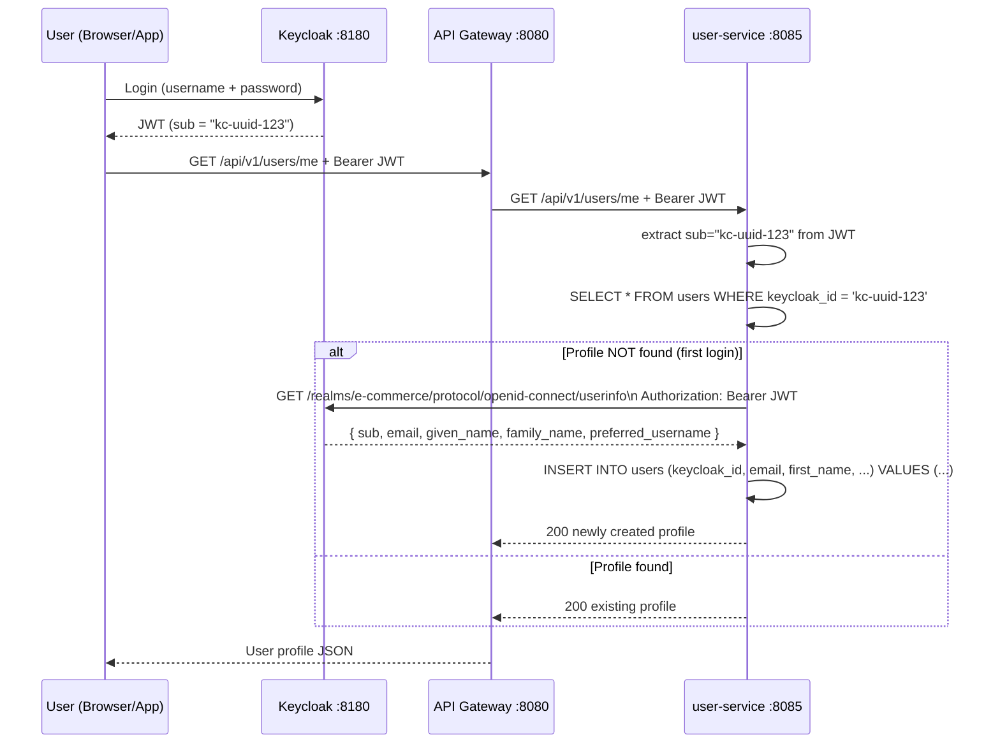
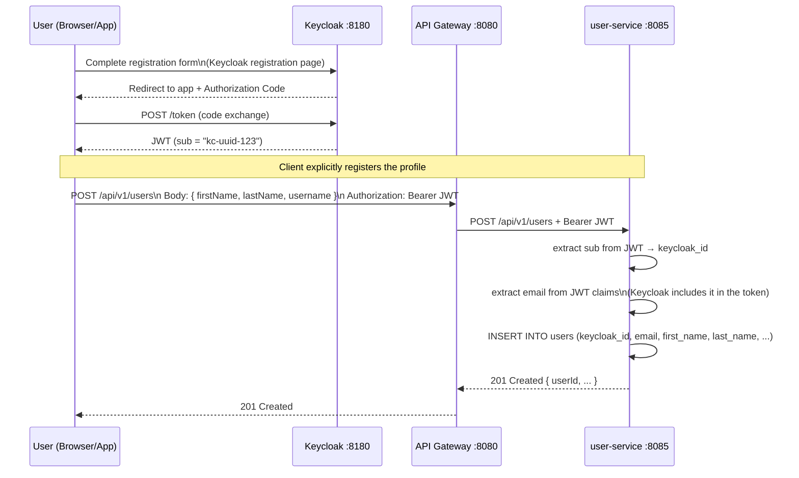
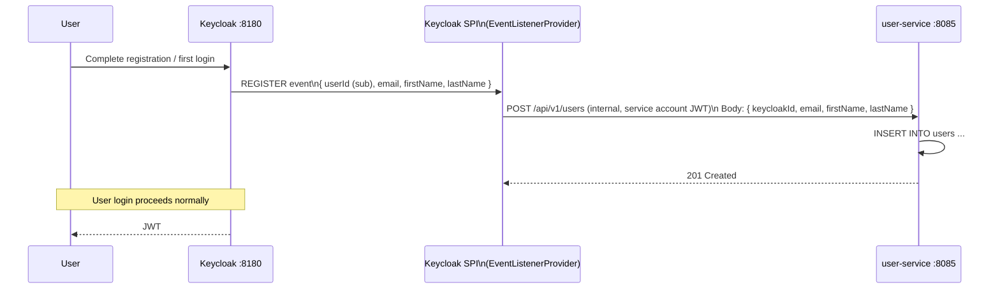

# User-Service Keycloak Profile Registration Flow

## The Core Problem

Keycloak owns the **identity** (username, password, email as a login credential). Your `user-service` owns the **profile** (enriched data: names, preferences, etc.). When a brand-new user logs in for the first time, Keycloak has a record but `user-service` has nothing. Something must bridge the two.

The link between the two systems is the JWT `sub` claim — a UUID Keycloak assigns permanently to each user. This becomes `keycloak_id` in your `users` table.

---

## Option A — Client-side "Lazy Registration" (Simplest)



### How it works

1. `GET /api/v1/users/me` is the standard endpoint for "get my profile"
2. `user-service` extracts the `sub` claim from the incoming JWT
3. It queries the DB for a row with matching `keycloak_id`
4. **On first call** — row does not exist → calls Keycloak's `/userinfo` endpoint with the user's own token to fetch name/email → auto-creates the profile row
5. All subsequent calls hit the DB directly (no Keycloak call needed)

| | |
|---|---|
| **Pros** | Zero extra configuration. Works automatically. No Keycloak extensions needed. |
| **Cons** | Profile name/email may drift if updated in Keycloak later (not synced automatically). |

---

## Option B — Explicit Registration Endpoint (What the README Documents)



### How it works

1. User completes registration on Keycloak's built-in registration page (or your own form that calls Keycloak's Admin API)
2. After the first login, the client app detects it needs to call `POST /api/v1/users` to create the local profile
3. The JWT already contains `email` (standard OIDC claim) — `user-service` reads it directly from the token, no extra Keycloak API call needed
4. `firstName`, `lastName` etc. come from the request body (user fills them in the app's onboarding form)

### How does the client know it's the first login?

Two approaches:

- Keycloak adds a custom claim `"first_login": true` via a **Protocol Mapper** (script mapper or custom extension) if no profile exists yet
- Or the client always calls `GET /api/v1/users/me` first — if it returns `404`, it renders the "complete your profile" form and `POST`s to create it

| | |
|---|---|
| **Pros** | Profile data is richer (user fills in their own name). Clean separation of concerns. |
| **Cons** | Two-step flow in the client; profile can be dangling if the user closes the browser after Keycloak registration but before completing the app form. |

---

## Option C — Keycloak Event Listener SPI (Fully Automated, Production-Grade)



### How it works

1. A custom Keycloak **EventListenerProvider** (a Java SPI plugin deployed into Keycloak) listens for the `REGISTER` event
2. When a user registers, Keycloak fires the event synchronously
3. The listener calls `POST /api/v1/users` on `user-service` using a **service account JWT** (Client Credentials grant for the `keycloak` internal client)
4. `user-service` creates the profile — by the time the user receives their first JWT, the profile already exists

| | |
|---|---|
| **Pros** | Fully automatic. Profile always exists before the user ever calls your API. Zero client logic required. |
| **Cons** | Requires writing and deploying a Keycloak SPI extension JAR into the Keycloak container — adds operational complexity. |

---

## JWT Claims Available Without Extra Keycloak Calls

All three options can read these fields directly from the JWT (no extra HTTP calls):

| JWT Claim | Maps to `users` table column | Notes |
|-----------|------------------------------|-------|
| `sub` | `keycloak_id` | Always present; permanent UUID |
| `email` | `email` | Present if *Email* scope requested |
| `given_name` | `first_name` | Present if *Profile* scope requested |
| `family_name` | `last_name` | Present if *Profile* scope requested |
| `preferred_username` | `username` | Keycloak username (not email) |

Configure scopes in the API Gateway's OAuth2 client to ensure these claims are always in the JWT:

```yaml
spring:
  security:
    oauth2:
      client:
        registration:
          keycloak:
            scope: openid, profile, email
```

---

## Comparison Summary

| | Option A — Lazy | Option B — Explicit | Option C — SPI |
|---|---|---|---|
| Complexity | Low | Medium | High |
| Keycloak extension needed | No | No | Yes (SPI JAR) |
| Client logic needed | Minimal | Yes (onboarding form) | No |
| Profile always exists | No (created on first API call) | No (created by client post-login) | Yes (created at registration) |
| Name/email drift risk | Yes | Low | No (Keycloak is source of truth) |
| Best for | Dev / MVP | Apps with onboarding flow | Production |

---

## Recommendation

Use **Option A (lazy registration)** first — it requires zero extra components and works immediately. Upgrade to **Option C (SPI listener)** when you move to production and need guaranteed profile existence before the user's first API call. **Option B** is a good middle ground for apps that need a custom onboarding flow (e.g., users pick a display name or set preferences during sign-up).
